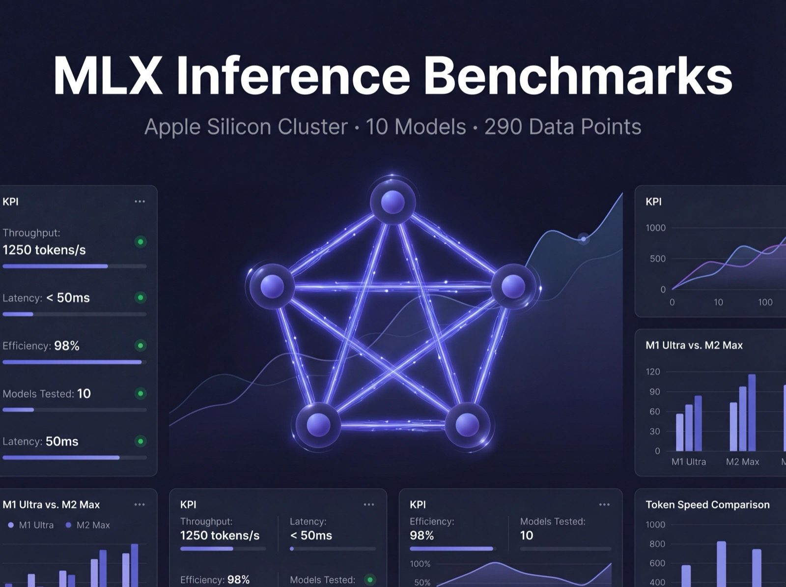
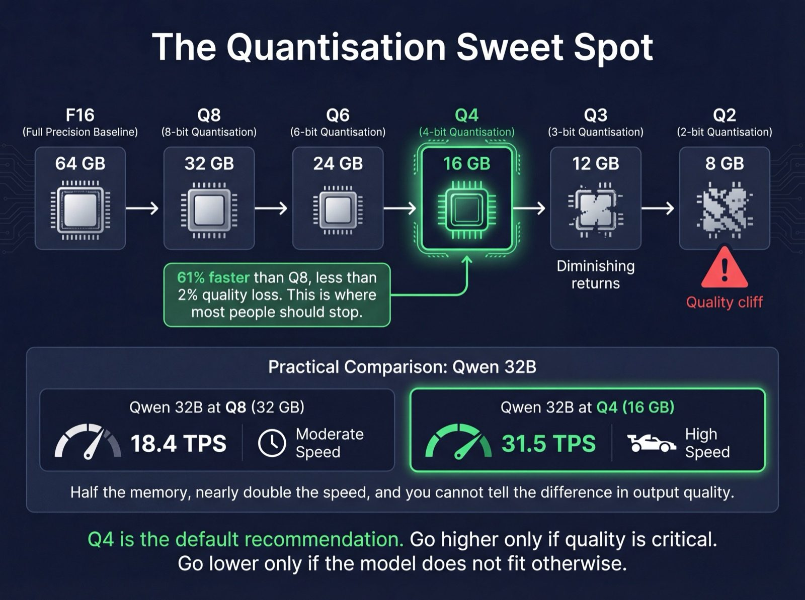
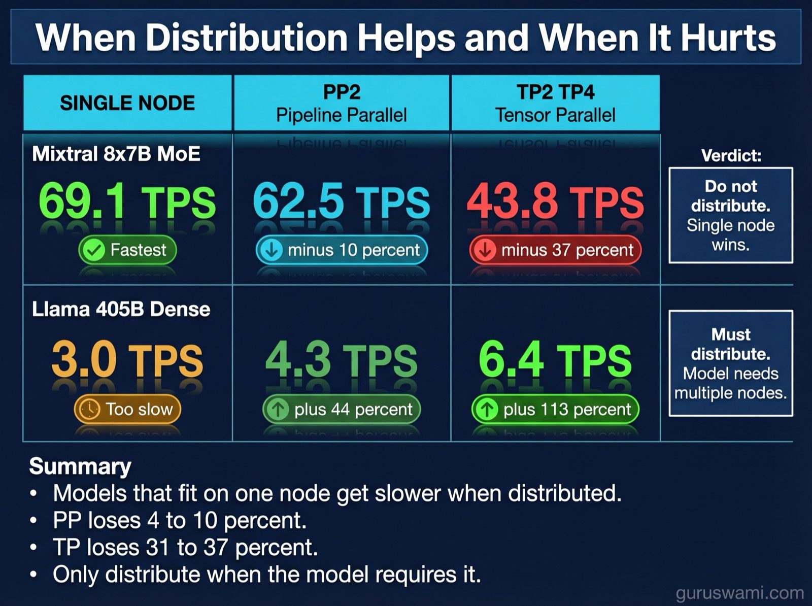
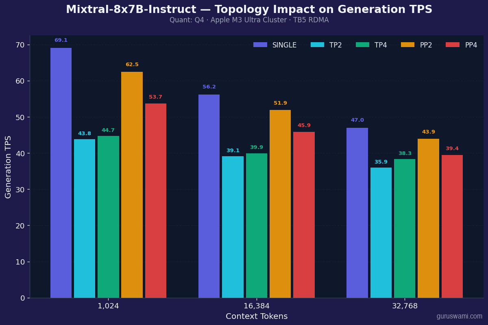
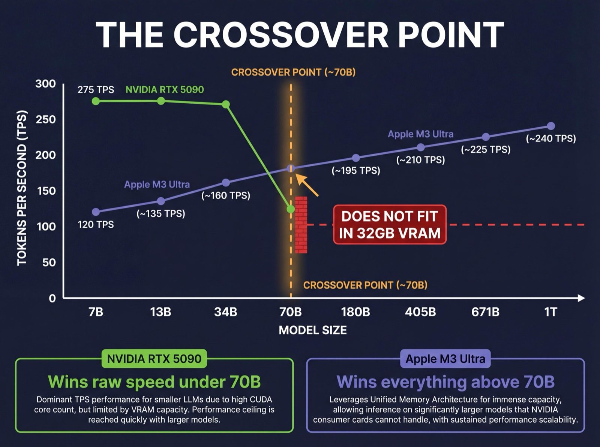
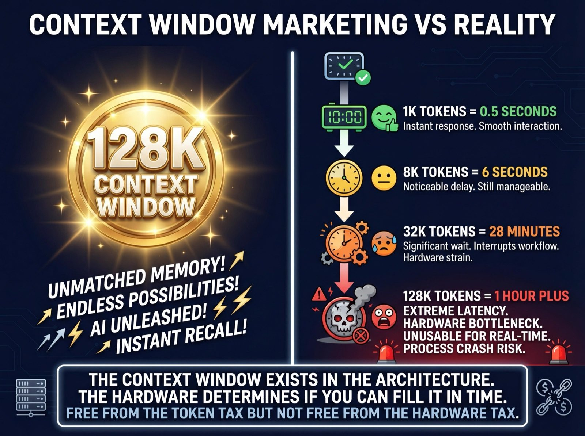

# MLX Inference Benchmarks on Apple Silicon

290 data points across 10 models, 5 quantisation levels, 5 distributed topologies, and 7 context lengths on a 5-node M3 Ultra cluster. Cross-platform comparison with 1,353 data points from NVIDIA RTX 3080, 4090, and 5090.

These benchmarks are the foundation for a graphical cluster simulator we are building. We needed real data points, not estimates, so that what you learn in the simulator reflects what actually happens on real hardware. The simulator will let you play with quantisation, topology, context length, and model selection to see the impact on TPS, TTFT, power consumption, and perplexity in real time. It also features custom French techno with model-specific lyrics, narrated by a floating cloud guy who never shuts up. That part is not optional. We expect it to become extremely popular at raves and datacentre dance parties.

For now, here are the benchmarks and the methodology behind them.

---

## What We Got Wrong (And What Surprised Us)



- **More nodes ≠ faster.** Distributing Qwen 32B across 4 nodes made generation 42% slower.
- **TP scaling depends on quantisation.** Q8 on TP2 loses 7%. Q2 on TP2 loses 48%.
- **Mixtral predicted at 23 TPS, measured at 69 TPS.** Active params ≠ total params. [Why →](docs/FINDINGS.md)
- **Q5 beat Q8 on perplexity.** Quantisation acts as regularisation. [Data →](docs/QUANTISATION.md)
- **DeepSeek V3 (671B) fits on a single Mac Studio.** 380 GB at Q4. 20 TPS.
- **1 trillion parameters at 16 TPS.** Kimi K2.5 on 4 Mac Studios. [Full findings →](docs/FINDINGS.md)

---

## Models

| Model | Params | Architecture | Charts & Data |
|-------|--------|-------------|---------------|
| [Llama 3.1 8B](charts/output/llama-8b/) | 8B | Dense | Dashboard, TPS, TTFT, perplexity, memory |
| [Mistral 7B](charts/output/mistral-7b/) | 7B | Dense | Dashboard, TPS, TTFT, perplexity, memory |
| [DeepSeek Coder 7B](charts/output/deepseek-coder-7b/) | 7B | Dense | Dashboard, TPS, TTFT, perplexity, memory |
| [Gemma 2 9B](charts/output/gemma-9b/) | 9B | Dense | Dashboard, TPS, TTFT, perplexity, memory |
| [Qwen 2.5 14B](charts/output/qwen-14b/) | 14B | Dense | Dashboard, TPS, TTFT, perplexity, memory |
| [Qwen 2.5 32B](charts/output/qwen25-32b/) | 32B | Dense | + topology comparison |
| [Mixtral 8x7B](charts/output/mixtral-8x7b/) | 47B (13B active) | MoE | + topology comparison |
| [Llama 3.1 405B](charts/output/llama-405b/) | 405B | Dense | + topology comparison |
| [DeepSeek V3](charts/output/deepseek-v3/) | 671B (37B active) | MoE + MLA | + topology comparison |
| [Kimi K2.5](charts/output/kimi-k2.5/) | 1T+ (32B active) | MoE + MLA | + topology comparison |

---

## Highlights

### Topology: When Distribution Helps and When It Hurts





### NVIDIA vs Apple Silicon: The Crossover



| Model Size | RTX 5090 (32GB) | M3 Ultra (512GB) | Verdict |
|-----------|----------------|------------------|---------|
| **7B Q4** | ~275 TPS | ~120 TPS | NVIDIA 2.3× faster |
| **32B Q4** | fits (19 GB) | 31.5 TPS | Comparable |
| **70B Q4** | doesn't fit | runs single-node | Apple Silicon only |
| **405B Q4** | doesn't fit | 3.0 TPS single, 6.4 TP4 | Apple Silicon only |
| **1T MoE Q4** | doesn't fit | 16.1 TPS on TP4 | Apple Silicon only |

[Full comparison →](docs/NVIDIA_CONSUMER_GUIDE.md) | [Why not multi-GPU? →](docs/INTERCONNECTS.md)

### Context Windows: Marketing vs Reality



A 405B model at 128K context takes over an hour before the first token appears. The window exists in the architecture. The hardware determines whether you can fill it. [Context details →](docs/CONCEPTS.md)

---

## Learn

**New to LLM inference?** Start here, in order:

1. [Basic Concepts](docs/CONCEPTS.md) - TPS, TTFT, perplexity, memory, Dense vs MoE
2. [Quantisation](docs/QUANTISATION.md) - F16→Q1, which layers survive, K-quants, platforms
3. [Model Types](docs/MODEL_TYPES.md) - dense, MoE, multimodal, reasoning, tool calling
4. [Model Scale](docs/MODEL_SCALE.md) - 890K params on an ESP-32 to 1T on a cluster
5. [Distributed Inference](docs/DISTRIBUTED_INFERENCE.md) - TP, PP, EP with diagrams
6. [Software Landscape](docs/SOFTWARE_LANDSCAPE.md) - Ollama, llama.cpp, MLX, vLLM
7. [Agentic vs Generative](docs/AGENTIC_VS_GENERATIVE.md) - chat vs agents, MCP
8. [Beyond Text](docs/BEYOND_TEXT.md) - diffusion, TTS, ASR, emerging architectures
9. [Glossary](docs/GLOSSARY.md) - quick reference
10. [The Yogi Method](docs/YOGI_METHOD.md) - brain inference benchmarks (be more like the puppy)

**Hardware:**

- [NVIDIA Consumer GPUs](docs/NVIDIA_CONSUMER_GUIDE.md) - gaming cards for AI
- [Apple Silicon and MLX](docs/APPLE_SILICON_GUIDE.md) - unified memory, RDMA
- [The Chakra Cluster](docs/CHAKRA_CLUSTER.md) - 5-node mesh, configurations
- [Interconnects](docs/INTERCONNECTS.md) - TB5 vs NVLink vs ethernet

**Deep dives:**

- [Findings](docs/FINDINGS.md) - 13 key results with data
- [Methodology](docs/METHODOLOGY.md) - testing protocol
- [RDMA Failure Modes](docs/RDMA_FAILURE_MODES.md) - TB5 issues and fixes
- [Vision](docs/VISION.md) - consumer GPU → cluster learning pathway

**[Full Documentation Index](docs/INDEX.md)**

---

## Data

All results are CSV files in `results/`. Import into pandas, Excel, or R.

```
model, topology, nodes, quant, context_tokens, prompt_tps, generation_tps,
peak_memory_gb, ttft_seconds, ttft_minutes, feasibility, node
```

- [Perplexity across all models](results/perplexity-all-models.csv) (42 records)
- NVIDIA: [RTX 3080](results/nvidia/NVIDIA-GeForce-RTX-3080-summary.csv) (342) | [RTX 4090](results/nvidia/NVIDIA-GeForce-RTX-4090-summary.csv) (510) | [RTX 5090](results/nvidia/NVIDIA-GeForce-RTX-5090-summary.csv) (501)

## Code Contributions

| File | What it adds |
|------|-------------|
| [patches/llama.py](patches/llama.py) | Pipeline parallelism for Llama |
| [patches/qwen2.py](patches/qwen2.py) | Pipeline parallelism for Qwen2 |
| [patches/mixtral.py](patches/mixtral.py) | Tensor + Pipeline parallelism for Mixtral |

Submitted as PRs to [ml-explore/mlx-lm](https://github.com/ml-explore/mlx-lm).

---

## Coming

- **Cluster Simulator** - interactive tool backed by this data. Adjust sliders, see TPS change. Guruswami narrates. French techno plays.
- **[LLM Space Heater](https://github.com/guruswami-ai/llm-space-heater)** - benchmark your own NVIDIA GPU
- **More models** - Qwen 3.5, Llama 4, newer MoE architectures
- **M4 benchmarks** - M4 Pro Mini (64 GB), M4 Pro Max (128 GB)

## Licence

CC BY-ND 4.0. Share freely with attribution to [guruswami.com](https://guruswami.com). No derivatives.

You can use this data, cite these findings, and share these charts in your own work, blog posts, presentations, and research. Just credit the source. Code patches in `patches/` are Apache 2.0 (matching MLX-LM).

## Acknowledgements

**[MLX](https://github.com/ml-explore/mlx) and [MLX-LM](https://github.com/ml-explore/mlx-lm) by Apple.** The MLX team built something remarkable: a machine learning framework that makes 512 GB of unified memory accessible to researchers and engineers without enterprise budgets. Before MLX, running a 405B model required hardware that cost more than a house. Now it loads on a Mac Studio. The quality of the framework, the speed of development, and the openness of the project have created a platform for discovering and learning inference that would be inaccessible to most people otherwise. These benchmarks exist because MLX made them possible.

**[Georgi Gerganov](https://github.com/ggerganov) and [llama.cpp](https://github.com/ggerganov/llama.cpp).** The project that proved local inference was viable. llama.cpp runs on everything, supports every quantisation format, and has the largest community of any inference engine. Our NVIDIA benchmark data runs on llama.cpp. The GGUF format and K-quant system are industry standards because of this project.

**The quantisation community.** [bartowski](https://huggingface.co/bartowski), [mlx-community](https://huggingface.co/mlx-community), and others who convert and quantise every new model within hours of release. Without their work, running these models locally would require doing the quantisation yourself, which is a significant barrier.

**Model creators.** Meta (Llama), Alibaba (Qwen), Mistral AI, Google (Gemma), DeepSeek, Moonshot (Kimi). Open-weight models are the reason local inference exists. Every benchmark in this project uses models that the creators chose to release publicly.

**[Ollama](https://ollama.com).** For making local inference accessible to people who have never opened a terminal. One command to download and run a model. This is how most people start.

**The AI YouTube community.** The creators who passionately share their knowledge, excitement, and discovery of AI topics inspired us to contribute too. Channels like [3Blue1Brown](https://www.youtube.com/@3blue1brown) (making the maths beautiful), [Andrej Karpathy](https://www.youtube.com/@AndrejKarpathy) (building from first principles), [Yannic Kilcher](https://www.youtube.com/@YannicKilcher) (paper deep dives), [AI Explained](https://www.youtube.com/@aiexplained-official) (clear-headed analysis), [Matthew Berman](https://www.youtube.com/@matthew_berman) (practical local inference), [Sam Witteveen](https://www.youtube.com/@samwitteveenai) (hands-on tutorials), and many others who make this field accessible. The best learning happens when someone who genuinely understands something is visibly excited to explain it, to share the joy of learning something remarkable. That energy is contagious, and it is why we built an interactive simulator instead of another PDF.

## Links

| Resource | What it is |
|----------|-----------|
| [MLX](https://github.com/ml-explore/mlx) | Apple's ML framework for Apple Silicon |
| [MLX-LM](https://github.com/ml-explore/mlx-lm) | LLM inference, serving, and fine-tuning on MLX |
| [llama.cpp](https://github.com/ggerganov/llama.cpp) | Cross-platform inference engine (NVIDIA, Apple, AMD, CPU) |
| [Ollama](https://ollama.com) | One-command local model runner |
| [LM Studio](https://lmstudio.ai) | Desktop app for local inference |
| [Hugging Face](https://huggingface.co) | Model repository and community |
| [LLM Space Heater](https://github.com/guruswami-ai/llm-space-heater) | Our NVIDIA benchmark tool (Linux distro) |
| [Apple TN3205](https://developer.apple.com/documentation/technotes/tn3205) | Apple's RDMA over Thunderbolt documentation |
| [MLX Discussion](https://github.com/ml-explore/mlx/discussions/3300) | Our benchmark discussion on the MLX repo |

## From Treats to Tensors

This project started with a simple question: *how do I explain an LLM by relating it to my puppy, Yogi?*

Yogi learns by associating specific behaviours with rewards - pats and food for good behaviour, a firm "no" for stealing socks. It is the perfect metaphor for Reinforcement Learning from Human Feedback (RLHF) and weight adjustment. The problem is that AI concepts accelerate from "simple dog brain analogies" to "hardcore mathematics" faster than Yogi can escape the laundry with a stolen sock.

The white paper Paul started writing was so boring even he was falling asleep. So he switched tactics and made the learning interactive - visual and acoustic metaphors so learners could experience the concepts of AI inference and feel what changing quantisation, context size, and topology does for speed and quality. Then he went a little too far and ended up with a floating cloud guy that explains AI while running a trillion-parameter model and listening to French techno music.

Either way, it is more fun than reading white papers.

| Level | Topic | Yogi Metaphor | Technical Reality |
|:------|:------|:-------------|:-----------------|
| **Intro** | Inference | "Wait for the treat" | TTFT and token generation |
| **Mid** | Quantisation | "Small kibble vs big kibble" | 4-bit vs 8-bit precision |
| **Mid** | Context | "How many tricks Yogi remembers at once" | KV cache and context windows |
| **Hard** | MoE | "Only the relevant dogs in the pack wake up" | Active vs total parameters |
| **Hard** | Topology | "The pack hunting together" | Tensor and pipeline parallelism |
| **Expert** | RDMA | "Telepathy between dogs" | Direct memory access between nodes |

You can explore the technical concepts via the [Codex](docs/INDEX.md) when you are ready to grow beyond the basics. AI is maths, not magic - but who says the maths cannot be as rewarding as a puppy getting a treat?

A warning for the curious: the more you learn about how an LLM works, the more you will understand about your own brain. How raw sensory data gets tokenised into concepts. How knowledge is not a thing you store but the strength of the links between ideas. How your biological "topology" shapes your creative output. Once you spot these patterns, you cannot unsee them. Consider it the reward for the work you are about to put in.

We are at the forefront of a new era, like early adopters of the cotton mill, the steam engine, electricity, the computer, the internet - now AI. Those revolutions brought about ideas and inventions people could not conceive when they started. You are at the start of the next one, and the future is going to happen faster than ever before. More innovation, more creativity, more opportunity, for those brave enough and willing enough to put in the effort to learn, experiment, and apply.

We hope this helps in a small way.

---

*Built by [Guruswami Advisory](https://guruswami.com). Independent AI research. No vendor ties.*

*If we missed something, made an assumption that is wrong, or you have data from your own hardware, [open an issue](https://github.com/guruswami-ai/mlx-benchmarks/issues).*
