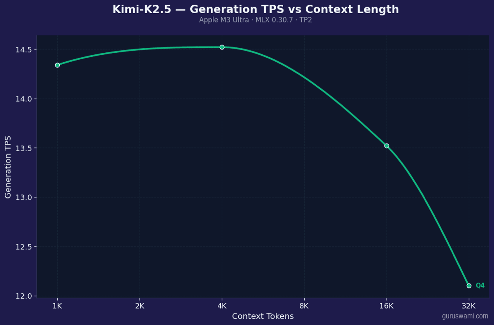
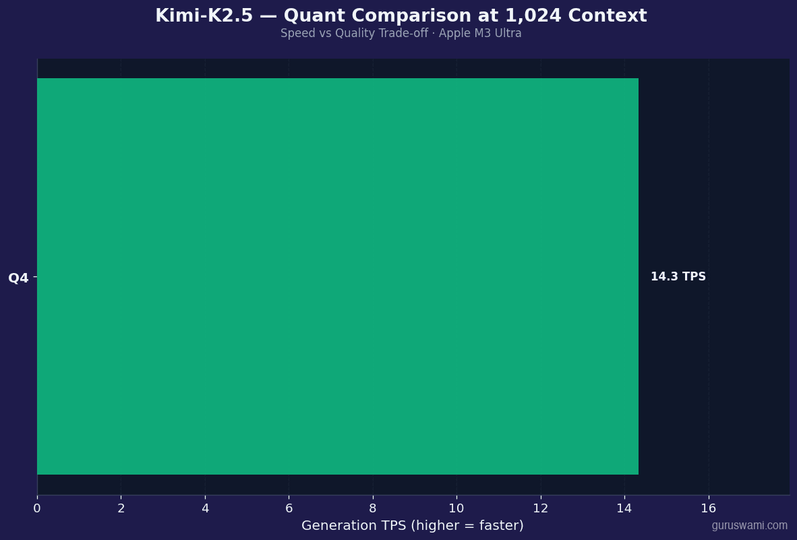
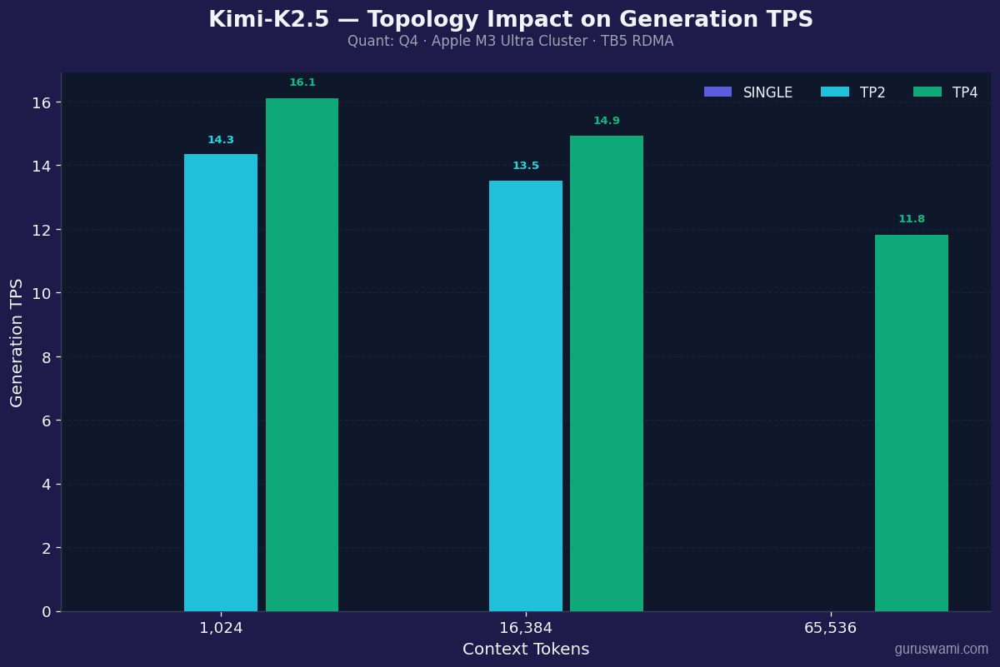
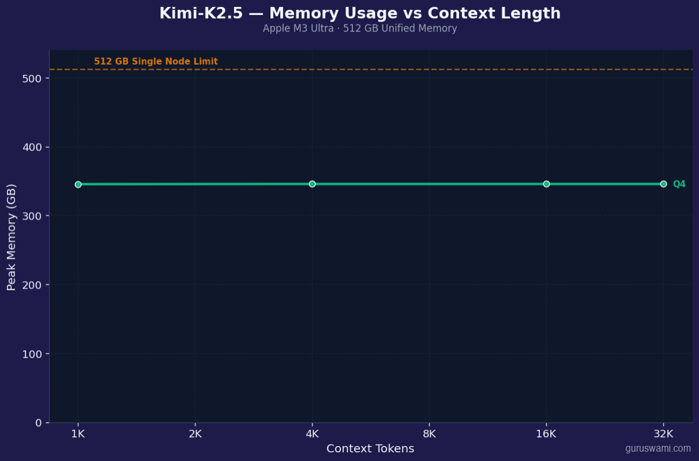
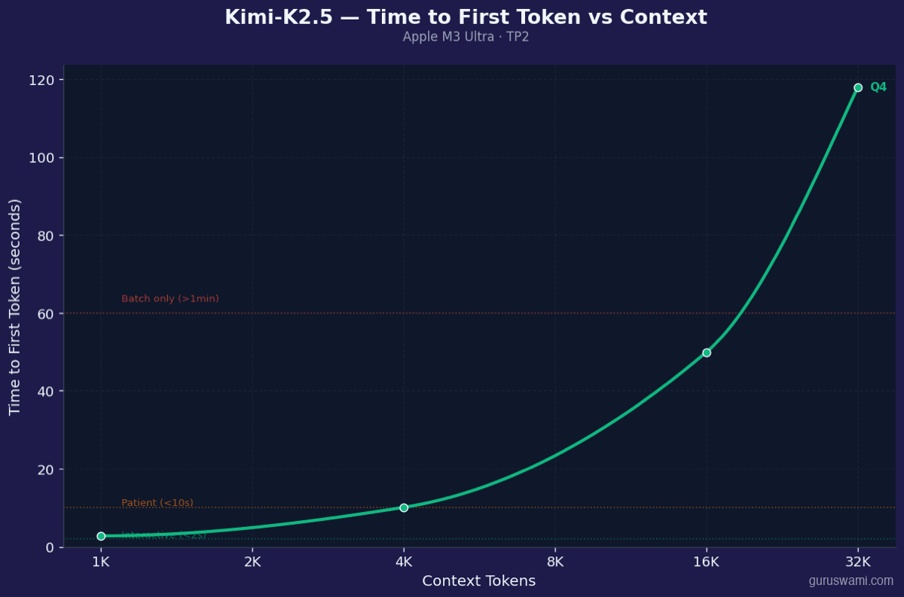
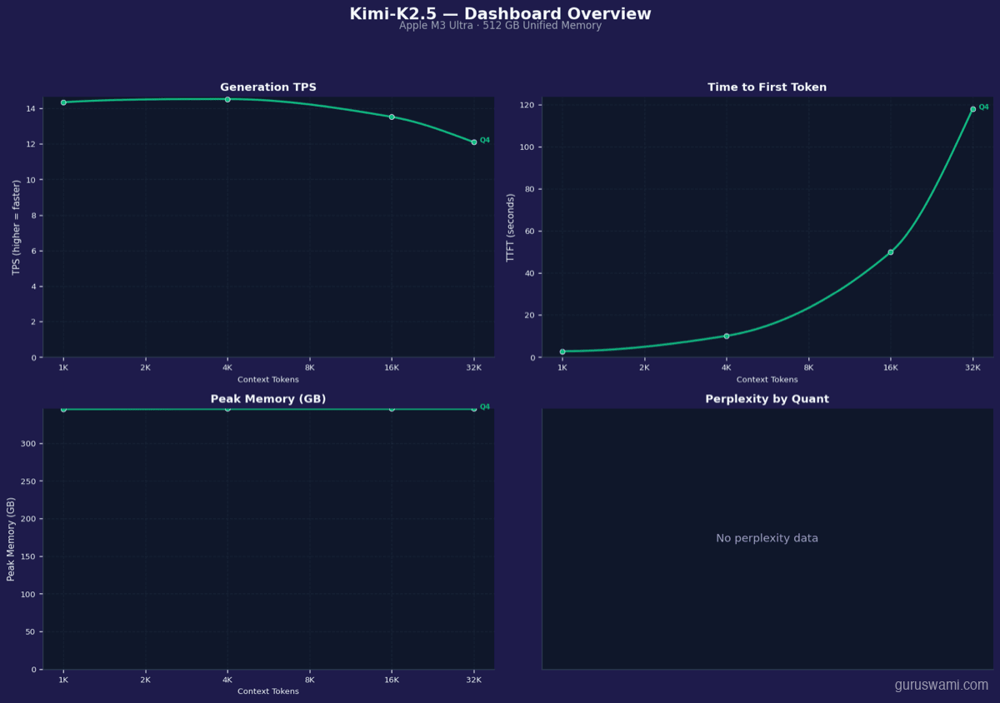

# Kimi K2.5

| Spec | Value |
|------|-------|
| Parameters | 1T+ (32B active) |
| Architecture | MoE + MLA |
| Category | Reasoning |

**Raw data:** [benchmark CSV](../../../results/kimi-k2.5/benchmark-results.csv)

---

## Generation TPS vs Context Length

## Quantisation Comparison

## Topology Comparison (SINGLE vs TP vs PP)

## Peak Memory vs Context Length

## Time to First Token vs Context Length

## Dashboard Overview

