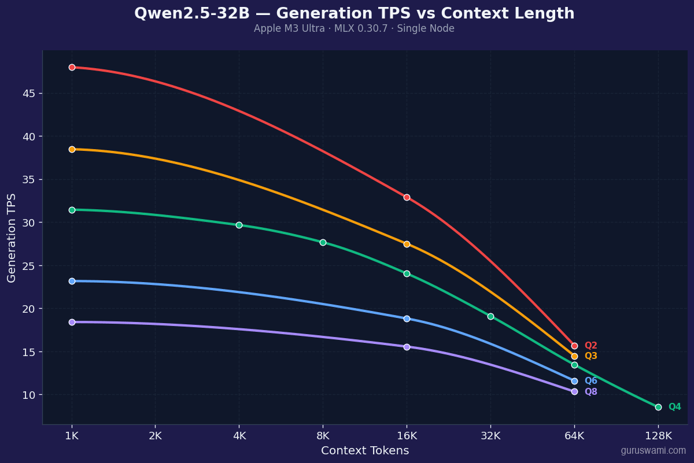
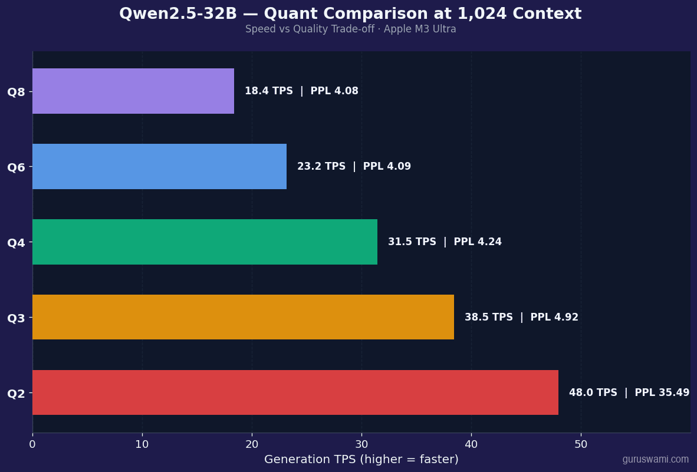
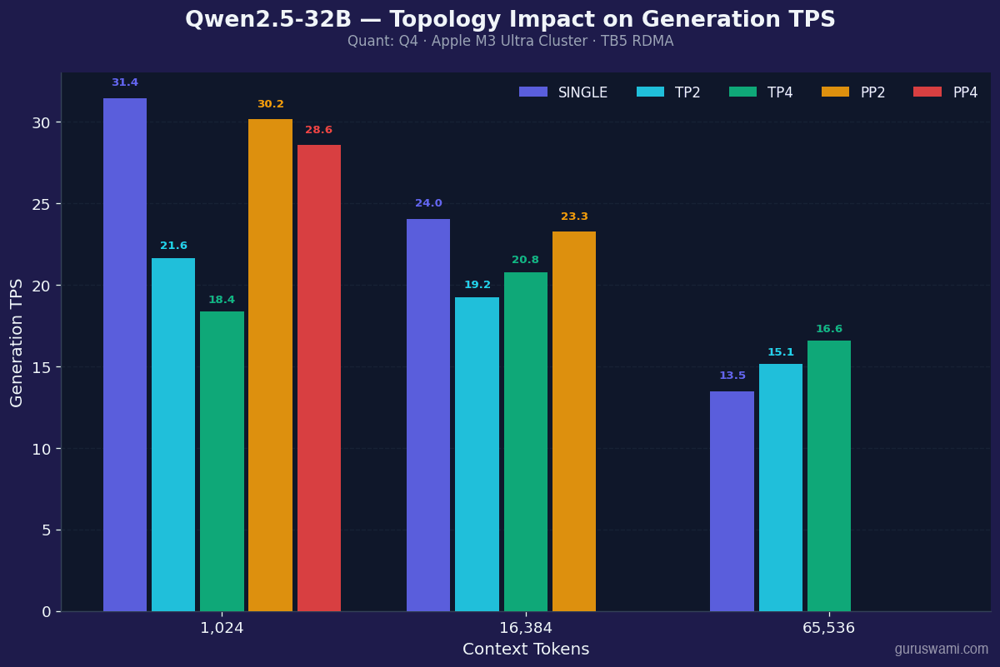
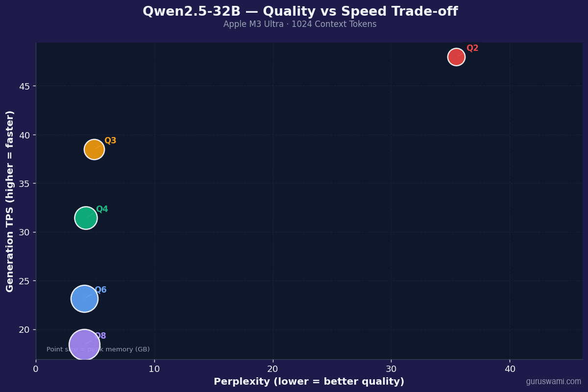
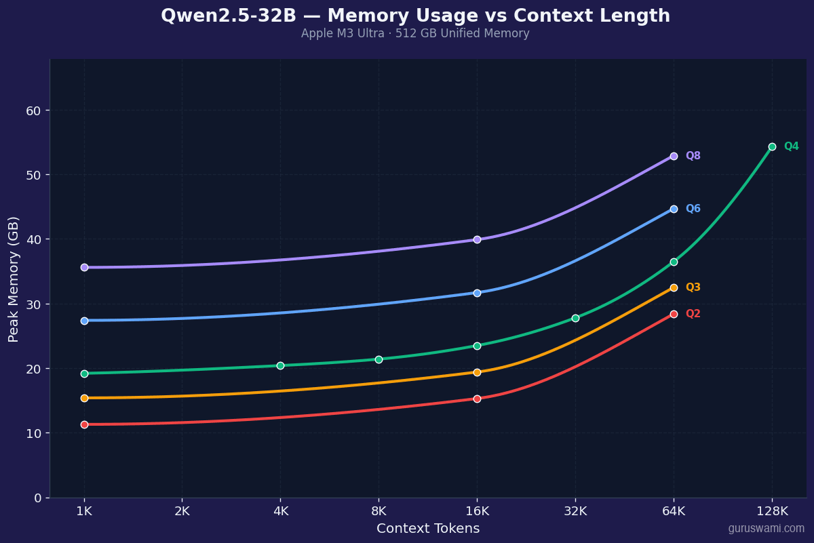
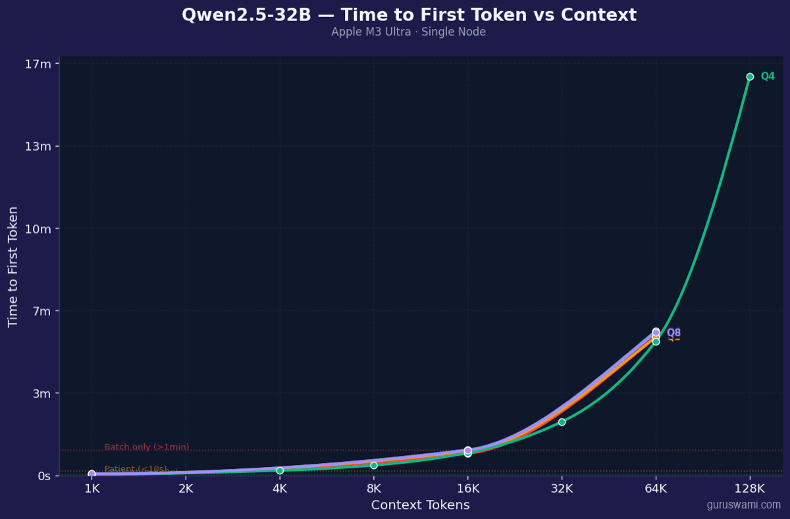
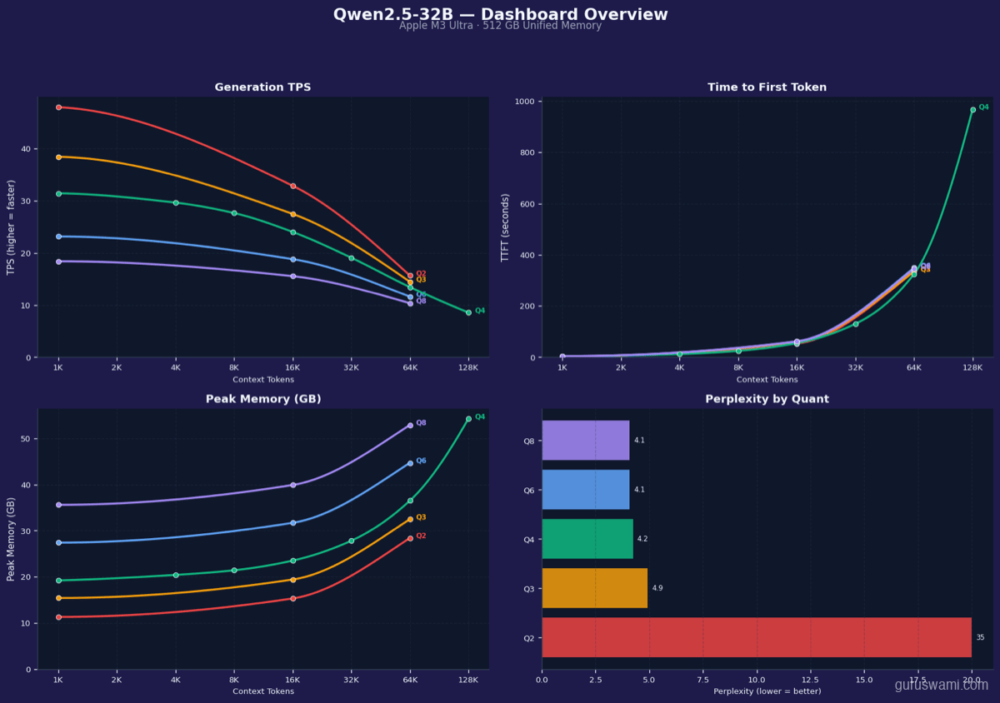

# Qwen 2.5 32B Instruct

| Spec | Value |
|------|-------|
| Parameters | 32B |
| Architecture | Dense |
| Category | Coding |

**Raw data:** [benchmark CSV](../../../results/qwen25-32b/benchmark-results.csv) | [perplexity CSV](../../../results/qwen25-32b/perplexity-results.csv)

---

## Generation TPS vs Context Length

## Quantisation Comparison

## Topology Comparison (SINGLE vs TP vs PP)

## Perplexity vs Generation Speed

## Peak Memory vs Context Length

## Time to First Token vs Context Length

## Dashboard Overview

