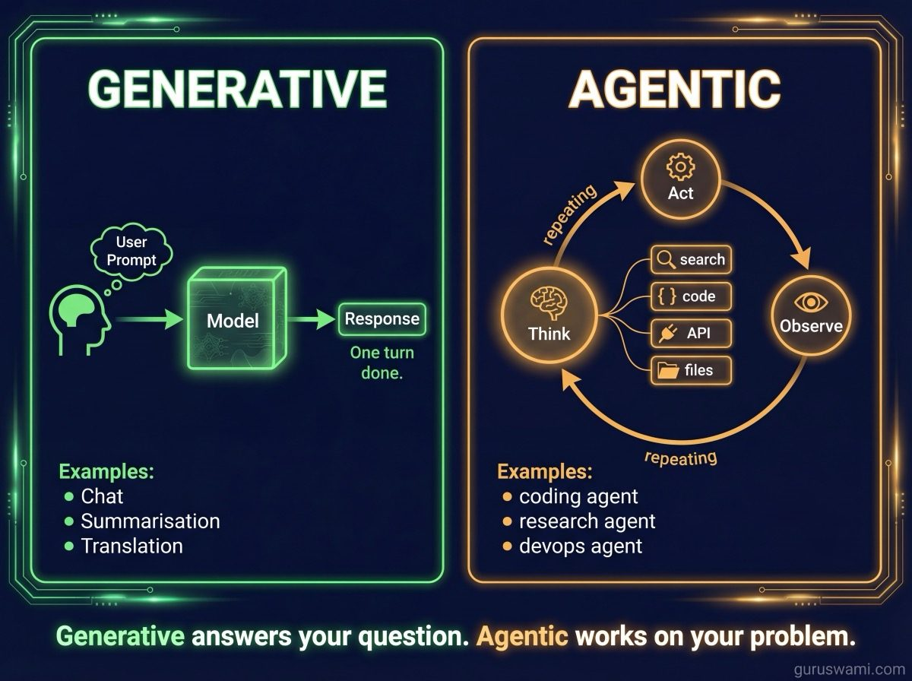
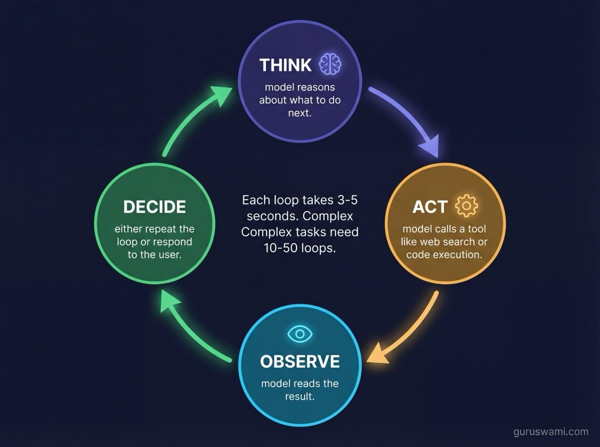
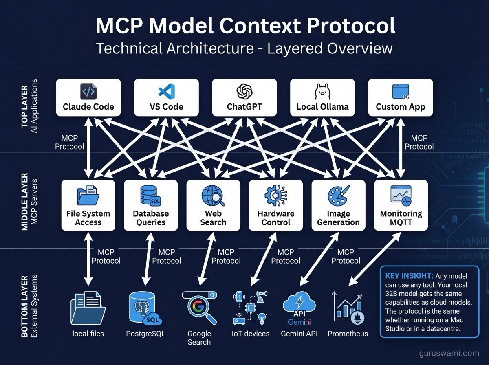

# Agentic vs Generative: Two Ways to Use a Model



## Generative: The Model Talks

Most people start here. You type a prompt, the model generates text. A conversation. A summary. A code snippet. The model produces output and you decide what to do with it.

Generative inference is a single turn: prompt in, response out. The model has no memory between conversations (unless you manually include prior context in the prompt). It does not take actions. It does not check its own work. It does not decide what to do next.

**Examples of generative use:**
- Chat (ask a question, get an answer)
- Summarisation (give it text, get a summary)
- Translation (give it English, get French)
- Code generation (describe what you want, get code)
- Creative writing (give it a prompt, get a story)

**What determines performance:** TPS (how fast you get the response) and TTFT (how long before it starts). These are the metrics this benchmark project measures.

---

## Agentic: The Model Acts



Agentic systems give the model the ability to take actions, observe results, and decide what to do next. The model is not just generating text - it is operating in a loop: think → act → observe → think again.

**The fundamental difference:** a generative model answers your question. An agentic model works on your problem.

**The agent loop:**
1. **Think** - the model reasons about what to do next
2. **Act** - the model calls a tool (search, code execution, file read, API call)
3. **Observe** - the model reads the result
4. **Repeat** until the task is complete or the model decides it needs your input

**Examples of agentic use:**
- A coding agent that reads your codebase, writes code, runs tests, fixes failures, and commits
- A research agent that searches the web, reads papers, synthesises findings, and writes a report
- A data analysis agent that queries databases, generates charts, and explains patterns
- A DevOps agent that checks cluster health, diagnoses issues, and applies fixes
- An automation agent that monitors systems, detects anomalies, and takes corrective action

---

## Why This Matters for Inference

Agentic use changes what you need from your hardware:

| Metric | Generative | Agentic |
|--------|-----------|---------|
| **TPS** | Higher is better (faster responses) | Less critical (model spends time "thinking" between actions) |
| **TTFT** | Matters for feel | Critical (every tool call adds a TTFT cycle) |
| **Context length** | Moderate (conversation history) | Large (accumulates tool results, observations, reasoning traces) |
| **Uptime** | Per-session | Continuous (agent may run for hours) |
| **Concurrency** | Usually one user | Often multiple agents running simultaneously |

An agentic system makes 10-50 model calls per task instead of one. Each call processes a growing context (the agent's accumulated observations and reasoning). TTFT compounds: 10 calls at 3 seconds TTFT each means 30 seconds of just "thinking" time. This is where prompt TPS and context efficiency matter more than raw generation speed.

---

## Tool Calling: The Bridge Between Generative and Agentic

Tool calling is what turns a generative model into an agent. The model is trained to recognise when it should call an external function and to format the call correctly.

```
User: What is the weather in Sydney?

Model (without tools): I don't have access to real-time weather data.

Model (with tools): <tool_call>{"name": "get_weather", "arguments": {"city": "Sydney"}}</tool_call>

[System executes get_weather("Sydney") → {"temp": 22, "condition": "Partly cloudy"}]

Model: It's 22°C and partly cloudy in Sydney.
```

The model did not "know" the weather. It knew to call a tool, received the result, and incorporated it into its response. This pattern scales to any external capability: web search, code execution, database queries, API calls, hardware control.

---

## MCP (Model Context Protocol)



MCP is a standard for connecting models to tools and data sources. Instead of every application implementing its own tool-calling format, MCP provides a common protocol.

**The problem MCP solves:** every AI tool (VS Code, Claude, ChatGPT, local inference apps) has its own way of connecting to external tools. A tool written for one does not work with another. MCP standardises this.

**How it works:**
- **MCP Servers** expose tools and resources (file system access, database queries, web search, hardware control)
- **MCP Clients** (the AI application) discover and call tools via the protocol
- The model sees a list of available tools and uses standard tool-calling to invoke them

**Example:** Our cluster uses MCP servers that expose hardware monitoring (MQTT metrics), image generation (Gemini API), display control (e-ink and split-flap displays), and cluster management. Claude Code connects to these via MCP and can check node temperatures, generate infographics, or display status messages without custom integration code.

**Why this matters for local inference:** MCP means your local model (running on Ollama, mlx-lm, or llama.cpp) can access the same tools as cloud models. Your 32B model running on a Mac Studio can search the web, query your database, read your files, and control your hardware through MCP servers - the same way Claude or GPT-4 does through their respective tool systems.

---

## Programmatic Model Integration

Chat GUIs are how most people start, but they are not how models get deployed. In practice, models are accessed programmatically:

### OpenAI-Compatible APIs

Most local inference tools expose an OpenAI-compatible API:

```python
from openai import OpenAI

# Connect to a local model (mlx-lm, Ollama, llama.cpp, vLLM)
client = OpenAI(base_url="http://localhost:8080/v1", api_key="unused")

response = client.chat.completions.create(
    model="qwen2.5-32b-instruct",
    messages=[{"role": "user", "content": "Explain RDMA in one paragraph"}],
    temperature=0.3,
)
print(response.choices[0].message.content)
```

This same code works with OpenAI's API, Anthropic's API (via adapter), local Ollama, local mlx-lm server, or any other OpenAI-compatible endpoint. Switch the `base_url` and the code works everywhere. This is why the OpenAI API format became a de facto standard.

### Tool Calling in Code

```python
tools = [{
    "type": "function",
    "function": {
        "name": "search_documents",
        "description": "Search internal documents by query",
        "parameters": {
            "type": "object",
            "properties": {
                "query": {"type": "string", "description": "Search query"},
                "limit": {"type": "integer", "description": "Max results"}
            },
            "required": ["query"]
        }
    }
}]

response = client.chat.completions.create(
    model="qwen2.5-32b-instruct",
    messages=[{"role": "user", "content": "Find our Q4 benchmark results for Llama 405B"}],
    tools=tools,
)
# Model returns a tool_call with {"query": "Q4 benchmark Llama 405B", "limit": 5}
```

### Structured Output

Modern models can generate JSON that matches a schema:

```python
response = client.chat.completions.create(
    model="qwen2.5-32b-instruct",
    messages=[{"role": "user", "content": "Extract: Llama 405B Q4 runs at 3.0 TPS on M3 Ultra"}],
    response_format={
        "type": "json_schema",
        "json_schema": {
            "name": "benchmark_result",
            "schema": {
                "type": "object",
                "properties": {
                    "model": {"type": "string"},
                    "quant": {"type": "string"},
                    "tps": {"type": "number"},
                    "hardware": {"type": "string"}
                }
            }
        }
    }
)
# Returns: {"model": "Llama 405B", "quant": "Q4", "tps": 3.0, "hardware": "M3 Ultra"}
```

This is how you build applications on top of models. Not by copying text from a chat window, but by having your code call the model, receive structured data, and act on it.

---

## Where This Is Going

The progression is clear:

1. **Chat** - you talk to a model (where most people are today)
2. **Tool calling** - the model can access external data and functions
3. **Agents** - the model operates autonomously in a loop (think → act → observe)
4. **Multi-agent systems** - multiple specialised models coordinating on complex tasks
5. **Autonomous systems** - agents monitoring, maintaining, and improving themselves

Local inference matters at every stage. The model running on your hardware can be a chat partner, a tool-calling assistant, an autonomous agent, or a node in a multi-agent system. The same hardware, the same model weights - just different orchestration. Understanding the inference fundamentals (TPS, TTFT, context, memory) helps at every level because those constraints shape what is practical at each stage.
