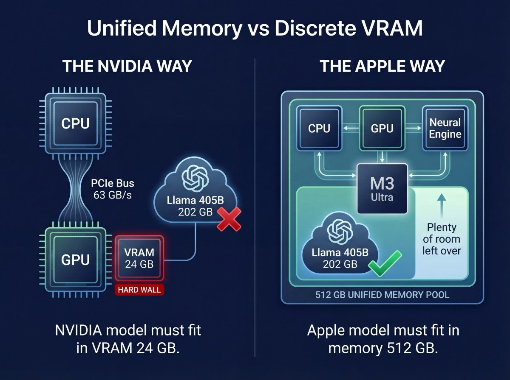

# Apple Silicon and MLX: The Unified Memory Advantage

## Why a Laptop Chip Runs Models That Need Datacentre Hardware

The M3 Ultra is not a GPU. It is not a CPU. It is a system-on-chip where CPU, GPU, and Neural Engine all share the same physical memory pool. When Apple says "512 GB unified memory," they mean every byte is accessible to every processor on the die, with no copies, no transfers, and no PCIe bus sitting between the model and the compute.

This architectural choice, made for completely unrelated reasons (power efficiency in laptops and creative workstations), turns out to be the single most important feature for LLM inference. The model loads once. The GPU reads it directly. There is no VRAM wall.

A 405 billion parameter model at Q4 occupies 202 GB. On NVIDIA, this requires 8 GPUs, each holding a shard in its own VRAM, communicating over NVLink, managed by a complex distributed framework, consuming 5,600 watts. On an M3 Ultra, it loads into memory like opening a file. One machine. 155 watts.

---

## Unified Memory vs Discrete VRAM



### The NVIDIA Way

Every NVIDIA GPU has its own dedicated VRAM, completely separate from system RAM. When you want to run a model:

1. Model weights load from disk into system RAM
2. System RAM copies weights across the PCIe bus into GPU VRAM
3. The GPU reads weights from VRAM to do computation
4. Results copy back across PCIe to system RAM

If the model does not fit in VRAM, it does not run at full speed. You either quantise it smaller, split it across multiple GPUs (each with their own VRAM, connected by NVLink or PCIe), or offload parts to system RAM at a 10× speed penalty.

The RTX 4090 has 24 GB of VRAM. The total model, KV cache, and framework overhead must fit in those 24 GB. That is a hard wall. There is no "just add more RAM."

### The Apple Way

There is no VRAM. There is no system RAM. There is one pool of memory, accessible to everything.

1. Model weights load from disk into memory
2. The GPU reads them. Done.

No copies. No bus. No wall. The M3 Ultra has 512 GB of this memory. A 380 GB model (DeepSeek V3 at Q4) loads and runs. A 202 GB model (Llama 405B at Q4) loads and runs with 300 GB left over for KV cache. A 614 GB model (Kimi K2.5) does not fit on one node, but fits comfortably across two.

### The Speed Trade-off

There is a catch. NVIDIA's VRAM is faster. An RTX 5090 delivers 1,792 GB/s of memory bandwidth. An M3 Ultra delivers 819 GB/s. For models that fit in VRAM, NVIDIA is 2× faster at generation.

But "models that fit in VRAM" is the constraint that changes everything. At 24-32 GB of VRAM, you are limited to ~32B parameter models at Q4. The M3 Ultra runs models 12× larger on a single machine. Models that would need $200,000+ of NVIDIA enterprise hardware.

| Model | Size at Q4 | RTX 5090 (32 GB) | M3 Ultra (512 GB) |
|-------|-----------|------------------|-------------------|
| Llama 8B | 4.5 GB | 275 TPS | 120 TPS |
| Qwen 32B | 19 GB | ~40 TPS | 31.5 TPS |
| Llama 405B | 202 GB | Does not fit | 3.0 TPS |
| DeepSeek V3 | 380 GB | Does not fit | 20.2 TPS |
| Kimi K2.5 | 614 GB | Does not fit | 16 TPS (TP2) |

The 5090 wins every race it can enter. The M3 Ultra enters races the 5090 cannot.

---

## MLX: Apple's ML Framework

MLX is to Apple Silicon what CUDA is to NVIDIA. It is the software that tells the hardware how to run models.

### What Makes MLX Different

**Lazy evaluation.** MLX does not compute anything until the result is needed. This lets it fuse operations, eliminate unnecessary copies, and schedule work efficiently. You write simple code; MLX figures out the fast way to execute it.

**Unified memory is not just marketing.** In PyTorch on NVIDIA, you explicitly move tensors between CPU and GPU with `.to('cuda')` and `.to('cpu')`. In MLX, there is no concept of "moving" data. Every array lives in the same memory space, accessible to every processor. The code is simpler and the execution is faster because there are zero copies.

**NumPy-like API.** If you know NumPy, you know MLX. The syntax is nearly identical. The learning curve for the framework is shallow even if the concepts it enables are deep.

### mlx-lm: The Model Runner

mlx-lm is the inference engine built on MLX. It handles model loading, quantisation, tokenisation, and generation. The key commands:

```bash
# Run a model interactively
mlx_lm.generate --model mlx-community/Llama-3.1-8B-Instruct-4bit \
    --prompt "Explain unified memory"

# Benchmark a model
mlx_lm.benchmark --model /path/to/model \
    --prompt-tokens 4096 --generation-tokens 100 --num-trials 3

# Start an OpenAI-compatible API server
mlx_lm.server --model mlx-community/Qwen2.5-32B-Instruct-4bit --port 8080

# Measure model quality
mlx_lm.perplexity --model /path/to/model \
    --data-path wikitext --num-samples 256

# Quantise a model yourself
mlx_lm.convert --hf-path meta-llama/Llama-3.1-8B-Instruct -q 4 \
    --mlx-path ./llama-8b-q4
```

### What You Can Learn on MLX That NVIDIA Cannot Teach

**Bandwidth-limited inference.** On NVIDIA, small models are often compute-limited because the GPU has massive FLOPS relative to VRAM bandwidth. On Apple Silicon, single-node inference is almost purely bandwidth-limited. The formula `TPS = bandwidth / model_size` predicts measured results within 5%. This clarity lets you build intuition about the fundamental relationship between memory speed and generation speed, without compute bottlenecks muddying the picture.

**Large model behaviour.** Running a 405B model teaches you things a 7B model cannot. How KV cache grows at scale. Why TTFT becomes impractical at long context. How attention heads affect sharding. These lessons require models that exceed NVIDIA VRAM, which means they require Apple Silicon (or very expensive enterprise hardware).

**Model fine-tuning.** MLX supports LoRA and QLoRA fine-tuning. With 512 GB of memory, you can fine-tune models that would not fit on any consumer NVIDIA GPU. A 32B model fine-tune on a 4090 requires aggressive quantisation and gradient checkpointing. On an M3 Ultra, it fits with room to spare.

---

## Building a Cluster: Thunderbolt 5 Supercomputing

### The Idea

When a model does not fit on one M3 Ultra (512 GB), you connect two, four, or five of them. Each node contributes its memory and compute. The model splits across nodes, and they coordinate to run inference together.

This is conceptually identical to what happens in an H100 cluster with NVLink. The scale is different. The cost is very different.

| Cluster | Total memory | Interconnect | Cost | Power |
|---------|-------------|-------------|------|-------|
| 5× Mac Studio M3 Ultra | 2.56 TB | TB5 RDMA (5.3 GB/s) | ~$40,000 | ~775W |
| 4× H100 SXM (DGX) | 320 GB HBM3 | NVLink (900 GB/s) | ~$150,000+ | ~2,800W |
| 8× H100 SXM (DGX) | 640 GB HBM3 | NVLink (900 GB/s) | ~$300,000+ | ~5,600W |

The H100 cluster is 170× faster at interconnect and has faster per-GPU memory bandwidth. The Mac Studio cluster has 4-8× more total memory and costs 4-8× less. Different tools for different problems.

### Physical Setup

Thunderbolt 5 cables. That is it. Each Mac Studio has six TB5 ports. You connect nodes with standard TB5 cables (the same ones you would use for a display or external drive). No special networking hardware. No rack switches. No fibre channel.

A two-node cluster is two Mac Studios and one cable. A five-node cluster is five Mac Studios and enough cables to form a mesh.

### Topologies: Ring vs Mesh

**Ring topology.** Each node connects to its two neighbours. Data travels around the ring. Simple cabling, but communication between distant nodes requires multiple hops.

```
Node A ←→ Node B ←→ Node C ←→ Node D ←→ Node A
```

**Mesh topology.** Every node connects directly to every other node. No hops, fastest communication, but requires more cables and uses more TB5 ports.

```
     Node A
    / | \  \
Node B  Node C
    \ | /  /
     Node D
```

Our cluster uses a mesh topology with direct TB5 connections between all 5 compute nodes. This minimises latency for the all-reduce operations in tensor parallelism, where every node needs to communicate with every other node after every transformer layer.

---

## RDMA and JACCL: Telepathy Between Nodes

### What RDMA Does

Normal network communication is slow because it goes through layers of software. Your application sends data to the operating system, which puts it in a network buffer, which sends it through the TCP/IP stack, which goes through the network driver, which sends it over the wire, and the other side does everything in reverse.

RDMA (Remote Direct Memory Access) skips all of that. One node writes directly into another node's memory. No operating system involvement. No CPU involvement. No network stack. The data moves from memory to memory via the hardware, as if both nodes were reading the same RAM.

This is not a metaphor. RDMA literally maps remote memory into local address space. When node A does an all-reduce with node B, the result appears in node B's memory without node B's CPU ever being interrupted. The GPU on node B can read the result the moment it arrives. Zero-copy. Zero-overhead.

### JACCL: Apple's RDMA Stack

JACCL (Just Another Communication and Computation Library) is Apple's implementation of distributed communication primitives over Thunderbolt 5 RDMA. It provides the operations distributed inference needs:

- **all-reduce** - every node contributes a value, every node gets the sum. Used after every transformer layer in tensor parallelism.
- **send/recv** - one node sends data to another. Used at pipeline boundaries in pipeline parallelism.
- **broadcast** - one node sends data to all others. Used for model distribution.

JACCL uses the `AppleThunderboltRDMA` kernel extension to establish protection domains, map remote memory, and perform DMA transfers. At 5.3 GB/s sustained per TB5 link, a 614 GB model (Kimi K2.5) broadcasts to 4 nodes in 2 minutes.

### Why This Matters for Learning

RDMA and distributed inference are concepts that normally require enterprise hardware to experience. InfiniBand cards cost thousands. NVLink is only available on enterprise NVIDIA GPUs. Ethernet-based distributed training works but is painfully slow for inference.

Thunderbolt 5 RDMA on Mac Studios lets you experiment with distributed inference at consumer prices. The concepts are identical to what happens in a datacentre:

- **Communication overhead compounds.** More nodes = more sync points = more time spent communicating instead of computing. Seeing your 32B model run 42% slower on 4 nodes than on 1 node teaches this instantly.
- **Bandwidth amortisation.** Larger model shards per node amortise sync costs better. Q8 on TP2 retains 93% of single-node speed. Q2 on TP2 retains only 52%. Same hardware, same interconnect - the difference is purely how much useful work each node does between syncs.
- **Topology selection matters.** TP trades generation speed for prompt speed. PP preserves generation speed but does not help with compute. Choosing the wrong topology is expensive. Better to learn that on hardware you own than on cloud hardware you rent.

---

## What Apple Silicon Is Not

### Not a Datacentre Replacement

An H100 cluster with NVLink runs Llama 405B at 50+ TPS. An M3 Ultra cluster runs it at 6.4 TPS (TP4). The H100 is 8× faster because NVLink delivers 170× the interconnect bandwidth of Thunderbolt 5. For production serving at scale, enterprise hardware wins on throughput.

### Not Optimised for Training

Apple Silicon can fine-tune models (LoRA, QLoRA). It cannot compete with NVIDIA for full pre-training. The GPU compute (28 TFLOPS FP16 on M3 Ultra vs 990 TFLOPS on H100) is 35× slower. Training is compute-bound. Inference is memory-bandwidth-bound. Apple Silicon is designed for the second problem.

### Not Cheap (But Cheaper Than the Alternative)

A Mac Studio M3 Ultra with 512 GB costs ~$8,000. Five of them cost ~$40,000. This is not pocket money. But the alternative for running models above 400B parameters is enterprise NVIDIA hardware at $150,000-$300,000, plus the power infrastructure, cooling, and datacentre space to house it. The Mac Studio sits on a desk, plugs into a standard outlet, and draws 155 watts.

---

## The Practical Path

1. **Start on NVIDIA** if you have a gaming GPU. Learn quantisation, context, and perplexity on models up to 32B.

2. **Move to a single M3 Ultra** when you outgrow VRAM. Run 405B models. Run DeepSeek V3. Experience bandwidth-limited inference in its purest form. Understand why the formula `TPS = bandwidth / model_size` is not an approximation but a law.

3. **Build a cluster** when you want to understand distributed inference. Two nodes and a TB5 cable is enough to learn tensor parallelism. Four nodes lets you run a trillion-parameter model at interactive speeds.

4. **Go to cloud** when you need production throughput. By this point, you understand every variable that determines cost, speed, and quality. You will make better procurement decisions than someone who skipped straight to the API.

The hardware is a tool for building understanding. The understanding is what has lasting value.
