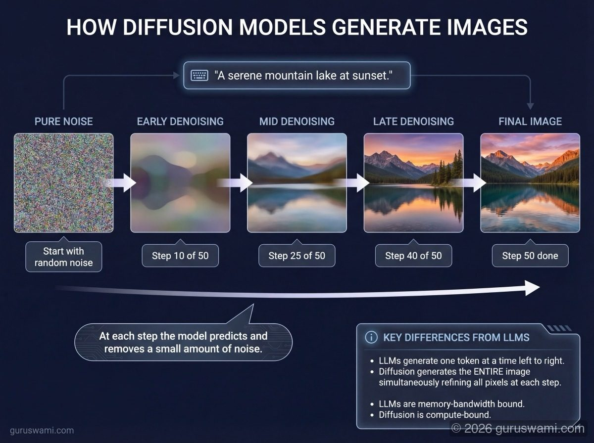
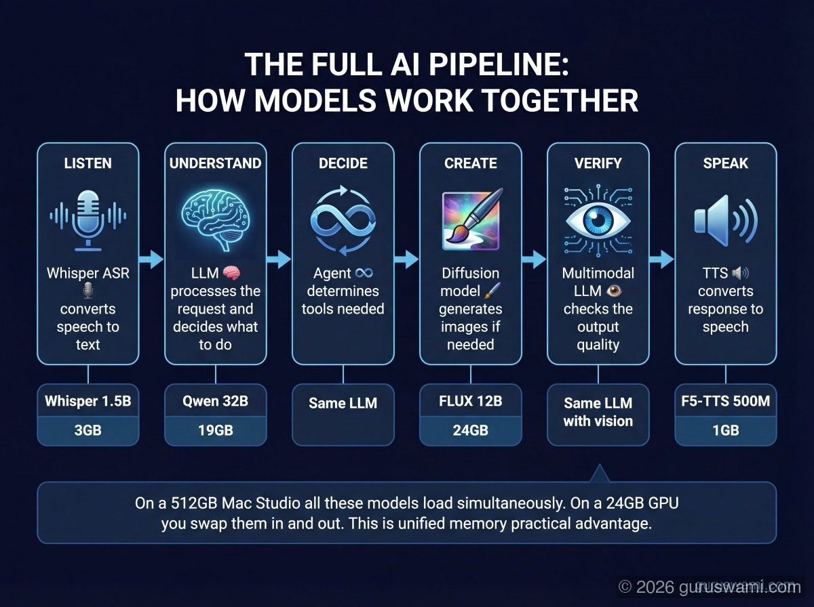

# Beyond Text: Diffusion Models, Image Generation, and Emerging Architectures

LLMs generate text one token at a time. But the transformer architecture and its descendants power far more than language. This guide covers the model types that are not LLMs but are increasingly part of the same ecosystem.

---

## Diffusion Models (Image Generation)

### How They Work

Diffusion models learn to remove noise from images. During training, the model sees millions of images with progressively more noise added, and learns to reverse the process. During generation, you start with pure random noise and the model iteratively denoises it into a coherent image, guided by your text prompt.

Fundamentally different from LLMs. An LLM generates one token at a time, left to right. A diffusion model generates the entire image simultaneously, refining it over 20-50 "steps" from noise to clarity.

### The Key Models

| Model | Creator | Parameters | Key feature |
|-------|---------|-----------|-------------|
| **Stable Diffusion 3.5** | Stability AI | 8B | Open weights, runs locally |
| **FLUX.1** | Black Forest Labs | 12B | State of the art open source |
| **DALL-E 3** | OpenAI | Unknown | Integrated with ChatGPT |
| **Midjourney** | Midjourney | Unknown | Discord-based, artistic style |
| **Imagen 3/4** | Google | Unknown | API access, highest quality |
| **Firefly** | Adobe | Unknown | Commercial use, Photoshop integration |

### Running Diffusion Models Locally

Diffusion models are compute-bound, not memory-bound (the opposite of LLM inference). A single image generation takes 5-30 seconds of sustained GPU computation. VRAM requirements are moderate: Stable Diffusion XL runs in 8 GB, FLUX.1 needs 12-16 GB.

**Common tools:**
- **ComfyUI** - node-based workflow editor. The most flexible option.
- **Automatic1111 / Forge** - web UI with extensive plugin ecosystem.
- **diffusers** (Hugging Face) - Python library for programmatic access.
- **Draw Things** - native macOS/iOS app using MLX and Core ML.

**Apple Silicon advantage:** unified memory means you can run both an LLM and a diffusion model simultaneously. Generate an image with FLUX while chatting with Qwen 32B. On NVIDIA, each model competes for the same VRAM.

### How Diffusion Relates to LLM Inference

Diffusion models and LLMs are increasingly used together:

- **Image understanding:** multimodal LLMs analyse images that diffusion models create
- **Prompt enhancement:** LLMs write better prompts for diffusion models (this is what our Gemini infographic pipeline does)
- **Agentic image generation:** an agent decides what image to create, generates the prompt, calls the diffusion model, and evaluates the result
- **Training data:** diffusion models generate synthetic training data for LLMs and vice versa

The hardware requirements differ. LLMs are bandwidth-bound (bigger memory = bigger models). Diffusion models are compute-bound (more GPU cores = faster images). Apple Silicon's strength is memory; NVIDIA's strength is compute. For mixed workloads, Apple Silicon's unified memory lets you run both without VRAM conflicts.

---

## Text-to-Speech (TTS) Models

Models that convert text into natural-sounding speech.

**Examples:** Bark, XTTS, Piper, Coqui, Parler-TTS, F5-TTS

**How they work:** Most modern TTS models use a two-stage approach: a text-to-spectrogram model converts text into a mel spectrogram (a visual representation of audio frequencies), then a vocoder converts the spectrogram into actual audio waveforms.

**Running locally:** TTS models are small (100M-1B parameters) and fast. They run comfortably on any modern GPU or even on CPU. The quality gap between local and cloud TTS has narrowed dramatically.

**Relevance to inference:** voice-enabled AI assistants combine LLM inference (text generation) with TTS (speaking the output) and ASR (understanding speech input). The LLM is the bottleneck - TTS and ASR are fast enough to not matter.

---

## Speech-to-Text / ASR (Automatic Speech Recognition)

Models that convert spoken audio into text.

**Examples:** Whisper (OpenAI), Distil-Whisper, Canary, Parakeet

**Running locally:** Whisper runs on everything and transcribes faster than real-time on modern hardware. `whisper.cpp` is the llama.cpp equivalent for speech recognition.

**Relevance to inference:** ASR turns spoken questions into text prompts. The LLM generates a text response. TTS speaks it. This is how voice assistants work. The inference pipeline is: ASR → LLM → TTS. Each step has its own latency, but the LLM generation (TPS and TTFT) dominates total response time.

---

## Video Generation Models

Models that generate video from text prompts or images.

**Examples:** Sora (OpenAI), Kling (Kuaishou), Runway Gen-3, Pika, Veo (Google)

**How they work:** Most use diffusion-based architectures adapted for temporal sequences. Instead of denoising a single image, they denoise a sequence of frames with temporal consistency constraints.

**Running locally:** Video generation is extremely compute-intensive. A single 5-second clip can take 10-60 minutes on consumer hardware. Most video generation happens in the cloud. Open-source options (Open-Sora, CogVideo) exist but require significant GPU resources.

**Relevance to inference:** video generation is the most compute-hungry AI workload. It makes LLM inference look trivial by comparison. A 405B model at 3 TPS generates useful text. Video generation at the same compute budget generates a few seconds of mediocre footage.

---

## Emerging Architectures

### State Space Models (SSMs) - Mamba

**What they are:** An alternative to transformers that processes sequences in linear time instead of quadratic. Mamba and its successors (Mamba-2, Jamba) replace the attention mechanism with a state space formulation.

**Why they matter:** Transformers have quadratic attention cost - processing 128K tokens costs 16× more compute than 32K tokens. SSMs scale linearly, making them potentially much faster at very long contexts.

**Current status:** Hybrid models (Jamba by AI21) combine SSM layers with attention layers. Pure SSM models have not matched transformer quality at scale. The architecture is promising but not yet dominant.

### Mixture of Depths

**What it is:** Some tokens in a sequence are "easy" (the model is very confident about the next token) and some are "hard" (the model needs full compute). Mixture of Depths lets the model skip layers for easy tokens and use all layers for hard tokens.

**Why it matters:** Potentially 2-3× faster inference on text that is partially predictable (most natural language). Hard tokens get full compute; easy tokens get a shortcut.

### Speculative Decoding

**What it is:** Use a small, fast "draft" model to generate several candidate tokens quickly, then use the large "target" model to verify them in a single forward pass. If the draft model guessed correctly (which it often does for common patterns), you get multiple tokens for the cost of one verification.

**Why it matters:** Can increase effective TPS by 2-3× without changing model quality. The target model always has the final say, so output is identical to running the target model alone.

**Running locally:** MLX supports speculative decoding. You need both models in memory simultaneously (draft + target), which is where unified memory helps.

### KV Cache Quantisation

**What it is:** Quantising the KV cache (attention keys and values stored during generation) from FP16 to INT8 or INT4. The model weights stay at their chosen quantisation; only the runtime cache is compressed.

**Why it matters:** At 64K context, Llama 405B's KV cache is 31.5 GB. Quantising it to INT4 shrinks this to ~8 GB. This extends practical context length without changing model quality (KV cache quantisation has minimal perplexity impact in practice).

**Current status:** MLX supports `--kv-bits` for KV cache quantisation. llama.cpp has similar support. The quality impact is actively being benchmarked.

---

## How These Fit Together

A modern AI system might use all of these:

1. **ASR** (Whisper) converts speech to text
2. **LLM** (Qwen 32B) processes the request, decides it needs an image
3. **LLM** writes an optimised prompt for the image
4. **Diffusion model** (FLUX) generates the image
5. **Multimodal LLM** evaluates whether the image matches the request
6. **TTS** (F5-TTS) speaks the response back to the user

On a Mac Studio with 512 GB unified memory, all of these models can be loaded simultaneously. On NVIDIA, you need to swap models in and out of VRAM or use multiple GPUs. This is unified memory's practical advantage: not just running one large model, but running an entire AI pipeline without memory conflicts.

The benchmarks in this project measure step 2 - the LLM inference that is usually the bottleneck. But understanding where LLMs sit in the broader AI stack helps you make better decisions about hardware, memory allocation, and system design.
