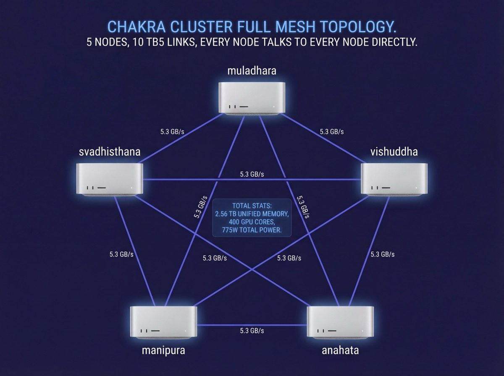
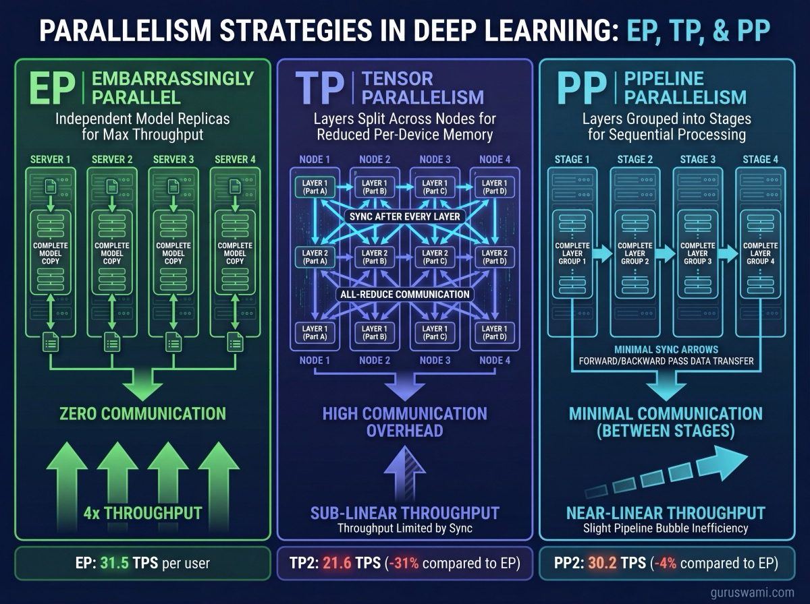
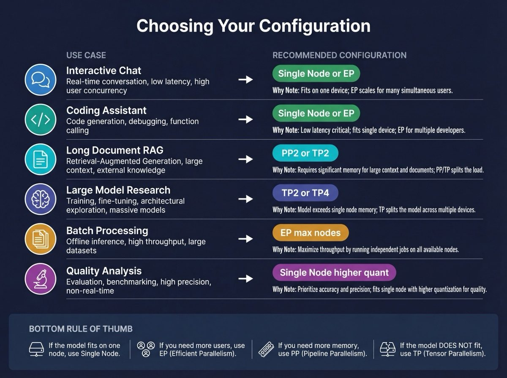

# The Chakra Cluster: Five Nodes, One Supercomputer

## What It Is

Five Mac Studio M3 Ultras connected by Thunderbolt 5 cables in a full mesh topology. 2.56 TB of unified memory. 400 GPU cores. 5 independent computers that operate as a single distributed inference engine.

Each node is identical: M3 Ultra, 512 GB unified memory, 80 GPU cores, 6 Thunderbolt 5 ports. The nodes are named after the seven chakras: `muladhara`, `svadhisthana`, `manipura`, `anahata`, `vishuddha` (5 compute nodes), with `ajna` and `sahasrara` running services (monitoring, orchestration, dashboards).

When a model is too large for 512 GB, or when you want faster prompt processing, the cluster splits the work. The 5 nodes can operate independently, in pairs, in groups of 4, or all together. The configuration depends on what you are trying to do.

---



## The Full Mesh Design

### Why Mesh, Not Ring

In a ring topology, each node connects to its two neighbours. If node A needs to talk to node C, the message travels through node B. Two hops. Double the latency.

In a full mesh, every node connects directly to every other node. A talks to C directly. No hops. This matters because tensor parallelism requires an all-reduce operation after every transformer layer. In a 126-layer model like Llama 405B, that is 126 synchronisation points per token generated. Each sync needs every node to communicate with every other node. On a ring, that means multi-hop messages. On a mesh, it is all direct.

### The Cabling

Each M3 Ultra has 6 Thunderbolt 5 ports. A 5-node full mesh requires 10 cables (every pair of nodes needs one direct connection). Each node uses 4 of its 6 ports for mesh connections, leaving 2 ports free for displays, storage, or additional connectivity.

```
            muladhara
           / |  \    \
          /  |   \    \
svadhisthana-+----manipura
          \  |   /    /
           \ |  /    /
            anahata--vishuddha
```

Each cable is a standard Thunderbolt 5 cable. No special networking equipment. No switches. No fibre. The same cable you would use to connect a monitor.

### Bandwidth

Each TB5 link sustains 5.3 GB/s of RDMA throughput. In a full mesh, every node has a direct 5.3 GB/s link to every other node. Total bisection bandwidth across the cluster is approximately 26.5 GB/s.

For comparison: a 4-node H100 DGX uses NVLink at 900 GB/s per GPU. The H100 interconnect is 170× faster per link. This is the fundamental trade-off: the Chakra cluster has 8× more memory but 170× less interconnect bandwidth. Inference tasks that are memory-capacity-limited (running models that do not fit on one node) favour Apple Silicon. Tasks that are communication-limited (small model shards with frequent syncs) favour NVIDIA.

---

## Configurations: How to Split Five Nodes



The cluster can operate in many configurations simultaneously or reconfigure between tasks. Here is every practical mode.

### EP (Embarrassingly Parallel) - Independent Copies

**What it does.** Each node runs its own independent copy of the model. No communication between nodes. EP4 means 4 independent copies serving 4 users simultaneously. The name comes from parallel computing: the tasks are so independent that splitting them requires no coordination at all.

**When to use it.** When the model fits on a single node and you want to serve multiple concurrent users. A 32B model at Q4 (19 GB) runs independently on each node. EP5 gives you 5× the throughput of a single node with zero communication overhead.

| Config | Nodes | Use case | Example |
|--------|-------|----------|---------|
| EP1 | 1 | Single user, max TPS | One person coding with Qwen 32B |
| EP2 | 2 | Two concurrent users | Two developers, independent sessions |
| EP3 | 3 | Small team | Three chat sessions simultaneously |
| EP4 | 4 | Team serving | Four RAG pipelines in parallel |
| EP5 | 5 | Maximum throughput | Production serving, 5 independent streams |

**TPS per user.** Identical to single-node. No penalty. The nodes do not talk to each other.

**Best for:** Chatbots, coding assistants, RAG pipelines, any workload where the model fits on one node and you need more users, not more speed.

### TP (Tensor Parallelism) - Split Every Layer

**What it does.** Splits every layer's weight matrices across nodes. Each node holds a slice of every layer, computes its portion, then all nodes synchronise via all-reduce. This happens for every layer, every token.

**When to use it.** When the model does not fit on one node, or when you need faster prompt processing (TTFT). TP is the only option for models above 400 GB.

| Config | Nodes | Memory per node | Sync points per token | Use case |
|--------|-------|----------------|----------------------|----------|
| TP2 | 2 | model/2 | layers × 1 all-reduce | Models 400-900 GB |
| TP4 | 4 | model/4 | layers × 1 all-reduce | Models 900 GB+, fast prompt |

**Generation TPS.** Slower than single-node for models that fit on one machine (communication overhead). Faster than single-node for models that do not fit (the only option).

**Prompt TPS.** Dramatically faster. TP4 gives 2-3× the prompt speed of single-node because all 4 nodes process the prompt simultaneously. Qwen 32B TP4 achieves 958 prompt TPS vs 289 single-node.

**The scaling catch.** TP efficiency depends on quantisation. Larger model shards per node amortise the sync cost better:

| Quant | Single TPS | TP2 TPS | Scaling |
|-------|-----------|---------|---------|
| Q8 | 18.4 | 17.0 | 93% |
| Q4 | 31.5 | 21.6 | 69% |
| Q2 | 48.0 | 25.0 | 52% |

Q8 on TP2 retains 93% of single-node speed. Q2 on TP2 retains only 52%. The lesson: do not distribute aggressively quantised models across many nodes. The communication overhead dominates.

**Best for:** Running Llama 405B, DeepSeek V3, Kimi K2.5. Long-context prompt processing where TTFT matters. Research on models above 400 GB.

### PP (Pipeline Parallelism) - Split by Layer Groups

**What it does.** Assigns whole layers to each node. Node 1 gets layers 0-31, node 2 gets layers 32-63. Activations pass between nodes at the boundaries. Only one sync point between each pair of adjacent nodes.

**When to use it.** When you want distributed memory without the generation speed penalty of TP. PP preserves nearly all single-node generation speed.

| Config | Nodes | Layers per node (32B, 64 layers) | Sync points per token | Use case |
|--------|-------|--------------------------------|----------------------|----------|
| PP2 | 2 | 32 | 1 | Memory reduction with minimal gen penalty |
| PP4 | 4 | 16 | 3 | Further memory reduction |

**Generation TPS.** Nearly identical to single-node. PP2 loses only 4% on Qwen 32B (30.2 vs 31.5 TPS). PP4 loses about 10%. The sync overhead is minimal because there are so few sync points.

**Prompt TPS.** PP helps at long context (PP2 at 16K: 538 prompt TPS vs 289 single-node). At short context, little benefit (PP2 at 1K: 339 vs 349).

**The hard limit.** Metal enforces a ~60-second GPU timeout on command buffers. If the layers assigned to one node take more than 60 seconds to process, the GPU crashes. Llama 405B PP2 puts 63 layers on each node and exceeds this timeout. PP is not viable for 405B-class dense models. Use TP instead.

**Best for:** Models in the 32-200B range where you want memory headroom for long context without sacrificing generation speed. Qwen 32B PP2 is the ideal configuration: 30.2 TPS generation with twice the context capacity.

---

## Choosing Your Configuration: A Practical Guide



### By Task

| Task | What matters most | Recommended config | Why |
|------|------------------|-------------------|-----|
| **Interactive chat** | Low TTFT, high gen TPS | Single node or EP | Fastest response, no overhead |
| **Coding assistant** | High gen TPS, moderate context | Single node or EP | Code completions need speed |
| **Long document RAG** | Large context window, accuracy | PP2 or TP2 | More memory for KV cache |
| **Research / exploration** | Running the largest models | TP2 or TP4 | Models above 400 GB |
| **Batch processing** | Total throughput | EP (max nodes) | Parallelise across copies |
| **Quality-sensitive analysis** | Accuracy over speed | Single node, higher quant | Q6/Q8 for best perplexity |

### By Model Size

| Model size (Q4) | Fits single node? | Recommended | Generation TPS |
|----------------|-------------------|-------------|----------------|
| 7B-14B (4-8 GB) | Easily | EP5 (5 copies) | 64-120 TPS each |
| 32B (19 GB) | Yes | Single or PP2 for long context | 31.5 TPS |
| 47B MoE (27 GB) | Yes | Single (MoE is fast) | 69 TPS |
| 405B (202 GB) | Yes (tight) | Single at short ctx, TP2 at long | 3.0 single, 4.3 TP2 |
| 671B MoE (380 GB) | Yes | Single (MoE, only 37B active) | 20.2 TPS |
| 1T MoE (614 GB) | No | TP2 minimum, TP4 preferred | 14.3 TP2, 16.1 TP4 |

### The Decision Flow

1. **Does the model fit on one node?** If yes, run single-node. Do not distribute. Distribution always adds overhead.
2. **Is it a dense model above 200B?** If yes, use TP. PP will timeout on Metal.
3. **Do you need longer context on a model that fits?** Use PP2. Doubles your memory budget with only 4% gen penalty.
4. **Do you need maximum prompt speed?** Use TP4. 3× faster prompt processing.
5. **Do you need to serve multiple users?** Use EP. Each user gets full single-node performance.

---

## Real Benchmarks by Configuration

### Kimi K2.5 (1T params, 614 GB, MoE)

The largest model we have run. Does not fit on one node.

| Config | Gen TPS | Prompt TPS (1K) | Memory/node | TTFT (1K) |
|--------|---------|-----------------|-------------|-----------|
| TP2 | 14.3 | 362 | 346 GB | 2.8s |
| TP4 | 16.1 | 555 | 187 GB | 1.8s |

16 TPS at TP4. Interactive speed on a trillion-parameter model. Four Mac Studios and some cables.

### Llama 405B (405B params, 202 GB, Dense)

The largest dense model. Fits on one node but benefits from distribution.

| Config | Gen TPS | Prompt TPS (1K) | TTFT (1K) | TTFT (16K) |
|--------|---------|-----------------|-----------|-----------|
| Single | 3.0 | 28 | 37s | 10 min |
| TP2 | 4.3 | 56 | 18s | 5 min |
| TP4 | 6.4 | 100 | 10s | 3 min |

TP4 doubles generation speed and cuts TTFT by 70%. Worth the 4 nodes for interactive use.

### Qwen 32B (32B params, 19 GB, Dense)

Fits easily on one node. Distribution helps prompt speed, hurts generation.

| Config | Gen TPS | Prompt TPS (1K) | Prompt TPS (16K) |
|--------|---------|-----------------|------------------|
| Single | 31.5 | 349 | 289 |
| PP2 | 30.2 (-4%) | 339 | 538 (+86%) |
| TP2 | 21.6 (-31%) | 577 (+65%) | 547 (+89%) |
| TP4 | 18.4 (-42%) | 912 (+161%) | 958 (+231%) |

If you want fast chat: single node. If you want to process 16K+ token documents fast: TP4 gives 3.3× the prompt speed.

### Mixtral 8x7B (47B MoE, 13B active)

MoE model that punches above its weight class.

| Config | Gen TPS | Prompt TPS (1K) |
|--------|---------|-----------------|
| Single | 69.1 | 740 |
| PP2 | 62.5 (-10%) | 720 |
| TP2 | 43.8 (-37%) | 1100 |

Single node is fastest for generation. 69 TPS is faster than most 7B dense models. MoE architecture means only 13B parameters are active, so the model reads like a small model but thinks like a large one.

---

## Operational Reality

### Mesh Setup

The TB5 RDMA mesh must be configured once after every boot. The `AppleThunderboltRDMA` kernel extension has a bug where reconfiguring corrupts ARP tables. Configure once, then leave it alone until the next reboot.

```bash
chakra-node mesh setup    # Configure RDMA mesh (once per boot)
chakra-node mesh verify   # Verify health (any time)
```

### RDMA Protection Domain Budget

Each RDMA operation (model broadcast, distributed inference run) allocates protection domains in the kernel. After 2-3 operations, the PD pool exhausts and RDMA fails. The only fix is rebooting.

Plan your workflow: boot → configure mesh → distribute models → run benchmarks → reboot when PDs exhaust.

### Model Distribution

Before running TP or PP, the model must exist on all participating nodes. `mlx_lm.share` broadcasts a model from one node to all others via RDMA at 5.3 GB/s.

```bash
# Broadcast Kimi K2.5 (614 GB) from muladhara to all nodes
# Takes ~2 minutes at 5.2 GB/s sustained
mlx_lm.share --model /opt/models/kimi-k2.5/Q4 --hostfile chakra-tp4.json
```

For large models (>400 GB), the broadcast should be the first RDMA operation after a clean boot. See [RDMA Failure Modes](RDMA_FAILURE_MODES.md) for the full list of constraints.

### Power and Thermals

| Config | Total power draw | Heat output | Noise |
|--------|-----------------|-------------|-------|
| 1 node idle | ~20W | Negligible | Silent |
| 1 node inference | ~155W | Warm | Fan audible |
| 5 nodes inference | ~775W | Warm office | Fans audible, not loud |
| 5 nodes sustained 24/7 | ~775W | Dedicated room | Consistent fan noise |

Compare: 4× RTX 4090 at sustained inference = 1,800W. 8× H100 SXM = 5,600W. The Chakra cluster draws less power than a single gaming rig with four GPUs.

---

## What You Learn Running a Cluster

Things you cannot learn from a single machine or from cloud APIs:

**Communication overhead is real and measurable.** Distributing Qwen 32B across 4 nodes makes generation 42% slower. You feel the overhead in TPS. This teaches you why cloud providers charge more for distributed inference and why model sizing matters.

**Topology selection is a genuine engineering decision.** PP preserves generation speed. TP accelerates prompts. EP maximises throughput. Choosing wrong costs 30-40% performance. This is the same decision faced by every team deploying models on cloud infrastructure.

**Quantisation and scaling interact.** Q8 on TP2 retains 93% of single-node speed. Q2 on TP2 retains 52%. The same model, the same hardware, the same topology - just different quantisation. Nobody publishes this interaction. You have to measure it.

**RDMA is fragile but fast.** 5.2 GB/s model distribution. Protection domain exhaustion after 3 operations. Mesh reconfiguration corruption. Silent transfer failures with misleading error messages. These are the same categories of problems that occur in InfiniBand clusters at 100× the scale. Learning them on $40K hardware is cheaper than learning them on $400K hardware.

**Models do not scale the way you expect.** A 1T parameter MoE model runs at 16 TPS because only 32B parameters activate per token. A 405B dense model runs at 3 TPS because every parameter activates. The bigger model is 5× faster. Model architecture matters more than parameter count, and you can only internalise this by running both.
