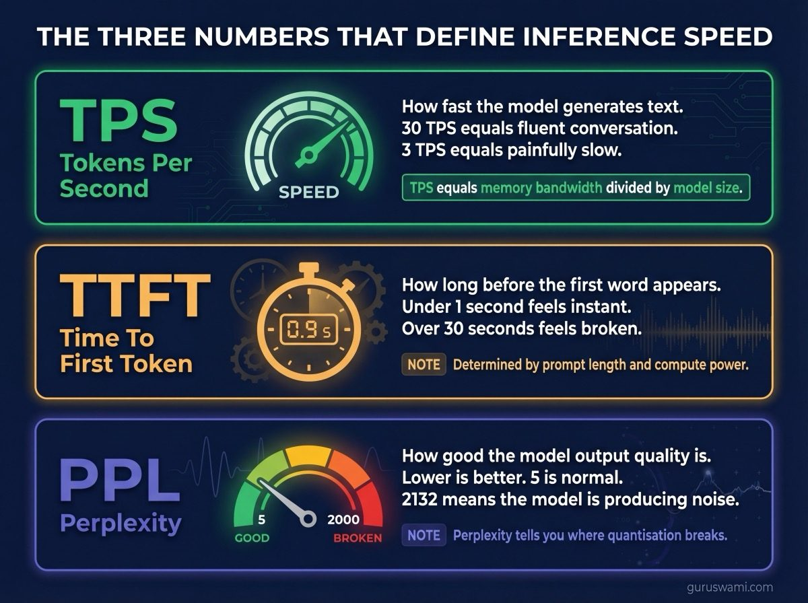
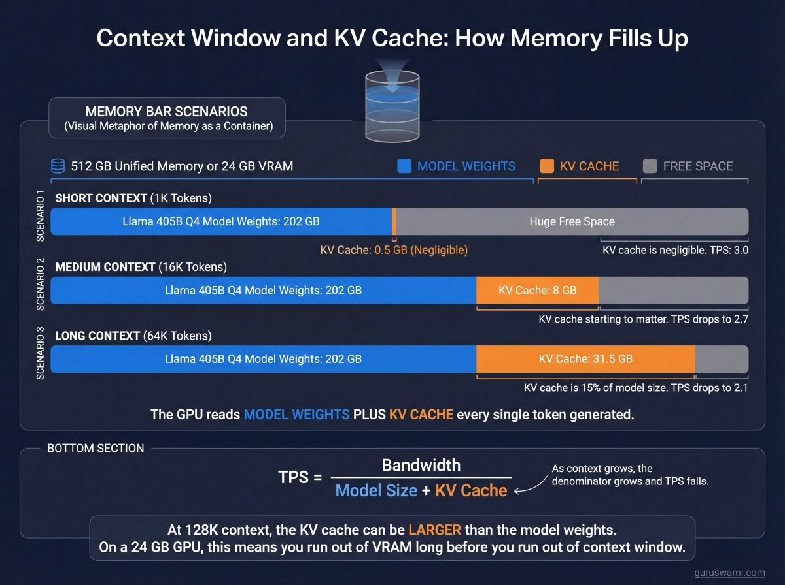
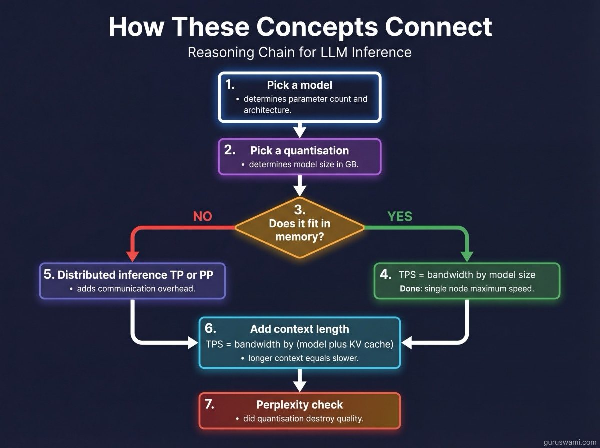

# Basic Concepts: What All These Letters Mean

If you have ever looked at a Hugging Face model card and seen something like `Qwen2.5-32B-Instruct-GGUF-Q4_K_M` and wondered what any of that means, start here.

LLM inference has its own language. The terms will become second nature once you understand the basics, and then you too can decode a string of random letters from a model repository, argue about whether dynamic quantisation is suboptimal for a MoE model, and nod knowingly when someone says "TTFT is dominated by KV cache pressure at 64K context." The learning curve is steep. These guides walk you through what matters.

**Deep dives:**
- [Quantisation](QUANTISATION.md) - F16 through Q1, which layers are never quantised, platform availability, hybrid approaches
- [Distributed Inference](DISTRIBUTED_INFERENCE.md) - TP, PP, EP explained with diagrams showing how models split across 2-5 nodes
- [Glossary](GLOSSARY.md) - quick reference for every term, temperature, file formats, decoding HuggingFace names

---

## The Three Numbers That Define Inference Speed

### TPS (Tokens Per Second)

**What it is.** How many tokens the model generates per second. A token is roughly 3/4 of a word. 30 TPS means the model produces about 22 words per second, which feels fast and fluent. 3 TPS feels like talking to someone who is thinking very carefully before each word.

**Why it matters.** TPS is the single number that determines whether a model feels interactive or painfully slow. Below about 5 TPS, the experience degrades noticeably. Above 30 TPS, you stop being able to read faster than the model writes.

**What determines it.** Memory bandwidth. Every token generated requires reading the entire model from memory once. The GPU is fast enough to do the maths; it spends most of its time waiting for data to arrive from memory. Faster memory = more tokens per second. Smaller model = less to read = more tokens per second.

**The formula.** `TPS = memory_bandwidth / model_size_in_bytes`. That is it. Everything else is detail.

### TTFT (Time To First Token)

**What it is.** How long you wait after pressing enter before the model starts responding. This is the "thinking" pause before the first word appears.

**Why it matters.** TTFT determines whether interaction feels instant or sluggish. Under 1 second feels like a fast conversation. Under 5 seconds is tolerable. Over 30 seconds and you start wondering if something crashed.

**What determines it.** The model has to process your entire prompt before it can start generating. Longer prompts = longer TTFT. A 1K token prompt on a 32B model takes about 3 seconds. A 64K token prompt on a 405B model takes over an hour. Same model, same hardware, completely different experience.

**TTFT is compute-bound, not memory-bound.** This is the opposite of generation. During TTFT, the GPU is doing actual maths (matrix multiplications on your prompt), not just reading data from memory. More GPU power = faster TTFT.

### Perplexity

**What it is.** A number that measures how "surprised" the model is by text it has not seen before. Lower perplexity = better quality. A model with perplexity 5 predicts the next word correctly more often than a model with perplexity 10.

**The absolute number means nothing on its own.** Perplexity of 5 is not inherently "good." Different models, different datasets, and different evaluation parameters produce different baselines. Gemma 9B at full precision (F16) has a perplexity of ~8.9 on our test set, while Mistral 7B at F16 has ~4.4. Gemma is not "worse" - the models have different architectures, training data, and vocabulary sizes. Comparing Gemma's 8.9 to Mistral's 4.4 is meaningless.

**What matters is the ratio between quantisations of the same model.** If Mistral 7B at F16 has perplexity 4.4 and Mistral 7B at Q4 has perplexity 4.5, that is a 2% increase - negligible. If Mistral 7B at Q2 has perplexity 13.5, that is a 3× increase - the model is degraded. The F16 baseline anchors the comparison. Every quantisation is measured against it.

**The intuition.** Imagine a model reading a book one word at a time. At each word, the model guesses what comes next. Perplexity is roughly "how many options the model thinks are equally likely." A perplexity of 5 means the model narrows it down to about 5 plausible next words on average. A perplexity of 2000 means the model has no idea what is coming next. It is effectively guessing randomly.

**The perplexity wall.** Most models hold up well down to Q4. Below Q3, perplexity starts climbing. At Q2, some models fall off a cliff. Llama 8B Q2 has a perplexity of 2132 - nearly 400× its F16 baseline. The model is producing noise. This wall is different for every model. Finding it is the entire point of perplexity benchmarks.

---

## Memory: Why Size Matters

### VRAM vs Unified Memory

**NVIDIA GPUs** have dedicated VRAM (Video RAM). The model must fit entirely in VRAM to run at full speed. An RTX 4090 has 24 GB. If your model is 25 GB, it does not fit. Game over.

**Apple Silicon** has unified memory shared between CPU and GPU. An M3 Ultra has 512 GB accessible to the GPU. A 400 GB model loads directly into GPU-accessible memory without any transfers.

### KV Cache

When a model processes your conversation, it stores the attention keys and values for every token it has seen. This is the KV cache. It grows linearly with context length.

At short context (1K tokens), the KV cache is tiny and irrelevant. At 64K tokens, it can be 30+ GB - larger than some models. Every token generated has to read the entire KV cache in addition to the model weights. This is why TPS drops at long context.

---

## Model Architecture: Dense vs MoE

**Dense models** use every parameter for every token. Llama, Qwen, Gemma, Mistral. If a model has 32B parameters, all 32B are read from memory for every token.

**MoE (Mixture of Experts)** models have many expert sub-networks but only activate a few per token. Mixtral 8x7B has 47B total but only activates 13B per token. DeepSeek V3 has 671B total but only activates ~37B.

This matters for speed: TPS depends on bytes read per token, and MoE models read far less than their total parameter count suggests. It matters for memory: all parameters must still fit in memory even though only a subset activates.

---

## How These Concepts Connect

1. **You pick a model** (determines parameter count and architecture)
2. **You pick a quantisation** (determines bytes per parameter → model size) - see [Quantisation](QUANTISATION.md)
3. **Model size vs available memory** determines whether it fits (VRAM on NVIDIA, unified memory on Apple Silicon)
4. **If it fits:** `TPS = bandwidth / model_size`. Done.
5. **If it doesn't fit:** you need distributed inference (TP or PP) - see [Distributed Inference](DISTRIBUTED_INFERENCE.md)
6. **Context length** adds KV cache to the denominator: `TPS = bandwidth / (model_size + KV_cache)`
7. **Perplexity** tells you whether your quantisation choice destroyed the model's quality

Every benchmark in this project measures one or more of these relationships. The numbers change with every new model and hardware generation. The relationships do not.
