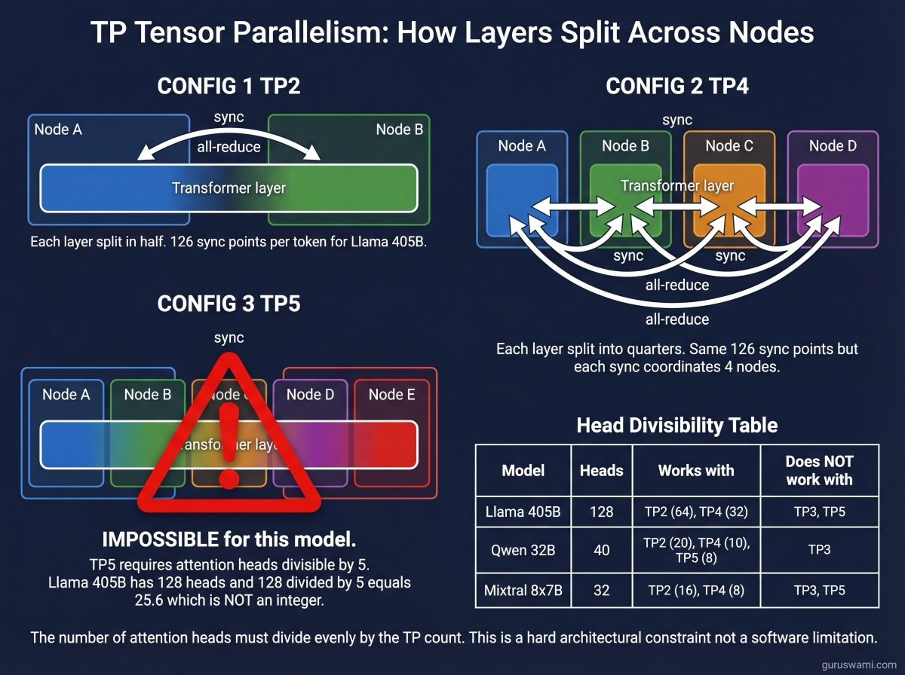
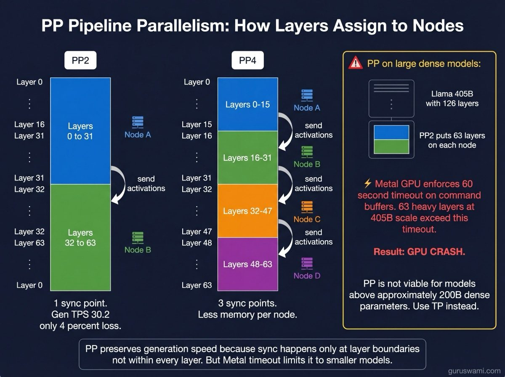
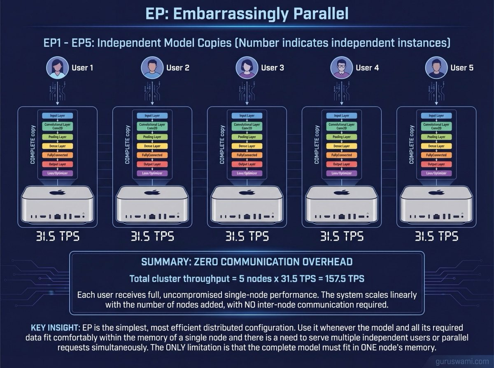

# Distributed Inference: Splitting Models Across Machines

When a model is too large for one machine, you split it across multiple machines. There are three approaches, each with different trade-offs.

---

## TP (Tensor Parallelism)

Every layer of the model is split across nodes. Each node holds a slice of every layer. After processing its slice, nodes synchronise their results via network communication (all-reduce). This happens for every single layer in the model.

**Pro:** Evenly splits memory. All nodes work simultaneously.
**Con:** Lots of communication. A 126-layer model means 126 synchronisation points per token. Each sync adds latency.

**Not all models can be split any way you want.** TP requires the model's attention heads to divide evenly by the number of nodes. Llama 405B has 128 attention heads: TP2 (64 heads each) and TP4 (32 heads each) work, but TP3 (42.67 heads) and TP5 (25.6 heads) are mathematically impossible. This is a hard architectural constraint, not a software limitation.

---

## PP (Pipeline Parallelism)

Whole layers are assigned to different nodes. Node 1 processes layers 0-31, node 2 processes layers 32-63, etc. Only one communication point between each pair of adjacent nodes.

**Pro:** Much less communication overhead. Generation speed is nearly as fast as single-node.
**Con:** Only one node is actively computing at a time during generation (the others wait). Does not help with generation speed, only with memory.

**Metal GPU timeout limits PP on large models.** Apple's Metal enforces a ~60-second hard limit on GPU command buffers. Llama 405B PP2 puts 63 layers on each node, and processing those layers exceeds the timeout. PP is not viable for dense models above ~200B parameters on Apple Silicon. Use TP instead.

---

## EP (Embarrassingly Parallel)

Each node runs its own independent copy of the model. No communication between nodes. If you have 4 nodes, you have 4 independent inference servers, each serving a different user.

**Pro:** Zero overhead. Each user gets full single-node performance. Simple to set up.
**Con:** The model must fit on a single node. No benefit for models too large for one machine.

The name comes from parallel computing: "embarrassingly parallel" means the tasks are so independent that splitting them requires no coordination at all. EP is the simplest distributed configuration and should be your default when the model fits on one node and you need to serve multiple users.

Note: "Expert Parallelism" is a different concept entirely - it distributes MoE experts across nodes, which is an advanced research topic (MLX PR #3158).

---

## TP2, TP4, PP2, PP4

The number is how many nodes are involved. TP2 = tensor parallelism across 2 nodes. PP4 = pipeline parallelism across 4 nodes. Higher numbers split the model more ways, which reduces per-node memory but increases communication overhead.

---

## RDMA (Remote Direct Memory Access)

How nodes communicate. Instead of sending data through the network stack (slow), RDMA lets one node write directly into another node's memory (fast). Our cluster uses Thunderbolt 5 RDMA at 5.3 GB/s per link. Enterprise clusters use NVLink or InfiniBand at 400-900 GB/s. The speed of this link determines how much communication overhead you pay for distributed inference.
