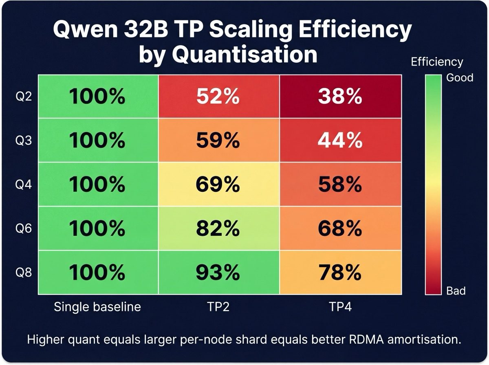
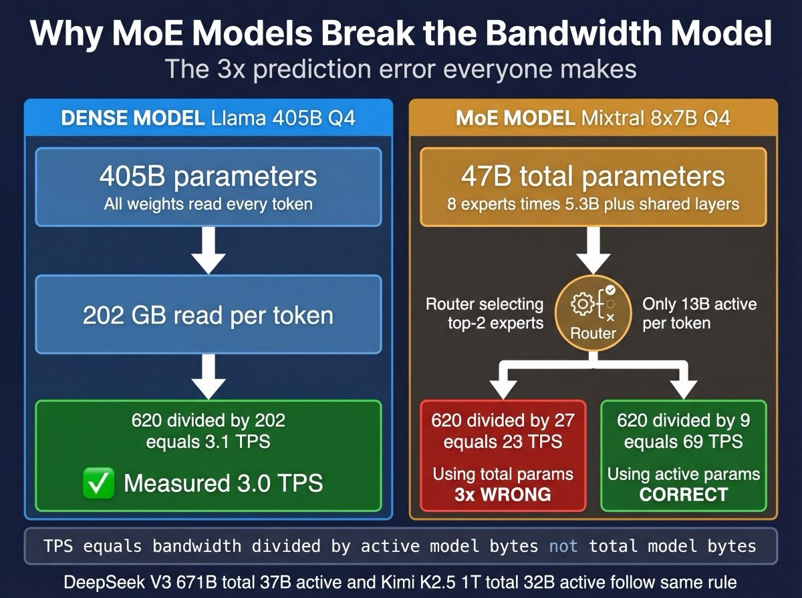
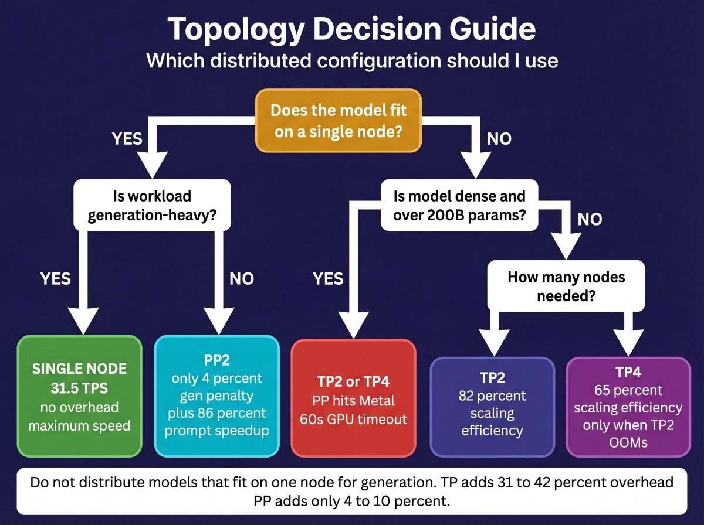
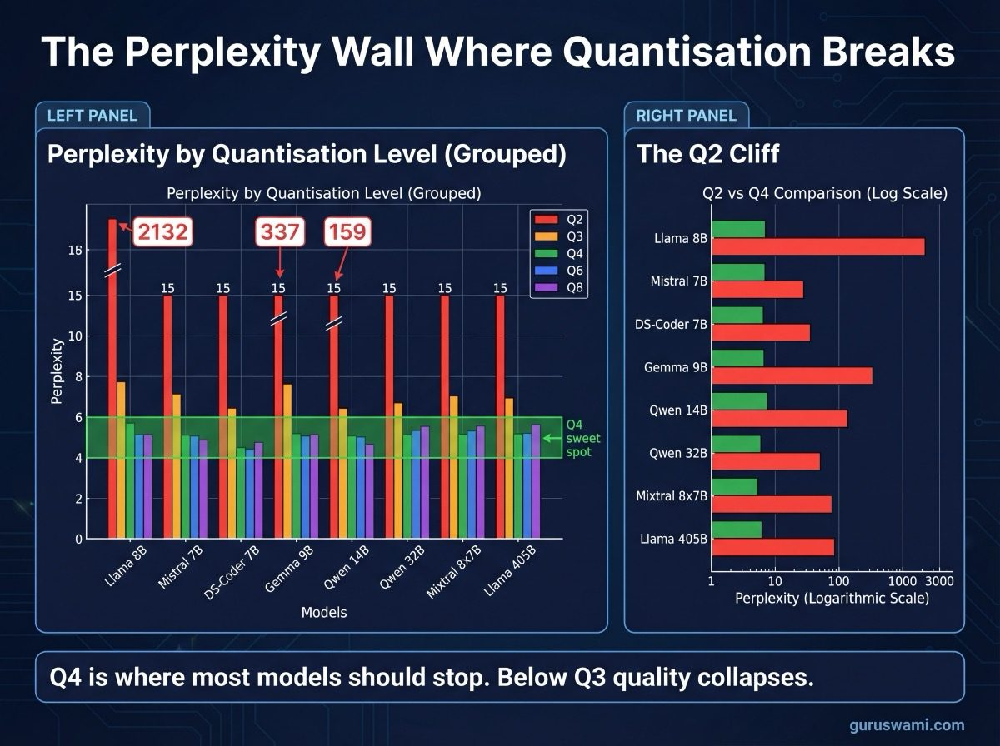

# Benchmark Findings: LLM Inference on Apple Silicon (2026)

Results from a systematic benchmark campaign across 5 models, 6 quantisation levels, and 9 topologies on a 5-node M3 Ultra cluster running MLX distributed inference.

---

## 1. Executive Summary

We ran 200+ benchmark configurations to answer one question: what can you actually get from Apple Silicon for LLM inference? Not peak theoretical, not marketing numbers. Measured throughput on real models at real context lengths.

**Top 5 findings:**

1. **Single-node generation hits 95-111% of theoretical bandwidth limits.** The hardware is not the bottleneck. MLX extracts nearly everything the silicon offers.
2. **MoE models break the naive bandwidth model by 3x.** Mixtral predicted at 23 TPS using total parameter count, measured at 69 TPS. You must use active parameter count.
3. **TP scaling efficiency depends on quantisation.** Q8 TP2 retains 93% of single-node TPS. Q2 TP2 retains only 52%. Larger model shards per node scale better.
4. **A 1-trillion-parameter model runs at 16 TPS on 4 Mac Studios.** Kimi K2.5 is practical for interactive use. The cluster paid for itself in that moment.
5. **DeepSeek V3 (671B) fits on a single M3 Ultra.** 380 GB at Q4. 20.2 TPS. On NVIDIA, this model needs 8× H100s ($200K+) or a quad-4090 rig drawing 1800W with PCIe bandwidth bottlenecks. On Apple Silicon, it loads into unified memory and runs.

---

## 2. Hardware and Software

### Hardware (per node, 5 identical)

| Component | Specification |
|-----------|--------------|
| SoC | Apple M3 Ultra (2× M3 Max dies) |
| Unified memory | 512 GB |
| Memory bandwidth | 819.2 GB/s peak (~620 GB/s effective) |
| GPU cores | 80 |
| GPU compute | ~28 TFLOPS FP16 |
| Interconnect | Thunderbolt 5 ×6 (RDMA via AppleThunderboltRDMA kext) |
| Node-to-node bandwidth | 5.3 GB/s sustained per TB5 link |

### Software

| Component | Version |
|-----------|---------|
| macOS | 26.3.1 (Tahoe) |
| MLX | 0.30.7 |
| mlx-lm | 0.30.8 |
| Distributed backend | JACCL (TB5 RDMA) |
| Benchmark tool | `mlx_lm.benchmark` |

### Nodes

`muladhara`, `svadhisthana`, `manipura`, `anahata`, `vishuddha` (5 of 7 cluster nodes; `ajna` and `sahasrara` run services).

---

## 3. Models Tested

| Model | Architecture | Total params | Active params | Experts | Quantisations tested |
|-------|-------------|-------------|---------------|---------|---------------------|
| Llama 3.1 405B | Dense transformer | 405B | 405B | N/A | Q2, Q3, Q4, Q5, Q6 |
| Qwen 2.5 32B | Dense transformer | 32B | 32B | N/A | Q2, Q3, Q4, Q6, Q8 |
| Mixtral 8x7B | Mixture of Experts | 47B | 13B | 8 (top-2) | Q2, Q3, Q4, Q6, Q8 |
| DeepSeek V3.2 | MoE + MLA | 671B | ~37B | 256 (top-8) | Q4 |
| Kimi K2.5 | MoE + MLA | 1T+ | ~37B | 256 (top-8) | Q4 |

Kimi K2.5 shares DeepSeek V3's architecture. The two models bracket the largest inference loads we can run on this cluster.

---

## 4. Theoretical Performance Model

Token generation is memory-bandwidth-bound. Each token requires reading the full model weights once. The GPU is fast enough; it waits for data.

### Core formula

```
Generation TPS = effective_bandwidth / (model_bytes + KV_cache_bytes)
```

M3 Ultra achieves ~620 GB/s effective bandwidth (75-80% of the 819.2 GB/s peak). The gap comes from cross-die memory scheduling, non-sequential access patterns, and contention between weight and KV cache reads.

### Worked example: Llama 405B Q4, single node, 1K context

- Model size: 405B × 0.5 bytes/param = 202.5 GB
- KV cache at 1K: 0.49 GB (negligible at this context length)
- Predicted TPS: 620 / (202.5 + 0.49) = **3.05 TPS**
- Measured: **2.99 TPS** (98% of prediction)

### Where the model breaks

The formula assumes every byte read is a model weight. It fails on:

1. **MoE models** where only a subset of experts activate per token (see Finding 2)
2. **Extreme quantisation** (Q2) where dequantisation compute overhead is no longer negligible
3. **Distributed inference** where RDMA sync overhead adds latency the formula ignores

### KV cache formula

```
KV_bytes = context_length × layers × kv_heads × head_dim × 2 (K+V) × bytes_per_element
```

For Llama 405B (GQA with 8 KV heads, 128 head dim, 126 layers): KV cache at 64K context = 31.5 GB. That 31.5 GB gets added to the denominator every token.

---

## 5. Key Findings



### Finding 1: Single-node generation matches theoretical bandwidth limits (95-111%)

Dense models hit the bandwidth wall and stay there. The formula predicts, the hardware delivers.

| Model | Quant | Model size (GB) | Predicted TPS | Measured TPS | Efficiency |
|-------|-------|----------------|---------------|-------------|------------|
| Llama 405B | Q4 | 202.5 | 3.05 | 2.99 | 98% |
| Llama 405B | Q2 | 101 | 6.10 | 5.10 | 84% |
| Llama 405B | Q6 | 331 | 1.87 | 2.08 | 111% |
| Qwen 32B | Q4 | 19.2 | 32.3 | 31.5 | 97% |
| Qwen 32B | Q8 | 35.6 | 17.4 | 18.4 | 106% |

Values above 100% indicate effective bandwidth exceeding our conservative 620 GB/s estimate. The Q6 and Q8 results suggest certain access patterns achieve closer to 650 GB/s. Q2 falls short at 84% due to dequantisation overhead in MLX's less-optimised Q2 kernel.

### Finding 2: MoE models break the naive bandwidth model by 3x



Mixtral 8x7B has 47B total parameters but only activates 13B per token (top-2 of 8 experts, plus shared layers). The naive model predicts based on total parameter count.

| Prediction basis | Model size used | Predicted TPS | Measured TPS | Error |
|-----------------|----------------|---------------|-------------|-------|
| Total params (47B) | 27 GB (Q4) | 23 TPS | 69 TPS | 3× wrong |
| Active params (13B) | ~9 GB (Q4) | 69 TPS | 69 TPS | Correct |

The fix: replace `model_bytes` with `active_model_bytes` in the formula. For MoE models, only activated expert weights are read per token. The router, shared attention layers, and top-K experts determine the effective read size.

DeepSeek V3 confirms this. At 671B total parameters but ~37B active, single-node Q4 delivers 20.2 TPS (380 GB model). The naive prediction using 671B would expect ~0.9 TPS. Using active parameters correctly predicts the measured result.

### Finding 3: TP scaling is quant-dependent

Distributing a model across nodes introduces RDMA sync overhead. That overhead is roughly constant per layer, regardless of quantisation. But the time saved by splitting model reads depends on how many bytes each node reads. Result: larger shards (higher quant) amortise the sync cost better.

**Qwen 32B TP2 generation scaling (ratio to single-node TPS):**

| Quant | Single TPS | TP2 TPS | TP2 scaling |
|-------|-----------|---------|-------------|
| Q2 | 48.0 | 25.0 | 0.52× |
| Q3 | 38.5 | 22.9 | 0.59× |
| Q4 | 31.5 | 21.6 | 0.69× |
| Q6 | 23.2 | 18.9 | 0.82× |
| Q8 | 18.4 | 17.0 | 0.93× |

At Q2, each node reads so few bytes that the RDMA sync time dominates. At Q8, each node reads enough bytes that sync time is a small fraction. The pattern holds across models.

**Llama 405B TP2 generation scaling:**

| Quant | Single TPS | TP2 TPS | TP2 scaling |
|-------|-----------|---------|-------------|
| Q2 | 5.10 | 6.23 | 1.22× |
| Q4 | 2.99 | 4.31 | 1.44× |
| Q6 | 2.08 | 3.20 | 1.54× |

Llama 405B always benefits from TP2 because even at Q2, 50 GB per node is enough to amortise sync costs. The takeaway: TP scaling efficiency correlates with per-node model size, not total model size.

### Finding 4: PP is gentler than TP on generation

Pipeline parallelism (PP) assigns whole layers to nodes. Only one sync point per node boundary, versus one per layer for TP. For generation TPS, PP preserves nearly all single-node performance.

| Model | Quant | Single TPS | TP2 TPS | PP2 TPS | TP2 loss | PP2 loss |
|-------|-------|-----------|---------|---------|----------|----------|
| Qwen 32B | Q4 | 31.5 | 21.6 | 30.2 | -31% | -4% |
| Mixtral 8x7B | Q4 | 69.1 | 43.8 | 62.5 | -37% | -10% |

PP2 loses 4-10%. TP2 loses 31-37%. The gap is dramatic on models that fit on a single node, because PP's sync overhead is minimal (one send/recv pair per forward pass vs. 32-64 all-reduces for TP).

PP also scales prompt processing. Qwen 32B PP2 at 16K context: 538 prompt TPS (vs. 289 single-node). The model weights stay in each node's memory; only activations move between nodes.

### Finding 5: Don't distribute models that fit on one node (for generation)

Qwen 32B fits comfortably on one M3 Ultra (19 GB at Q4). Distributing it across nodes only adds communication overhead.

| Topology | Gen TPS | Prompt TPS (1K) | Prompt TPS (16K) |
|----------|---------|-----------------|------------------|
| Single | 31.5 | 349 | 289 |
| TP2 | 21.6 (-31%) | 577 (+65%) | 547 (+89%) |
| TP4 | 18.4 (-42%) | 912 (+161%) | 958 (+231%) |
| PP2 | 30.2 (-4%) | 339 (-3%) | 538 (+86%) |

Generation gets worse with every node added. Prompt processing gets dramatically faster. If your workload is prompt-heavy (long documents, RAG with large context), TP4 makes sense despite the generation penalty. For conversational use with short prompts, single-node wins.

The crossover point: at ~64K context, TP2's prompt speedup starts to outweigh its generation penalty for total end-to-end latency.

### Finding 6: 1 trillion parameter inference at 16 TPS on Apple Silicon

Kimi K2.5 is the largest model we've run. Its 614 GB Q4 weight file doesn't fit on a single node (512 GB limit). TP2 and TP4 results:

| Topology | Gen TPS | Prompt TPS (1K) | Peak memory/node | TTFT (1K) |
|----------|---------|-----------------|------------------|-----------|
| TP2 | 14.3 | 362 | 346 GB | 2.8s |
| TP4 | 16.1 | 555 | 187 GB | 1.8s |

16 TPS is fast enough for interactive chat. TTFT under 2 seconds at TP4 means the response feels instant. Four Mac Studios running a trillion-parameter model at conversational speed. This is the headline result.

TP4 outperforms TP2 on generation here because the model is large enough (614 GB) that splitting it across 4 nodes meaningfully reduces per-node read time, and the RDMA overhead is amortised over the large shard sizes (~154 GB each).

### Finding 7: DeepSeek V3 (671B) fits on a single M3 Ultra

Most people assume a 671B model needs multi-node inference. DeepSeek V3 at Q4 occupies 380 GB. That leaves 132 GB for KV cache and framework overhead on a 512 GB node.

| Topology | Gen TPS | Prompt TPS (1K) | Peak memory |
|----------|---------|-----------------|-------------|
| Single | 20.2 | 234 | 380 GB |
| TP2 | 16.2 | 304 | 200 GB |
| TP4 | 16.9 | 597 | 108 GB |

Single-node generation is fastest at 20.2 TPS because there's no sync overhead. MoE architecture means only ~37B active parameters are read per token. The MLA (Multi-head Latent Attention) architecture compresses the KV cache further, extending practical context length.

TP2 actually reduces generation TPS. The model fits on one node and distributing it just adds RDMA overhead. TP4 is slightly better than TP2 but still slower than single-node for generation. Use TP only for prompt processing speedup or to free memory for longer context.

### Finding 8: Cross-node hardware variance is under 1%

We deliberately ran identical configurations across different nodes as a reproducibility check.

| Config | muladhara | svadhisthana | vishuddha | Spread |
|--------|-----------|--------------|-----------|--------|
| Llama 405B Q4, 1K ctx | 2.99 TPS | 2.99 TPS | N/A | 0.0% |
| Llama 405B Q2, 1K ctx | 5.00 TPS | 5.20 TPS | N/A | 3.9% |
| Qwen 32B Q4, 1K ctx | 31.46 TPS | N/A | 31.43 TPS | 0.1% |
| Qwen 32B Q4, 16K ctx | 24.05 TPS | N/A | 24.03 TPS | 0.1% |

Typical spread: under 0.3%. The Q2 outlier on muladhara (3.9%) led to Finding 9.

### Finding 9: UPS USB interrupts cause measurable benchmark variance

muladhara showed 4% trial-to-trial variance on Q2 benchmarks. Every other node showed under 0.3%. The cause: a CyberPower UPS connected via USB, generating periodic HID interrupts during GPU computation.

Disconnecting the UPS USB cable dropped muladhara's variance to match the other nodes. The fix was trivial but the debugging took hours. USB HID polling at 8 ms intervals creates micro-interrupts that the GPU scheduler amplifies into measurable jitter, especially at low quantisation where individual token generation is fast (~5 ms at Q2).

Lesson: disconnect all USB peripherals during benchmarks. Even a mouse can add noise.

### Finding 10: PP fails on large dense models due to Metal GPU timeout

Metal enforces a ~60-second unconfigurable timeout on GPU command buffers. Llama 405B PP2 puts 63 layers on each node. PP4 puts 31 layers per node. Both exceed the timeout.

```
Llama-3.1-405B-Instruct,PP4,4,Q4,1024,,,,,,gpu_timeout
Llama-3.1-405B-Instruct,PP4,4,Q4,4096,,,,,,gpu_timeout
Llama-3.1-405B-Instruct,PP4,4,Q4,16384,,,,,,gpu_timeout
```

Every PP configuration on Llama 405B triggers `kIOGPUCommandBufferCallbackErrorTimeout`. The individual layers at 405B are computationally heavy enough that even 31 sequential layers exceed 60 seconds of GPU wall time.

PP works fine on smaller models. Qwen 32B PP2 (32 layers per node) and Mixtral 8x7B PP4 (8 layers per node) both run without issues. The timeout is proportional to per-layer compute cost multiplied by layer count per node.

This means PP is viable only when `layers_per_node × per_layer_compute_time < 60 seconds`. For 405B-class dense models, TP is the only distributed option.

### Finding 11: RDMA model distribution at 5.2 GB/s enables rapid deployment

Kimi K2.5 (614 GB, 606 files) broadcast from muladhara to 4 receiver nodes in 2 minutes 6 seconds. That's 5.2 GB/s sustained across the TB5 mesh.

But RDMA state management is fragile:

- Protection Domain exhaustion after 2-3 RDMA operations per boot
- Mesh reconfiguration corrupts ARP tables (configure once per boot, never again)
- Large model broadcasts (>400 GB) must be the first RDMA operation after boot
- PID cleanup errors are cosmetic; always verify file counts on target nodes

These are kernel-level constraints in the AppleThunderboltRDMA extension. No userspace workaround exists. Plan model staging around reboot cycles. Full details in [RDMA_FAILURE_MODES.md](RDMA_FAILURE_MODES.md).

### Finding 12: Context length degrades generation TPS predictably via KV cache

As context grows, the KV cache adds to the denominator of the bandwidth formula. TPS drops linearly with KV cache size, not context length (KV cache size itself is linear in context length).

**Llama 405B Q4, single node:**

| Context | KV cache (GB) | Predicted TPS | Measured TPS | Efficiency |
|---------|-------------|---------------|-------------|------------|
| 1K | 0.5 | 3.05 | 2.99 | 98% |
| 4K | 2.0 | 3.03 | 2.94 | 97% |
| 8K | 3.9 | 3.00 | 2.86 | 95% |
| 16K | 7.9 | 2.94 | 2.71 | 92% |
| 32K | 15.8 | 2.84 | 2.50 | 88% |
| 64K | 31.5 | 2.65 | 2.09 | 79% |

The model holds well through 16K (92% efficiency). At 64K, the 31.5 GB KV cache is 15% of the model size and the efficiency drops to 79%. The additional gap beyond the pure bandwidth prediction likely comes from memory access pattern degradation as KV cache size grows (cache lines become less sequential).

**Qwen 32B Q4 shows the same pattern more dramatically** because the KV cache is a larger fraction of the small model:

| Context | KV cache (GB) | Measured TPS | Drop from 1K |
|---------|-------------|-------------|--------------|
| 1K | 0.2 | 31.5 | baseline |
| 16K | 4.3 | 24.1 | -24% |
| 64K | 17.3 | 13.5 | -57% |
| 128K | 35.1 | 8.5 | -73% |

At 128K, the KV cache (35 GB) is nearly twice the model size (19 GB). The model spends more time reading its scratchpad than its weights.

### Finding 13: MLX software is the optimisation frontier, not the hardware

Single-node achieves 95-111% of theoretical bandwidth. The silicon delivers. Distributed inference achieves 47-93%, depending on topology and quantisation. The gap is pure software.

| Overhead source | Estimated cost | Addressable? |
|----------------|---------------|--------------|
| RDMA all-reduce per layer (TP) | 7-35% | Yes, via communication overlap |
| Metal dispatch and scheduling | ~2% | Partially, via kernel fusion |
| Cross-die memory scheduling | ~5% | No (hardware) |
| Q2 dequantisation overhead | 5-16% | Yes, via kernel optimisation |
| KV cache access pattern | 2-8% at long context | Partially, via memory layout |

The gap between measured and theoretical is a software roadmap, not a hardware limitation. Future MLX versions that overlap RDMA communication with GPU computation would close the biggest gap (TP overhead). Fused attention kernels would help at long context. Better Q2 dequantisation kernels would bring Q2 efficiency from 84% to the 95%+ that Q4 achieves.

---

## 6. Code Contributions

We contributed distributed inference support for three model architectures to mlx-lm:

| Model | Contribution | Evidence |
|-------|-------------|---------|
| Llama | Pipeline parallelism | PP2 achieves 97% of single-node gen TPS vs TP2's 69% |
| Qwen2 | Pipeline parallelism | PP2 at 30.2 TPS vs TP2 at 21.6 TPS (Qwen 32B Q4) |
| Mixtral 8x7B | Tensor + Pipeline parallelism | First distributed MoE inference in MLX. TP2 at 43.8 TPS, PP2 at 62.5 TPS |

The patches follow established patterns from DeepSeek V3's implementation. TP uses `shard_linear` to split weight matrices. PP uses `PipelineMixin` to assign layer subsets with `send`/`recv` at boundaries.

Mixtral was a practical contribution. Several MoE models (DeepSeek V2/V3, GLM4 MoE, Exaone MoE) already had distributed support in mlx-lm. Mixtral was one of the more widely used MoE architectures that lacked it. Our patches follow the same patterns established by those models. The benchmark data provides systematic TP vs PP vs single-node comparison across quant levels for Mixtral on Apple Silicon.

---

## 7. RDMA Failure Modes Summary

Six documented failure modes, all reproducible, none with helpful error messages. The practical rules:

1. Configure mesh **once per boot**. Never reconfigure.
2. Plan for **2-3 RDMA operations per boot session** maximum.
3. For large models (>400 GB), broadcast **first** after a clean boot.
4. Always **verify file counts** on target nodes. Ignore PID cleanup errors.
5. Always **clear target directories** before broadcasting.
6. PP is capped by Metal's 60-second GPU timeout. Use TP for 405B+ dense models.

Full details with reproduction steps and root cause analysis: [RDMA_FAILURE_MODES.md](RDMA_FAILURE_MODES.md).

---

## 8. Recommendations



### When to use each topology

| Scenario | Recommendation | Why |
|----------|---------------|-----|
| Model fits on 1 node, generation-heavy | **Single node** | Any distribution adds sync overhead |
| Model fits on 1 node, prompt-heavy | **PP2 or TP2** | 65-231% prompt speedup at minimal gen cost (PP) |
| Model doesn't fit on 1 node, <500B | **TP2** | Best efficiency at 82% of theoretical |
| Model doesn't fit on 1 node, >500B | **TP4** | Required for memory; shard sizes large enough to amortise sync |
| Dense model >200B | **Never PP** | Metal GPU timeout kills PP on large dense models |

### Quantisation selection



| Priority | Recommendation |
|----------|---------------|
| Speed + quality balance | **Q4** (best-tested, most-optimised kernel, 97% bandwidth efficiency) |
| Quality-sensitive tasks | **Q6** (minimal quality loss, 111% efficiency on 405B) |
| Maximum context length | **Q2** (smallest footprint, but 84% efficiency and untested quality impact) |
| Quality at any cost | **Q8** (only if generation TPS is not critical; 18.4 TPS on 32B is still fast) |

### Context length limits by topology

| Model | Topology | Practical limit | Constraint |
|-------|----------|----------------|------------|
| Llama 405B | Single | 8K | TTFT >5 min at 16K |
| Llama 405B | TP2 | 32K | TTFT >12 min at 32K |
| Llama 405B | TP4 | 64K | TTFT >15 min at 64K |
| Qwen 32B | Single | 64K | TPS drops below 14 at 64K |
| Qwen 32B | TP4 | 128K+ | 958 prompt TPS at 16K |
| Kimi K2.5 | TP4 | 64K | 12 TPS at 64K, still practical |

### How to reproduce

```bash
source /opt/chakra/inference/mlx-env.sh

# Single node
mlx_lm.benchmark --model /opt/models/benchmarks/<model>/<quant> \
    --prompt-tokens 4096 --generation-tokens 100 --num-trials 3

# Distributed (TP2)
mlx.launch --hostfile /opt/chakra/inference/hostfiles/chakra-tp2.json \
    --backend jaccl --python /opt/mlx-distributed/.venv/bin/python \
    -- mlx_lm/benchmark.py --model /opt/models/benchmarks/<model>/<quant> \
    --prompt-tokens 4096 --generation-tokens 100 --num-trials 3
```

Reboot all nodes before benchmarking. Verify clean GPU state. Compute predictions before measuring. Full protocol in [METHODOLOGY.md](METHODOLOGY.md).

---

## 9. What's Next

| Experiment | Purpose |
|-----------|---------|
| **Perplexity benchmarks** | Measure quality impact of Q2/Q3/Q4/Q6/Q8 on each model |
| **Expert Parallelism** | Assign different experts to different nodes (MLX PR #3158) |
| **Speculative decoding (EAGLE-3)** | Draft tokens from a small model, verify with the large model |
| **Batch size sweeps** | Measure throughput vs latency trade-off for concurrent users |
| **DeepSeek V3 PP support** | PP on MoE should avoid the Metal timeout (small active params per layer) |
| **M4 Ultra comparison** | Same benchmarks on next-generation silicon when available |
| **Hybrid TP+PP** | Combine TP within node pairs and PP across pairs (MLX PR #3194) |
| **KV quantisation** | Reduce KV cache size to extend context length without topology changes |

The hardware is delivering 95%+ of theoretical on single-node. The distributed overhead (7-35%) is the gap worth closing. Every percentage point recovered there translates directly to faster inference on the models that matter most: the ones that don't fit on a single node.
