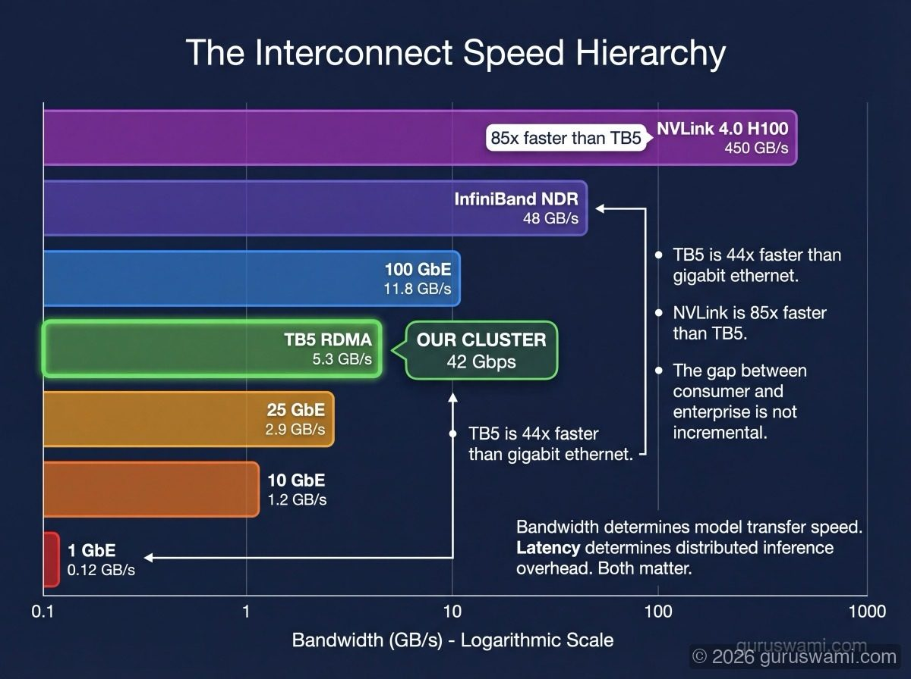
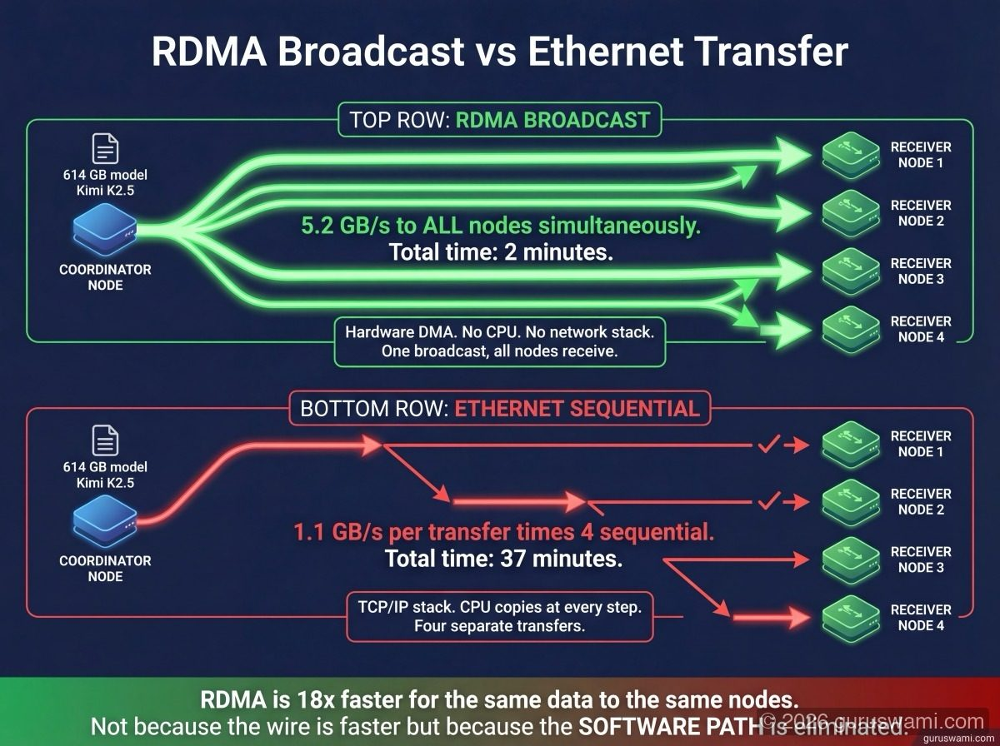

# Interconnects: How Fast Can Nodes Talk?

The speed of the link between nodes determines whether distributed inference is practical or painfully slow. This page explains why our Thunderbolt 5 RDMA cluster achieves 65-93% scaling efficiency, where the overhead comes from, and how it compares to enterprise hardware.

---

## What Actually Limits Inference Speed

Before comparing interconnects, you need to understand the two bottlenecks in any inference system:

**Single-node inference is memory-bandwidth-bound.** The GPU reads model weights from memory to generate each token. The speed of memory determines TPS.

| Hardware | Memory bandwidth | 32B Q4 (19 GB) TPS | 405B Q4 (202 GB) TPS |
|----------|-----------------|--------------------|--------------------|
| RTX 5090 (32 GB VRAM) | 1,792 GB/s | ~40 TPS | Does not fit |
| M3 Ultra (512 GB unified) | 819 GB/s | 31.5 TPS | 3.0 TPS |

The 5090 is 2.2× faster at memory bandwidth. For models that fit in its 32 GB, it wins on raw speed. But it cannot run anything above ~48B at Q4.

**Distributed inference is interconnect-bound.** When you split a model across multiple nodes, nodes must synchronise after every transformer layer. The interconnect speed determines how much overhead this adds.

| Setup | Internal bandwidth | Interconnect | Bottleneck |
|-------|-------------------|-------------|------------|
| Single M3 Ultra | 819 GB/s | N/A | Memory bandwidth |
| 3× M3 Ultra (TB5 mesh) | 819 GB/s × 3 | 5.3 GB/s per link (42 Gbps) | **Interconnect** (155× slower than memory) |
| 3× RTX 5090 in one PC | 1,792 GB/s × 3 | 63 GB/s shared PCIe | **PCIe** (85× slower than VRAM) |
| 3× H100 (NVLink) | 3,350 GB/s × 3 | 450 GB/s per GPU | Memory bandwidth (NVLink nearly matches) |

This is the fundamental insight. On a single node, the GPU reads memory at 819-1,792 GB/s. The moment you go distributed, nodes talk to each other at 5-63 GB/s. The interconnect is 85-155× slower than the internal memory bus. Every all-reduce operation pays this penalty.

**NVLink is the exception.** At 450 GB/s per GPU, NVLink bandwidth is close enough to memory bandwidth that distributed overhead becomes manageable. This is why H100 DGX systems scale well. This is also why they cost $300,000.

**Three RTX 5090s in one PC** share a single PCIe Gen5 ×16 bus at 63 GB/s. That is 28× slower than each GPU's VRAM bandwidth. Add the fact that PCIe is shared (not per-GPU), and three GPUs are fighting over 63 GB/s total. For tensor parallelism, this bottleneck often negates the benefit of having more GPUs. You pay for three GPUs but get less than 2× the performance of one.

---

## The Speed Hierarchy

| Interconnect | Bandwidth | Latency (per op) | Typical use |
|-------------|-----------|-------------------|-------------|
| **1 GbE** | 0.12 GB/s | 50-100 us | Home networking |
| **10 GbE** | 1.2 GB/s | 10-25 us | Office / small datacentre |
| **25 GbE** | 2.9 GB/s | 5-15 us | Datacentre standard |
| **TB5 RDMA** | **5.3 GB/s** | **~50 us** | **Our cluster** |
| **100 GbE** | 11.8 GB/s | 2-5 us | High-end datacentre |
| **InfiniBand NDR** | 48 GB/s | 0.5 us | HPC / AI clusters |
| **NVLink 4.0 (H100)** | 450 GB/s | 5-20 us | Intra-node GPU-to-GPU |

TB5 RDMA sits between 25 GbE and 100 GbE. It is 44× faster than gigabit ethernet and 9× slower than InfiniBand. It is 85× slower than NVLink. These ratios explain everything about distributed inference performance.

---

## Thunderbolt 5 Specifications

| Spec | Value |
|------|-------|
| Bidirectional (symmetric) | 80 Gbps total (40 Gbps each direction) |
| Asymmetric (Bandwidth Boost) | 120 Gbps in one direction, 40 Gbps return |
| Physical layer | PAM-3 signalling, 4 lanes |
| RDMA latency | < 50 us (vs ~300 us over TCP) |
| Ports per M3 Ultra | 6 |

### What our 5.3 GB/s really means

Our measured RDMA throughput of 5.3 GB/s sustained equals **42.4 Gbps** unidirectional. The TB5 symmetric spec is 40 Gbps per direction. We slightly exceed this because TB5's Bandwidth Boost asymmetric mode activates during bulk unidirectional transfers (like model broadcasts), dynamically allocating 3 of 4 lanes to the sending direction. In theory, full asymmetric mode can deliver 120 Gbps (15 GB/s), but we sustain 42.4 Gbps in practice - likely limited by the RDMA software stack and memory controller contention.

### Compared to Thunderbolt 4

| Interface | Bandwidth | Our RDMA throughput |
|-----------|-----------|-------------------|
| Thunderbolt 3/4 | 40 Gbps bidir (20+20) | N/A (no Apple RDMA support) |
| Thunderbolt 5 | 80 Gbps bidir, 120 Gbps burst | 42.4 Gbps sustained |

TB5's RDMA capability is the key. TB4 has bandwidth but no Apple RDMA driver. Without RDMA, distributed inference would go through the TCP stack at ~300 us per operation instead of ~50 us - making tensor parallelism impractical.

---

## NVIDIA NVLink: What the Enterprise Gets

| Spec | NVLink 4.0 (H100) |
|------|--------------------|
| Per-GPU bandwidth | 900 GB/s bidirectional |
| Links per GPU | 18 |
| NVSwitch | Single-hop all-reduce across 8 GPUs |
| DGX H100 total bisection | 3.6 TB/s |
| All-reduce bandwidth (8 GPUs) | 450 GB/s |

NVLink is not just faster - it has a fundamentally different topology. NVSwitch provides a non-blocking crossbar where any GPU can communicate with any other GPU in a single hop. Our TB5 mesh uses point-to-point links requiring ring or tree algorithms for collective operations.

**The cost:** A DGX H100 (8 GPUs with NVLink) costs $300,000+. Our 5-node cluster costs ~$40,000. NVLink is 85× faster. It is also 7.5× more expensive. The bandwidth-per-dollar is actually comparable, but the absolute performance is in a different league.

---

## Why Bandwidth Alone Does Not Tell the Story

For distributed inference, what matters is **per-operation latency**, not just bulk bandwidth. Every transformer layer in tensor parallelism requires an all-reduce synchronisation. The all-reduce latency compounds across all layers.

### Llama 405B TP2: 126 layers, 126 all-reduce operations per token

| Interconnect | Per all-reduce | 126 layers total | Token gen time | Overhead |
|-------------|---------------|------------------|---------------|----------|
| NVLink 4.0 | ~10 us | ~1.3 ms | ~5 ms | 26% |
| InfiniBand NDR | ~20 us | ~2.5 ms | ~5 ms | 50% |
| **TB5 RDMA** | **~100 us** | **~12.6 ms** | **~35 ms** | **36%** |
| 25 GbE TCP | ~200 us | ~25.2 ms | ~35 ms | 72% |

This is why our TP2 overhead is 7-35% depending on model and quantisation. The ~12.6 ms of RDMA sync is a fixed cost per token. When token generation itself takes 54 ms (Q8 Qwen 32B), the overhead is a manageable 23%. When token generation takes 21 ms (Q2 Qwen 32B), the same 12.6 ms overhead becomes 60% of total time. This is Finding 3: TP scaling is quant-dependent.

Over 25 GbE TCP, the overhead would be 72% - making TP effectively useless for generation. RDMA is the difference between "distributed inference works" and "distributed inference is slower than single-node for everything."

---

## RDMA Model Broadcasting: The Transfer That Changes Everything

### How mlx_lm.share Works

When you broadcast a model from one node to all others, `mlx_lm.share` uses RDMA to transfer files directly into the receiving nodes' memory. The coordinator node sends data; receiver nodes write it to disk from their local memory. No TCP, no network stack, no CPU involvement on the receive side.

### Measured Performance

| Transfer | Size | Time | Throughput | Notes |
|----------|------|------|-----------|-------|
| Kimi K2.5 → 4 nodes | 614 GB (606 files) | 2 min 6 sec | 5.2 GB/s | Broadcast to all 4 simultaneously |
| Llama 405B Q4 → 4 nodes | 202 GB | ~40 sec | 5.1 GB/s | Broadcast |
| Qwen 32B Q4 → 4 nodes | 19 GB | ~4 sec | 4.8 GB/s | Broadcast |

**The broadcast is simultaneous.** All 4 receiver nodes get the data at the same time. The coordinator sends once; the RDMA hardware replicates to all receivers. This is not 4 sequential transfers at 5 GB/s each (which would take 4× longer). It is one broadcast at ~5 GB/s that all receivers participate in concurrently.

### Compared to Ethernet Transfers

| Method | Transferring 614 GB to 4 nodes | Time |
|--------|-------------------------------|------|
| **TB5 RDMA broadcast** | 5.2 GB/s to all simultaneously | **2 minutes** |
| rsync over 10 GbE (sequential) | 1.1 GB/s × 4 transfers | ~37 minutes |
| rsync over 10 GbE (parallel) | 1.1 GB/s shared (4 streams) | ~9 minutes |
| rsync over 1 GbE (sequential) | 110 MB/s × 4 transfers | ~6.2 hours |
| scp over 25 GbE (sequential) | 2.8 GB/s × 4 transfers | ~14 minutes |
| scp over 25 GbE (parallel) | 2.8 GB/s shared (4 streams) | ~4 minutes |

RDMA broadcast at 2 minutes vs sequential rsync over 10 GbE at 37 minutes. That is an 18× speedup. Even parallel 25 GbE is still 2× slower than TB5 RDMA because ethernet transfers go through the TCP/IP stack, driver, and OS scheduler on both ends.

### What Makes RDMA Different from Network Transfers

**Normal network transfer (rsync, scp):**
1. Application reads file from disk into user-space buffer
2. OS copies buffer to kernel-space socket buffer
3. TCP stack adds headers, segments data
4. Network driver sends packets
5. Receiving OS processes packets through the network stack
6. Kernel copies data to user-space buffer
7. Application writes data to disk

**RDMA transfer:**
1. Application registers memory region with RDMA hardware
2. Hardware DMA transfers data directly from sender's memory to receiver's memory
3. Done

Steps 2-6 of the normal path are eliminated. The CPU on the receiving node is not interrupted. The OS is not involved. The data moves at hardware speed.

---

## The TB5 RDMA Constraints

The speed is impressive but the operational constraints are real:

| Constraint | Impact |
|-----------|--------|
| **2-3 RDMA operations per boot** | Protection domains exhaust in the kernel. Reboot to recover. |
| **Configure mesh once per boot** | Reconfiguration corrupts ARP tables. |
| **Large models first** | >400 GB broadcasts must be the first RDMA operation after boot. |
| **No hot-plug** | TB5 cable changes while running cause kernel panic. |

These are documented in detail in [RDMA Failure Modes](RDMA_FAILURE_MODES.md). They are kernel-level constraints in Apple's `AppleThunderboltRDMA` extension, not software bugs that will be fixed soon. Plan your workflow around them.

---

## Where TB5 RDMA Fits

TB5 RDMA occupies a unique position: it is the only consumer-grade interconnect that makes distributed ML inference practical. Everything below it (ethernet) is too slow for tensor parallelism. Everything above it (NVLink, InfiniBand) costs 10-100× more.

| Need | Best interconnect | Cost |
|------|------------------|------|
| Learning distributed inference | **TB5 RDMA** | ~$40K for 5-node cluster |
| Production inference (small scale) | **TB5 RDMA** or **25 GbE** | $40K-$100K |
| Production inference (large scale) | **InfiniBand NDR** | $500K+ |
| Maximum performance (no budget) | **NVLink** (intra-node) + **InfiniBand** (inter-node) | $1M+ |
| Model deployment to edge | **10 GbE** or **25 GbE** | $5K-$20K |

The same concepts apply everywhere: all-reduce latency compounds across layers, bandwidth amortises with larger model shards, and the interconnect determines whether adding nodes helps or hurts. Learning these dynamics on a $40K cluster teaches you everything you need to make decisions about $1M infrastructure. The physics is the same. Only the speed and price change.
