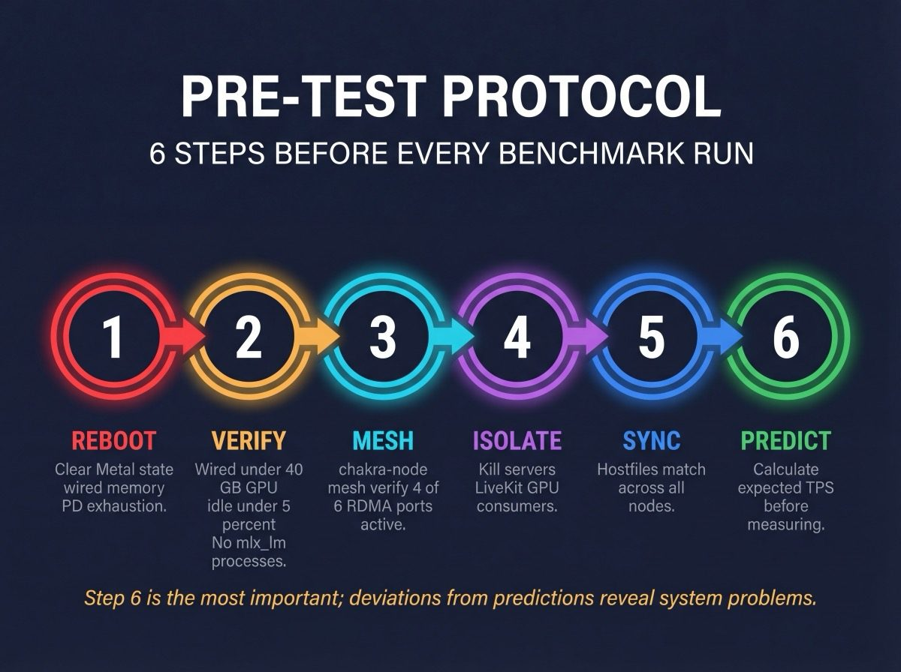
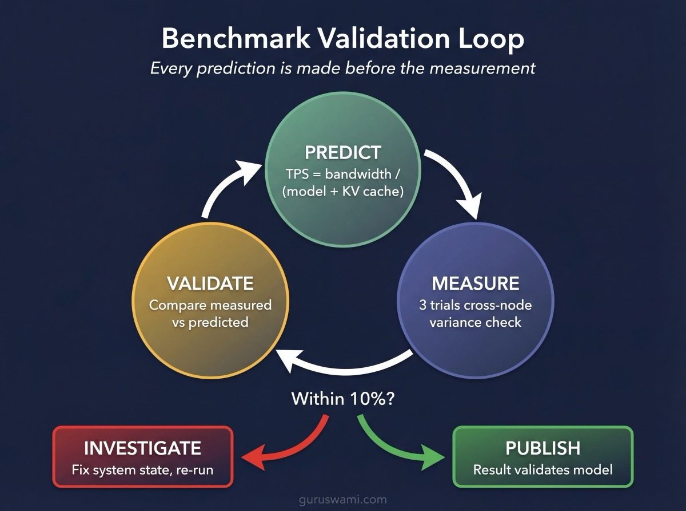

# Benchmark Methodology

## Purpose and Scope

Every LLM provider advertises peak theoretical performance. None of them tell you what happens when you actually run inference on real hardware with real models at real context lengths.

These benchmarks exist to close that gap on Apple Silicon. Specifically: what throughput can you actually achieve running large language models on M3 Ultra Mac Studios using MLX, Apple's native ML framework? How does performance degrade as context grows? Where does distributed inference help, and where does the communication overhead eat your gains?

The target audience is anyone who wants to understand LLM inference beyond what cloud APIs reveal. Whether you are repurposing a gaming GPU, evaluating Apple Silicon for serious work, or deciding between a cluster of Mac Studios and a rack of H100s, the methodology here shows how to measure what matters and how to tell when a number is trustworthy.

All measurements come from a 5-node cluster running `mlx_lm.benchmark`. Every number has been validated against a theoretical performance model. When measured results deviate from predictions, we investigate before publishing.

---

## Hardware Specification

Each node is a Mac Studio with an M3 Ultra SoC. Five specs matter for inference.

**512 GB unified memory.** CPU and GPU share the same physical memory pool. No PCIe transfers, no copies between host and device. A 405B parameter model at Q4 (202 GB) loads directly into GPU-accessible memory. On consumer NVIDIA, this model would need multiple GPUs communicating over PCIe (63 GB/s shared), each holding a shard in its own VRAM. Enterprise NVIDIA solves this with NVLink (900 GB/s), but at 10-50× the cost per node. Unified memory sidesteps the entire problem.

**819.2 GB/s memory bandwidth (peak).** This is the single number that determines generation speed. Every token generated requires reading the entire model from memory once. Higher bandwidth means more tokens per second. In practice, M3 Ultra sustains roughly 620 GB/s (~75-80% of peak) due to cross-die scheduling and non-sequential access patterns.

**80 GPU cores across 2 dies.** The M3 Ultra is two M3 Max dies bonded together. This cross-die topology means memory accesses that cross the die boundary incur additional latency. It also means the 819.2 GB/s is aggregate, not per-die.

**Metal 4 GPU compute (~28 TFLOPS FP16).** This determines prompt processing speed. Prefill is compute-bound, not memory-bound, so TFLOPS matter more than bandwidth for time-to-first-token.

**Thunderbolt 5 ports (×6).** Each node has six TB5 ports supporting RDMA (Remote Direct Memory Access) via the AppleThunderboltRDMA kernel extension. Direct node-to-node transfers achieve 5.3 GB/s sustained per link, used for the all-reduce operations in tensor parallelism.

---

## Theoretical Performance Model

The value of benchmarks comes from understanding *why* you get the numbers you get. This section builds the model from first principles.

### Generation (Autoregressive Decoding)

Token generation is memory-bandwidth-bound. Each token requires one full forward pass through the model, which means reading every weight once. The GPU has plenty of compute capacity; it spends most of its time waiting for data to arrive from memory.

The core formula:

```
Generation TPS = effective_bandwidth / (model_bytes + KV_cache_bytes)
```

M3 Ultra achieves ~620 GB/s effective bandwidth (75-80% of the 819.2 GB/s peak). The gap comes from three sources: cross-die memory controller scheduling, non-sequential access patterns in transformer architectures, and contention between weight reads and KV cache reads.

**Worked example: Llama 405B Q4 on a single node.**

- Model size: 405B params × 0.5 bytes/param = 202.5 GB
- KV cache at 1K context: 1024 × 4096 bytes/token/layer × 126 layers = 0.49 GB (negligible)
- Predicted TPS: 620 / (202.5 + 0.49) = 3.05 TPS
- **Measured: 2.9 TPS** (95% of prediction)

At short context, the KV cache is tiny and the formula simplifies to `bandwidth / model_size`. As context grows, KV cache starts consuming significant bandwidth and TPS drops.

### Prompt Processing (Prefill)

Prefill works differently. All prompt tokens are processed in a single forward pass using batched matrix multiplications. The GPU reads the model weights once and applies them to every token in the prompt simultaneously. This makes prefill compute-bound, not memory-bound.

Key implications:
- Quantisation does NOT speed up prefill (the FLOPs are the same regardless of weight precision)
- Prefill speed scales inversely with active parameter count
- All prompt tokens amortise the cost of reading weights, so prompt TPS >> generation TPS

At short context, prompt TPS is roughly constant. As context grows past ~16K tokens, the quadratic attention computation starts dominating and prompt TPS degrades. At 128K context, attention alone can halve prompt throughput.

### KV Cache

The KV cache stores attention keys and values for all previously processed tokens. It grows linearly with context length and must be read for every generated token.

```
KV_bytes = context_length × layers × kv_heads × head_dim × 2 (K+V) × 2 bytes
```

Grouped Query Attention (GQA) reduces this. Llama 405B uses a 16:1 ratio (128 attention heads, 8 KV heads), shrinking its KV cache by 16×. Multi-head Latent Attention (MLA), used by DeepSeek and Kimi, compresses further via learned low-rank projections.

**Llama 405B KV cache at 64K context:**

```
65536 × 126 layers × 4096 bytes/token/layer = 31.5 GB
```

That 31.5 GB gets added to the 202.5 GB model weight reads every token. TPS drops from 2.9 to 2.1. The model weights haven't changed; the KV cache is what's eating bandwidth.

### Quantisation Impact

Quantisation reduces bytes per parameter, which directly speeds up generation (less to read per token). Q4 stores ~4.2 effective bits per parameter including scales and zero-points.

| Quant | Bytes/param | 405B size | Predicted TPS | Measured TPS |
|-------|------------|-----------|---------------|--------------|
| Q8 | 1.0 | 405 GB | 1.53 | 1.6 |
| Q4 | 0.5 | 202 GB | 3.05 | 2.9 |
| Q2 | 0.25 | 101 GB | 6.10 | 5.1 |

The Q2 result (84% of prediction) shows where the model breaks down. Dequantisation overhead at extreme compression levels costs 5-15% of theoretical throughput, and the MLX Q2 kernel is less optimised than Q4/Q8.

### Distributed Inference (Tensor Parallelism)

Tensor parallelism splits model weights across N nodes. Each node reads `model_size / N` bytes per token, then nodes synchronise via all-reduce after every transformer layer.

```
TP_TPS = N × single_node_bandwidth / (model_bytes/N + KV_bytes) × (1 - communication_overhead)
```

The communication overhead compounds. Llama 405B has 126 layers, meaning 126 all-reduce synchronisation points per token. Each all-reduce transfers a tensor across the TB5 RDMA links. At TP4, that's 126 sync points across 4 nodes per token generated.

**Llama 405B Q4 distributed scaling:**

| Config | Theoretical TPS | Measured TPS | Efficiency |
|--------|----------------|--------------|------------|
| Single | 3.05 | 2.9 | 95% |
| TP2 | 5.2 | 4.3 | 82% |
| TP4 | 9.9 | 6.4 | 65% |

TP2 achieves 82% of theoretical because 126 sync points over one RDMA link is manageable. TP4 drops to 65% because the same 126 sync points now require coordination across 4 nodes, and the all-reduce pattern means each sync involves multiple RDMA transfers.

The practical takeaway: TP2 is efficient. TP4 is viable but you lose a third of your theoretical gains to communication. TP5 and beyond have not produced reliable results.

---

## Pre-Test Protocol



Benchmarks on Apple Silicon are sensitive to system state. A node that ran a 433 GB model an hour ago may still have wired memory residue that corrupts subsequent measurements. We learned this the hard way (9 corrupted records from memory pressure, detailed in FINDINGS.md).

**Step 1: Reboot all nodes.** Clears Metal GPU memory fragmentation, protection domain exhaustion, wired memory residue, and stale inference processes. Nodes auto-start all services via LaunchDaemons within 60 seconds.

**Step 2: Verify clean state.** On each node, check `vm_stat` for wired memory below 40 GB, `mactop` for GPU idle (<5% utilisation), and `ps` for no lingering `mlx_lm` processes. Our campaign infrastructure automates this via VictoriaMetrics queries.

**Step 3: Verify mesh health.** For distributed benchmarks, run `chakra-node mesh verify`. Expect 4/6 RDMA ports active with no TB5 errors. Confirm matching MLX versions across all nodes (`mlx.core.__version__`).

**Step 4: Disable competing services.** Kill any running model servers, LiveKit sessions, or other GPU consumers. A background inference server holding 20 GB of wired memory will silently degrade benchmark results.

**Step 5: Sync hostfiles.** Ensure all nodes have identical hostfile configurations. Stale hostfiles cause silent RDMA failures that manifest as inexplicable TPS drops.

**Step 6: Calculate predictions.** Compute expected TPS for every configuration *before* running. This turns benchmarking from "collect numbers" into "validate a model." Deviations reveal system problems, not just performance characteristics.

---

## Test Execution Protocol

**Trials.** 3 trials per configuration using `mlx_lm.benchmark --num-trials 3`. The tool runs an automatic warmup pass (excluded from results). We report the average of the 3 trials.

**Generation length.** 100 tokens per run. Long enough to amortise any startup variance, short enough to avoid thermal throttling on sustained runs.

**Context lengths.** 1024, 4096, 8192, 16384, 32768, 65536, 131072 tokens. This range captures the full KV cache impact curve, from negligible (1K) to bandwidth-dominating (128K).

**Validation gates.** After trial 1, compare measured TPS against the theoretical prediction. If deviation exceeds 30%, stop and investigate. Common causes: memory pressure from a previous run, thermal throttling, a stale process holding GPU memory. This gate has caught every corrupted measurement before it polluted the dataset.

**Variance check.** If trial-to-trial variance exceeds 10%, flag the configuration for investigation. Consistent variance beyond 10% indicates system instability (often thermal throttling or background memory pressure).

**Infeasible configurations.** Configs that exceed memory (OOM), fail attention head sharding (e.g. 128 heads on TP3), or have estimated TTFT >10 minutes are pre-screened and recorded as infeasible without running. This avoids wasting hours on configurations that would crash or produce unusable results.

### Parallel Node Strategy

Single-node benchmarks (SINGLE topology) do not require coordination between nodes. With 5 identical M3 Ultra Mac Studios available, we distribute different test configurations across all nodes simultaneously. This achieves two goals.

**Speed.** A full context-length sweep (7 sizes × 3 trials) that takes 10+ hours on one node completes in under 3 hours when fanned across 5 nodes. Each node runs a subset of context lengths. Longer contexts (64K, 128K) go to dedicated nodes since a single trial can take 45+ minutes.

**Cross-node reproducibility.** Running the same configuration on two different nodes reveals whether results depend on the specific hardware unit or the test protocol. If muladhara produces 27.8 TPS at 1K context and svadhisthana produces 27.5 TPS, the methodology is sound. If they differ by more than 5%, something is wrong: thermal conditions, background processes, memory state, or firmware differences.

We deliberately duplicate at least one configuration across two nodes in every sweep. This duplicated data point serves as the reproducibility canary. If it deviates beyond the 3-trial variance on a single node, we audit both systems before trusting any results from that sweep.

**Node assignment.** Distribute configurations to balance completion time across nodes. Short contexts (1K, 4K) are fast and can share a node. Long contexts (64K, 128K) each get a dedicated node. Example assignment for Llama 405B Q4:

| Node | Context lengths | Estimated time |
|------|----------------|---------------|
| muladhara | 65536, 131072 | ~3 hours |
| svadhisthana | 1024, 4096 | ~15 minutes |
| manipura | 8192, 16384 | ~30 minutes |
| anahata | 32768 | ~45 minutes |
| vishuddha | 65536 (duplicate) | ~2 hours |

Nodes that finish early can be reassigned to distributed (TP2/TP4) runs or the next model in the sweep. The 131072 context length on muladhara becomes the long pole; all other nodes are free well before it completes.

**Audit between sweeps.** After completing a model's full sweep, verify clean state on all nodes before starting the next model. A single node that hit OOM or thermal throttle during its run may need a reboot before it produces trustworthy data for the next model.

---

## Interpreting Results



**Generation TPS as percentage of theoretical bandwidth limit.** A result at 95% of the bandwidth prediction confirms the model. A result at 65% (like TP4) quantifies the communication overhead precisely. Both are useful.

**Prompt TPS scaling with context.** Prompt processing speed should be roughly constant up to ~8K context, then degrade as quadratic attention kicks in. A 55% drop at 128K vs 1K is expected. A larger drop suggests memory pressure or competing workloads.

**Memory consumption vs predictions.** Measured peak memory should match `model_bytes + KV_cache_bytes + ~2 GB` (MLX framework overhead). If measured memory significantly exceeds predictions, something is leaking.

**TP scaling efficiency.** The ratio `measured_TP_TPS / (N × single_node_TPS)` directly measures communication overhead. TP2 at 82% and TP4 at 65% are our baselines. Improvements here would come from RDMA kernel optimisation or MLX communication overlap.

**Where headroom exists.** The gap between measured and theoretical performance breaks down into: RDMA communication overhead (largest for TP4), dequantisation compute cost (5-10%), Metal dispatch overhead (~2%), and cross-die memory scheduling (~5%). Future MLX releases that overlap communication with computation would reduce the RDMA penalty.

---

## Quantisation Spot-Check Strategy

Running every permutation of quant × context × topology is expensive. A 405B model with 6 quants, 7 context lengths, and 3 topologies produces 126 configurations at 3 trials each. At 3-5 minutes per config, that's 6-10 hours of benchmarking on dedicated hardware.

We use a three-phase approach that reduces testing time while remaining defensible.

### Phase 1: Theoretical prediction

Derive expected generation TPS from hardware bandwidth and model size for every quant. The formula is the same regardless of quantisation level:

```
gen_tps = effective_bandwidth / (model_size_bytes + kv_cache_bytes)
```

Smaller quants read fewer bytes per token, so they generate faster. This is a pure bandwidth prediction with no free parameters.

### Phase 2: Exhaustive testing at Q4

Q4 is the most commonly deployed quantisation level. It balances quality and speed. We test Q4 across all context lengths (1K through 128K) and all topologies (SINGLE, TP2, TP4), with 3 trials per configuration and cross-node variance checks.

This produces three calibration constants:
- Single-node efficiency: measured TPS as percentage of theoretical bandwidth limit
- TP2 scaling factor: measured TP2 TPS / single-node TPS
- TP4 scaling factor: measured TP4 TPS / single-node TPS

For Llama 405B Q4, these were: 103% single-node (at 1K context), 1.44× TP2, 2.13× TP4.

### Phase 3: Spot-check validation

We test each remaining quant (Q2, Q3, Q5, Q6) at three context lengths chosen to span the full operating regime:

- **1K context**: minimal KV cache, tests pure model weight throughput
- **16K context**: practical use case, moderate KV pressure
- **64K context**: KV-cache-dominant, tests bandwidth under memory pressure

Each spot-check is compared against two predictions:
1. The theoretical bandwidth prediction (Phase 1)
2. The Q4-derived scaling factors (Phase 2)

If both predictions match the measurement within 10%, the model generalises and intermediate context lengths can be interpolated. If either prediction deviates by more than 10%, we flag that quant for full testing.

### Why this works

The three spot-check contexts span the full curve shape. At 1K, KV cache is negligible and performance is determined by model size alone. At 64K, KV cache consumes significant bandwidth and degrades TPS. At 16K, the balance shifts between the two regimes. Any anomaly in how a quant interacts with memory bandwidth will manifest at one of these three points.

### Where it breaks down

This approach assumes quantisation affects only the number of bytes read per token. If a specific quant level triggers different Metal shader paths, different dequantisation overhead, or different memory access patterns, the spot-check would catch the deviation but might not pinpoint the cause. In practice, we found that Q2 TP2 scaling was 1.25× vs Q4's 1.44×, confirming that scaling factors do NOT transfer between quants and each must be measured independently.

### What the dashboard shows

Configurations fall into four categories:

| Category | Source | Display |
|----------|--------|---------|
| **Measured** | Real benchmark data, 3 trials | Solid data point with variance bars |
| **Infeasible: OOM** | Calculated from model + KV > 486 GB | Greyed out, shows memory requirement |
| **Infeasible: TTFT > 10 min** | Calculated from measured prompt TPS | Marked as "batch/offline only" |
| **Topology impossible** | Attention heads not divisible by node count | Greyed out, shows reason |

No estimated or interpolated performance numbers are published. If we haven't measured it, the dashboard shows a gap, not a guess.

---

## Reproducing These Results

### Environment Setup

```bash
source /opt/chakra/inference/mlx-env.sh
```

This activates the MLX virtual environment and sets critical environment variables. `MLX_METAL_FAST_SYNCH=1` is required for distributed inference. Without it, RDMA latency increases 10×.

### Single Node Benchmark

```bash
source /opt/chakra/inference/mlx-env.sh

/opt/mlx-distributed/.venv/bin/python -m mlx_lm.benchmark \
    --model /opt/models/benchmarks/llama-405b/Q4 \
    --prompt-tokens 4096 \
    --generation-tokens 100 \
    --num-trials 3
```

### Distributed Benchmark (TP2)

The `mlx.launch` command distributes the process across nodes via SSH. The `--backend jaccl` flag enables RDMA transport. The `--python` flag ensures the correct virtualenv is used on remote nodes.

```bash
source /opt/chakra/inference/mlx-env.sh

/opt/mlx-distributed/.venv/bin/mlx.launch \
    --hostfile /opt/chakra/inference/hostfiles/chakra-tp2.json \
    --backend jaccl \
    --python /opt/mlx-distributed/.venv/bin/python \
    -- /opt/mlx-distributed/.venv/lib/python3.12/site-packages/mlx_lm/benchmark.py \
    --model /opt/models/benchmarks/llama-405b/Q4 \
    --prompt-tokens 4096 \
    --generation-tokens 100 \
    --num-trials 3
```

### Distributed Benchmark (TP4)

Same command, different hostfile.

```bash
/opt/mlx-distributed/.venv/bin/mlx.launch \
    --hostfile /opt/chakra/inference/hostfiles/chakra-tp4.json \
    --backend jaccl \
    --python /opt/mlx-distributed/.venv/bin/python \
    -- /opt/mlx-distributed/.venv/lib/python3.12/site-packages/mlx_lm/benchmark.py \
    --model /opt/models/benchmarks/llama-405b/Q4 \
    --prompt-tokens 4096 \
    --generation-tokens 100 \
    --num-trials 3
```

### Distributed Benchmark (PP2 - Pipeline Parallelism)

Same as TP, but with the `--pipeline` flag. Each node processes a subset of layers sequentially rather than splitting each layer across nodes.

```bash
/opt/mlx-distributed/.venv/bin/mlx.launch \
    --hostfile /opt/chakra/inference/hostfiles/chakra-tp2.json \
    --backend jaccl \
    --python /opt/mlx-distributed/.venv/bin/python \
    -- /opt/mlx-distributed/.venv/lib/python3.12/site-packages/mlx_lm/benchmark.py \
    --model /opt/models/benchmarks/qwen25-32b/Q4 \
    --prompt-tokens 4096 \
    --generation-tokens 100 \
    --num-trials 3 \
    --pipeline
```

### TP vs PP: When to Use Each

Tensor Parallelism (TP) splits every layer's weights across nodes. Each node computes part of every layer, then nodes synchronise via `all_reduce`. This creates N sync points per layer (126 for Llama 405B, 32 for Mixtral). Good for large models that don't fit on one node.

Pipeline Parallelism (PP) assigns entire layers to nodes. Node 0 gets layers 0-31, node 1 gets layers 32-63, etc. Activations are passed between nodes via `send`/`recv` at the boundaries. Only one sync point between each pair of adjacent nodes.

The benchmark data shows the trade-off clearly:

| | TP2 gen TPS (vs single) | PP2 gen TPS (vs single) | Why |
|--|------------------------|------------------------|-----|
| Qwen 32B Q4 | 21.6 (-31%) | 30.5 (-3%) | PP has fewer sync points |
| Mixtral 8x7B Q4 | 44.7 (-35%) | 63.4 (-8%) | Same pattern |
| Llama 405B Q4 | 4.3 (+44%) | GPU timeout | 405B needs TP, PP layers too heavy |

PP is gentler on generation because it synchronises less often. But PP can't help with models where individual layers exceed the Metal GPU timeout (~60 seconds). For Llama 405B with 126 layers, PP2 puts 63 layers on each node, and processing the full 405B model through 63 sequential layers exceeds the timeout. TP2 splits each layer in half, keeping per-node compute within the timeout.

The rule: use TP when the model is too large for a single node's compute capacity. Use PP when the model fits per-node but you want to reduce memory usage without the generation TPS penalty of TP.

### MLX-LM Distributed Support by Model

Not all models in MLX-LM support distributed inference. Support requires model-specific code (`shard()` for TP, `pipeline()` for PP) that tells MLX how to split the model's weights and computation.

| Model | TP | PP | Notes |
|-------|:--:|:--:|-------|
| Llama | Yes (upstream) | Yes (our patch) | PP added by Chakra project |
| Qwen2 | Yes (upstream) | Yes (our patch) | PP added by Chakra project |
| Mixtral | Yes (our patch) | Yes (our patch) | Both TP and PP added by Chakra project |
| DeepSeek V3 | Yes (upstream) | Yes (upstream) | Full support |
| Kimi K2.5 | Yes (upstream) | Yes (upstream) | Via DeepSeek V3 base |

The patches follow established patterns from DeepSeek V3 and Ministral3 implementations in the same codebase. TP sharding uses `shard_linear` to split weight matrices across nodes. PP uses `PipelineMixin` to assign layer subsets to nodes with `send`/`recv` at boundaries.

### Hostfile Format

Hostfiles are JSON arrays. Each entry specifies a node's SSH hostname, LAN IP, and RDMA device mapping. The RDMA array is a peer matrix: index `i` is the RDMA device name for the link to node `i`, or `null` for self.

```json
[
    {"ssh": "muladhara", "ips": ["10.x.x.1"], "rdma": [null, "rdma_en5", "rdma_en3"]},
    {"ssh": "svadhisthana", "ips": ["10.x.x.2"], "rdma": ["rdma_en2", null, "rdma_en4"]},
    {"ssh": "anahata", "ips": ["10.x.x.4"], "rdma": ["rdma_en4", "rdma_en3", null]}
]
```

### Verifying Results

Compare measured TPS against the theoretical model:

```
Expected TPS = 620 / (model_GB + KV_cache_GB)
```

Results within 10% of prediction validate both the measurement and the model. Deviations beyond 30% indicate a system-state problem (memory pressure, thermal throttle, stale process). Fix the problem and re-run; do not publish contaminated data.

---

## Known Limitations and Caveats

**Metal GPU timeout (~60 seconds).** Metal enforces an unconfigurable ~60-second timeout on GPU command buffers. Prefill operations exceeding this limit trigger a kernel panic and forced reboot. This caps maximum practical context length on single-node dense models. Llama 405B hits this wall around 32K context on a single node.

**Protection Domain exhaustion.** RDMA operations allocate protection domains in the kernel. Under sustained distributed inference, these can exhaust. The only fix is rebooting the affected node. Not hot-fixable, not recoverable.

**TB5 mesh: configure once per boot.** The AppleThunderboltRDMA kernel extension has a bug where reconfiguring the mesh after initial setup corrupts ARP tables and causes protection domain exhaustion. Configure the mesh once after boot, then leave it alone.

**Thermal throttling.** Mac Studio thermals are adequate for burst inference but degrade under sustained load. SoC temperatures above 78C trigger frequency throttling that reduces both bandwidth and compute. We monitor temperature via VictoriaMetrics and flag runs where peak temperature exceeded the throttle threshold.

**Single-user, batch-size-1 measurements.** These benchmarks measure raw single-stream throughput. Batched inference, concurrent users, and serving overhead are separate concerns with different performance characteristics. Batch-size sweeps are a separate campaign phase.

**Throughput, not quality.** TPS and TTFT measure speed. They say nothing about whether the model produces correct outputs at a given quantisation level. Perplexity evaluations for quality are tracked separately.

**TP3 and TP5 are unreliable.** Only TP2 and TP4 produce consistent results. TP3 fails due to attention head divisibility constraints on most models. TP5 encounters persistent RDMA stability issues. We do not publish TP3 or TP5 numbers.

**These results benchmark the MLX software stack, not just the hardware.** The theoretical bandwidth limit (819.2 GB/s) is a property of the M3 Ultra silicon. How close inference gets to that limit depends entirely on software: Metal shader efficiency, quantisation kernel quality, memory access patterns, distributed communication implementation. A different framework (llama.cpp with Metal, PyTorch with MPS, or a future Apple-optimised runtime) running on the same hardware would produce different numbers. Our measured efficiency (95% of theoretical on single node, 65-82% on distributed) reflects MLX 0.30.7 specifically. Future MLX releases with improved kernels, communication overlap, or fused operators would shift these numbers upward without any hardware change. The gap between measured and theoretical performance is a software optimisation opportunity, not a hardware limitation.
