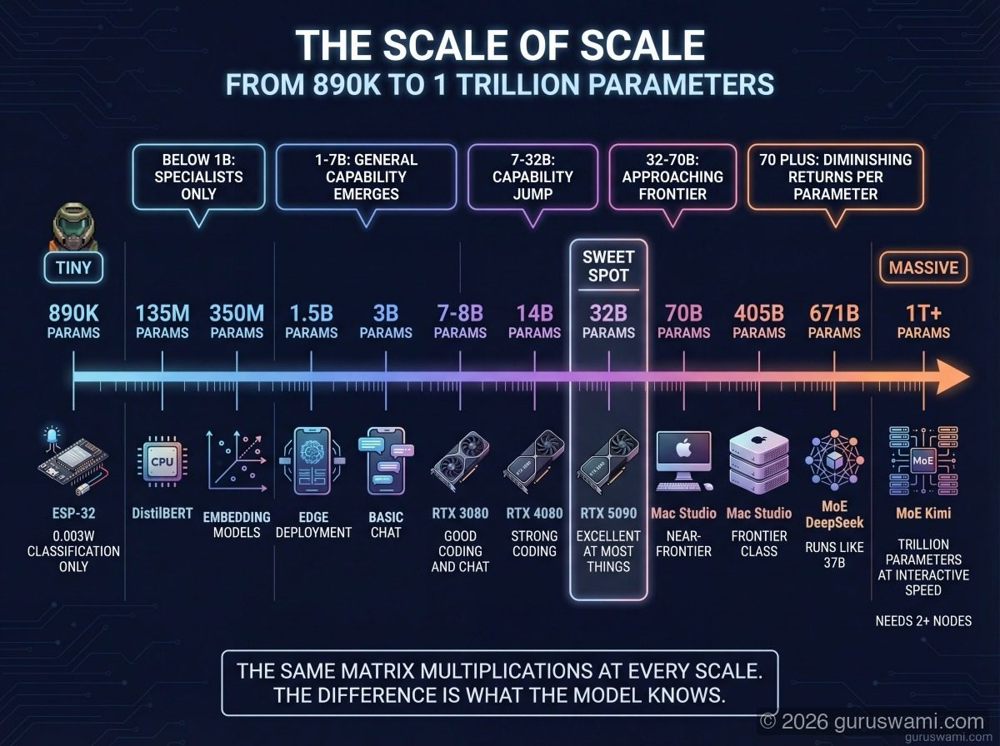
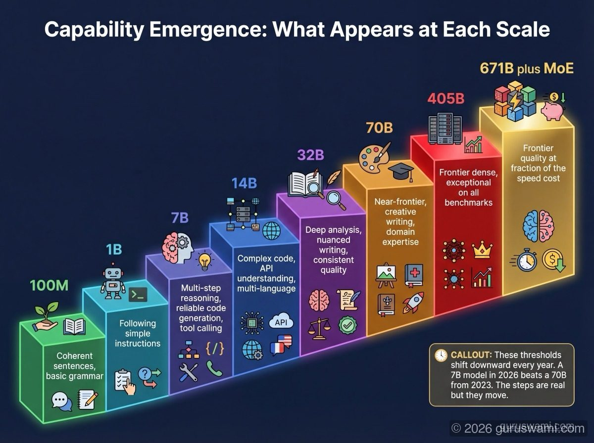
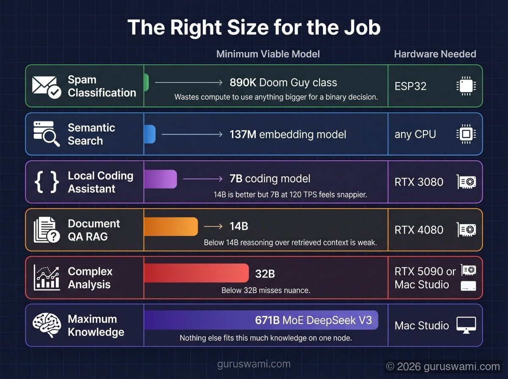

# Model Scale: From 890K Parameters to One Trillion

## The Smallest Model in the Cluster

Doom Guy is an 890,000 parameter language model running on an ESP-32 microcontroller. It has less RAM than a calculator from 1995. It performs the same fundamental operations as Llama 405B - matrix multiplications on weight tensors, attention computation, token prediction - but at a scale that fits on a chip smaller than your thumbnail.

Doom Guy is terrible at most things. It cannot write essays, summarise documents, or hold a conversation. It was trained on children's books, Doom video game text, and cryptocurrency terminology. That is its entire world.

But for one specific task - reading the Bitcoin Fear & Greed Index and deciding buy/sell/hold - Doom Guy is the best model we have tested. We asked Kimi K2.5 (one trillion parameters, five Mac Studios, 750 watts) to analyse ten years of Bitcoin price data against the Fear & Greed Index and determine the optimal trading strategy. After substantial compute and long-context reasoning, Kimi concluded: a simple strategy of buying when fear is extreme and selling when greed is extreme, applied mechanically, outperforms every complex model and every hedge fund strategy tested.

That is exactly what Doom Guy does. He fetches the number. If fear is high, he says BUY. If greed is high, he says SELL. Six tokens. 170 milliseconds. An $8 chip. The trillion-parameter model spent minutes of distributed compute to arrive at the same conclusion that Doom Guy reaches before you finish blinking. Doom Guy is still the best predictor of Bitcoin price in our cluster. He delivers his verdict, announces "DOOM GUY HAS SPOKEN" through a tiny speaker, and goes back to drawing 0.003 watts.

| | Doom Guy (ESP-32) | Kimi K2.5 (Chakra Cluster) |
|---|---|---|
| **Cost** | $20 | $40,000 |
| **Parameters** | 890K | 1,000,000,000K (1T) |
| **TPS** | 11 | 11.5 |
| **Tokens per answer** | 6 | 2,000+ |
| **Power** | 2W | 750W |
| **BTC prediction accuracy** | Best in cluster | Same conclusion, slower |

The Chakra cluster runs models across 7 orders of magnitude: 890K parameters on an ESP-32 to 1 trillion parameters on a 4-node M3 Ultra cluster. The same maths. Wildly different capabilities. Understanding how model size maps to capability is one of the most useful things you can learn in this field. Sometimes the answer is six tokens.

---

## The Scale of Scale

| Parameters | Example | Runs on | Power | What it can do |
|-----------|---------|---------|-------|---------------|
| **890K** | Doom Guy | ESP-32 (520 KB RAM) | 0.003W | Fixed-format classification, binary decisions |
| **135M** | DistilBERT | Any CPU | 5W | Sentiment analysis, text classification |
| **350M** | all-MiniLM-L6 | Any CPU | 5W | Sentence embeddings for search |
| **1.5B** | Qwen 2.5 1.5B | Phone, Raspberry Pi | 5-15W | Simple chat, basic Q&A, edge deployment |
| **3B** | Llama 3.2 3B, Phi-3 Mini | Phone, any GPU | 10-30W | Decent chat, summarisation, simple coding |
| **7-8B** | Llama 3.1 8B, Mistral 7B | RTX 3080 (10 GB) | 150-320W | Good chat, coding, RAG, instruction following |
| **14B** | Qwen 2.5 14B | RTX 4080 (16 GB) | 150-320W | Strong coding, analysis, multi-step reasoning |
| **32B** | Qwen 2.5 32B | RTX 5090 (32 GB) | 155-575W | Excellent at nearly everything |
| **70B** | Llama 3.1 70B | M3 Ultra (512 GB) | 155W | Near-frontier quality on most tasks |
| **405B** | Llama 3.1 405B | M3 Ultra (tight) or TP2 | 155-310W | Frontier-class dense model |
| **671B MoE** | DeepSeek V3 | M3 Ultra (380 GB Q4) | 155W | Frontier quality, runs like a 37B model |
| **1T+ MoE** | Kimi K2.5 | TP2 minimum (614 GB) | 310W | Trillion-parameter reasoning, interactive speed |

---

## What Changes as Models Grow

### Tiny (< 1B): Specialists, Not Generalists

Models under 1 billion parameters cannot hold enough knowledge to be good at general tasks. They do not understand context, cannot follow complex instructions, and produce incoherent output on open-ended prompts.

But they excel at narrow, well-defined tasks:
- **Classification** - is this email spam? Is this sensor reading anomalous?
- **Embeddings** - convert text to vectors for search (all-MiniLM at 350M parameters is industry standard)
- **Named entity recognition** - extract names, dates, amounts from text
- **Structured output** - fill in a fixed JSON template from simple inputs

Doom Guy lives here. It does one thing. It does it on hardware that costs $5 and runs on a battery. No cloud connection. No GPU. No operating system. For its specific task, replacing it with GPT-4 would cost more, be slower (network latency), less reliable (requires internet), and no more accurate.

**The lesson:** bigger is not always better. The right model for a task is the smallest model that does the task well enough.

### Small (1-7B): The Edge and the Starting Point

This is where models start feeling useful for general tasks. A 3B model can hold a conversation. A 7B model can write code, answer questions, and follow multi-step instructions. Quality varies - a 7B model will make mistakes a 70B model would not - but for many tasks the output is good enough.

**Why this range matters:**
- Fits on any modern GPU (even a 3080 with 10 GB)
- Fast enough for real-time interaction (120+ TPS on a 4090)
- Small enough for phones and edge devices
- Fine-tuning is practical (LoRA on a 7B model takes hours, not days)

Most people should start here. Download a 7B model, run it on whatever GPU you have, and learn the fundamentals before chasing bigger numbers.

### Medium (7-32B): The Capability Jump

Between 7B and 32B, something qualitative changes. Models start reliably following complex instructions, maintaining context over long conversations, writing production-quality code, and performing multi-step reasoning.

**What you gain:**
- Reliable instruction following (fewer "the model misunderstood me" moments)
- Better code generation (understands libraries, APIs, patterns)
- Multi-step reasoning (can chain 3-4 logical steps)
- Better multilingual capability
- More consistent output quality

**What you pay:**
- 14B at Q4 needs 8 GB VRAM (fits a 3080)
- 32B at Q4 needs 19 GB VRAM (needs a 4090 or Apple Silicon)
- TPS drops: 32B runs at 31.5 TPS on M3 Ultra vs 120+ TPS for 7B

The sweet spot for many applications is 14B-32B. Large enough to be reliable, small enough to run on consumer hardware.

### Large (32-70B): Approaching Frontier

70B dense models approach the quality of the best commercial APIs for most tasks. They handle nuanced reasoning, complex code generation, detailed analysis, and creative writing with few errors.

**The practical challenge:** 70B at Q4 is ~35 GB. It does not fit on any consumer NVIDIA GPU. It needs Apple Silicon (512 GB) or cloud inference. This is the first point where hardware choice becomes a real constraint, not just a speed trade-off.

### Massive (70B-405B): Frontier Dense Models

405B dense models like Llama 3.1 405B represent the upper limit of what dense architectures achieve at practical sizes. Quality on benchmarks is excellent. Real-world output is consistently strong across nearly all tasks.

**The cost:** 202 GB at Q4. Single M3 Ultra runs it at 3.0 TPS. TP2 improves to 4.3 TPS. TP4 reaches 6.4 TPS. All of these are usable but not fast. TTFT at 16K context is 10 minutes on TP4. This is not a chatbot. It is a system you query when quality matters more than speed.

### MoE Giants (400B-1T+): The Architecture Trick

Mixture of Experts changes the economics. A model can have hundreds of billions of total parameters but only activate a fraction per token. This means:

- **Speed of a small model** - DeepSeek V3 (671B total, 37B active) runs at 20 TPS. That is the speed of a ~37B dense model.
- **Knowledge of a large model** - all 671B parameters contribute to training. The model has seen more data and has more capacity than a 37B dense model.
- **Memory of a large model** - all 671B parameters must fit in memory even though only 37B activate per token.

Kimi K2.5 pushes this to a trillion parameters with only 32B active per token. It runs at 16 TPS on TP4. Interactive speed. The knowledge capacity of a trillion-parameter model at the generation speed of a 32B model.

**The catch:** MoE models are fast but not small. Kimi K2.5 is 614 GB at Q4. It needs at least 2 nodes. The MoE architecture trades memory for speed - you need the memory budget of a massive model but get the inference speed of a small one.

---

## Capability Emergence

Certain capabilities appear only above specific parameter thresholds. These are not gradual improvements - they are qualitative jumps where a model goes from "cannot do this at all" to "can do this reliably."

| Capability | Approximate threshold | Why |
|-----------|----------------------|-----|
| Coherent sentences | ~100M | Basic grammar requires minimal knowledge |
| Following simple instructions | ~1B | Instruction tuning works at this scale |
| Multi-step reasoning | ~7B | Needs enough parameters to maintain state |
| Reliable code generation | ~14B | Must internalise programming patterns |
| Complex analysis | ~32B | Requires deep domain knowledge |
| Nuanced creative writing | ~70B | Needs breadth of training data |
| Tool use / function calling | ~7B (with training) | Structured output is learnable at moderate scale |
| Multimodal understanding | ~3B (with vision encoder) | Vision encoder handles image complexity |

These thresholds shift downward with better training data, architecture improvements, and fine-tuning. A well-trained 7B model in 2026 outperforms a 70B model from 2023 on many tasks. The thresholds above are approximate for current-generation models.

---

## Embedding Models: A Different Scale Entirely

Embedding models convert text into numerical vectors for search and retrieval. They are not generative - they do not produce text. They live in a different part of the scale spectrum:

| Model | Parameters | Dimensions | Speed | Use |
|-------|-----------|-----------|-------|-----|
| all-MiniLM-L6 | 22M | 384 | 14,000 docs/sec | Quick search, prototyping |
| nomic-embed-text | 137M | 768 | 5,000 docs/sec | General purpose |
| BGE-large | 335M | 1024 | 2,000 docs/sec | High quality retrieval |
| mxbai-embed-large | 335M | 1024 | 2,000 docs/sec | Multilingual |
| GTE-Qwen2 | 1.5B | 8192 | 500 docs/sec | Maximum retrieval quality |

Embedding models are small enough to run on any hardware. Even a CPU handles them comfortably. The quality differences are subtle - for most RAG applications, a 137M model is fine. The 1.5B models exist for competitive benchmarks and edge cases where retrieval precision is critical.

Every RAG system has an embedding model even if you do not notice it. When you "upload a document to ChatGPT," it gets chunked, embedded, and stored in a vector database. The embedding model is doing the work that makes retrieval possible.

---

## The Right Size for the Job

The question is never "what is the biggest model I can run?" It is "what is the smallest model that does this task well enough?"

| Task | Minimum viable model | Why not smaller | Why not bigger |
|------|---------------------|-----------------|----------------|
| Spam classification | 890K (Doom Guy class) | Needs basic text understanding | Wastes compute on a binary decision |
| Semantic search | 137M embedding | Needs enough dimensions for nuance | Diminishing returns above 335M |
| Local coding assistant | 7B coding model | Below 7B, code quality drops | 14B is better but 7B at 120 TPS feels snappier |
| Document Q&A (RAG) | 14B | Below 14B, reasoning over retrieved context is weak | 32B is marginal improvement for 2× the memory |
| Complex analysis | 32B | Below 32B, misses nuance | 70B is better but needs special hardware |
| Frontier quality | 70B or 405B | Smaller models make more mistakes | Running 405B at 3 TPS is slow for interactive use |
| Maximum knowledge | 671B MoE (DeepSeek V3) | Nothing else fits this much knowledge on one node | 1T is diminishing returns for most tasks |

Doom Guy at 890K parameters and Kimi K2.5 at 1 trillion parameters are both doing matrix multiplications on weight tensors. The maths is identical. The difference is what they know, how fast they think, and what hardware they need. Understanding this spectrum - from the smallest useful model to the largest practical model - is what lets you make good decisions about which model to deploy for which task.
