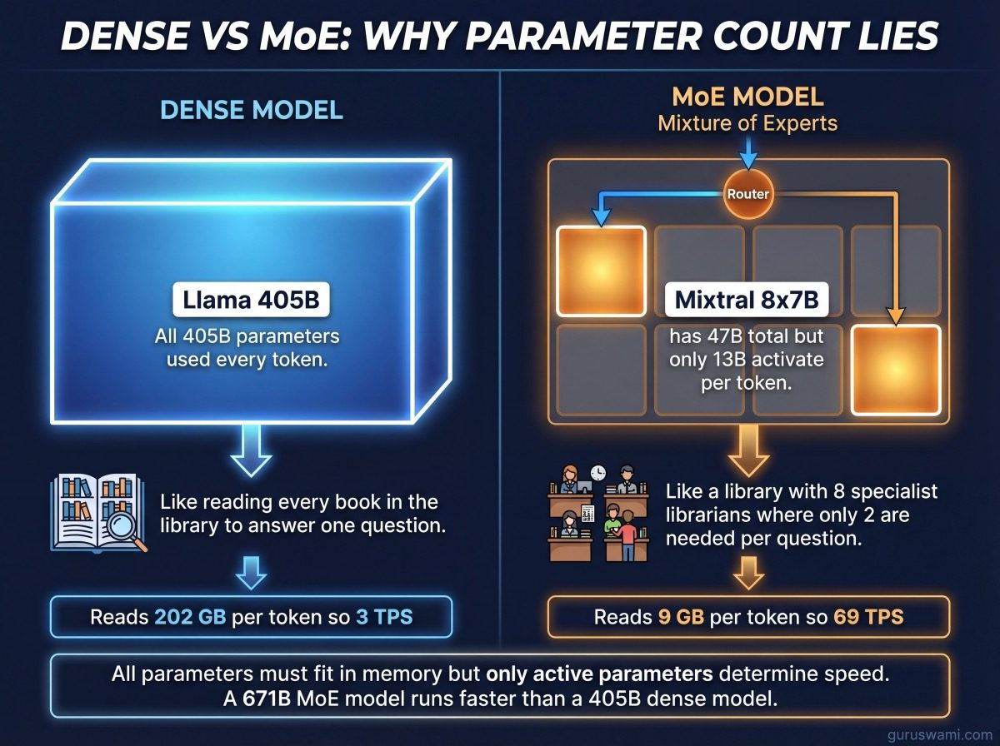
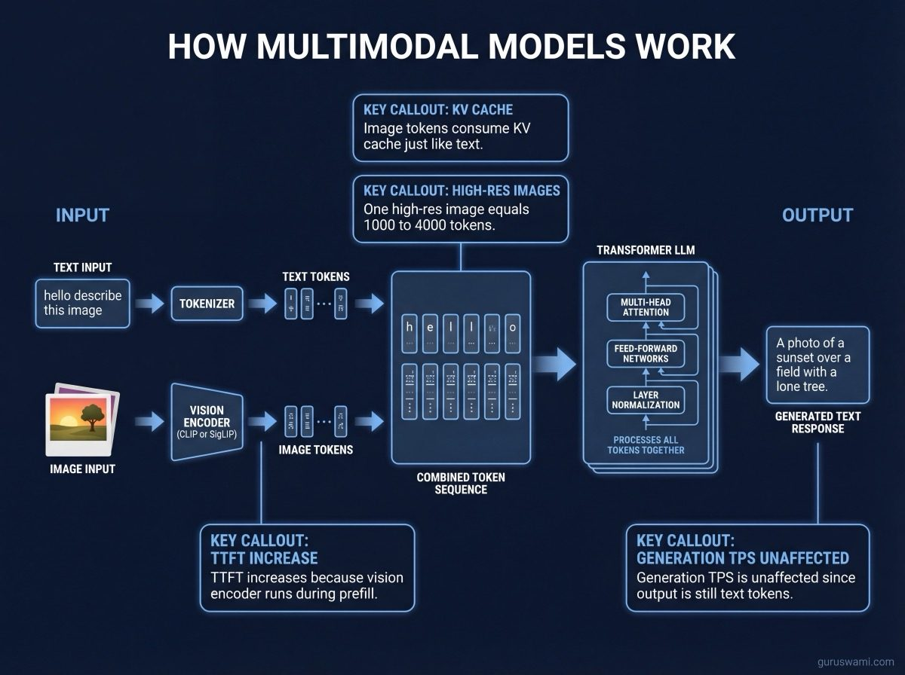
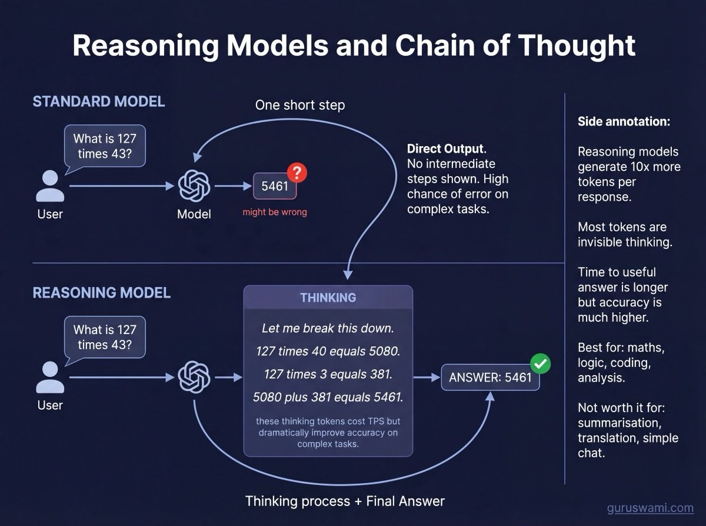
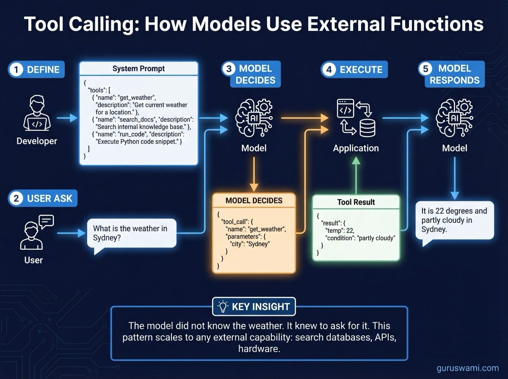

# Model Types: Dense, MoE, Multimodal, Reasoning, and More

Not all language models work the same way. The architecture determines how fast the model runs, how much memory it needs, what it can do, and how you should deploy it. This guide covers every major model type you will encounter.

---

## Dense Transformer Models

The original and most common architecture. Every parameter in the model participates in every token generated. If the model has 32B parameters, all 32B are read from memory for every single token.

**Examples:** Llama 3.1, Qwen 2.5, Gemma 2, Mistral, Phi-3, Command-R

**Characteristics:**
- Predictable performance: `TPS = bandwidth / model_size`
- Simple to quantise and deploy
- Memory usage equals model size plus KV cache
- Quality scales reliably with parameter count

**When to use:** Most tasks. Dense models are the default choice unless you have a specific reason to use something else.

---

## MoE (Mixture of Experts)

The model has many "expert" sub-networks but only activates a few per token. A small router network examines each token and decides which experts to use.

**Examples:** Mixtral 8x7B, DeepSeek V3, Kimi K2.5, Qwen MoE, DBRX, Grok-1

**Characteristics:**
- Total parameter count is misleading. Mixtral has 47B total but only 13B activate per token
- Generation speed is determined by active parameters, not total
- All parameters must still fit in memory (MoE models are fast but not small)
- Quality can match or exceed dense models at the same active parameter count

**The naming convention:** "8x7B" means 8 expert networks of ~7B parameters each. But the total is not 56B because they share attention layers. The total is 47B, with 13B active per token (2 of 8 experts plus shared layers).

**When to use:** When you want large-model quality at small-model speed. DeepSeek V3 (671B total, 37B active) runs at 20 TPS on a single M3 Ultra - the speed of a 37B dense model with the knowledge capacity of a much larger one.

---

## Multimodal Models

Models that process more than just text. They can understand images, audio, video, or combinations.

**Examples:** GPT-4o, Claude (with vision), Llama 3.2 Vision, Qwen-VL, LLaVA, Gemini

**How they work:** A vision encoder (usually a separate network like CLIP or SigLIP) converts images into token-like embeddings. These embeddings are fed into the language model alongside text tokens. The language model processes everything together.

**Impact on inference:**
- Image tokens consume KV cache just like text tokens. A single high-resolution image can add 1,000-4,000 tokens to your context
- TTFT increases because the vision encoder runs during prompt processing
- Generation TPS is unaffected (generating text tokens works the same regardless of input modality)
- Memory usage increases by the size of the vision encoder (typically 300M-2B parameters)

**When to use:** Document understanding, image analysis, screenshot interpretation, diagram reading. Not all local inference tools support multimodal models yet. MLX has growing support via mlx-vlm.

---

## Reasoning Models

Models specifically trained to "think step by step" before answering. They produce internal reasoning traces (chain-of-thought) that improve accuracy on complex tasks.

**Examples:** DeepSeek-R1, Qwen QwQ, o1/o3 (OpenAI), Claude with extended thinking

**How they work:** The model generates a reasoning trace (sometimes called "thinking tokens") before producing the final answer. This trace can be hundreds or thousands of tokens long. Some models show the thinking; others hide it.

**Impact on inference:**
- Much higher total token generation per response (thinking + answer)
- TTFT may be fast but "time to useful answer" is longer
- Quality on maths, logic, and coding tasks is significantly better than standard models
- Memory usage is the same as the base model

**Chain-of-Thought (CoT):** The technique of prompting a model to reason step by step. Reasoning models do this natively. Standard models can be prompted to do it with instructions like "think step by step" or "show your reasoning." CoT prompting on a standard model is not the same as a purpose-trained reasoning model, but it helps.

**When to use:** Complex maths, multi-step logic, code debugging, scientific analysis. Not worth the extra tokens for simple tasks like summarisation or translation.

---

## Instruction-Tuned vs Base Models

**Base models** predict the next token based on training data. They complete text, not follow instructions. Ask a base model "What is the capital of France?" and it might continue with "What is the capital of Germany? What is the capital of Italy?" because that is the pattern it learned from training data.

**Instruct models** are fine-tuned (usually with RLHF or DPO) to follow instructions and have conversations. Ask an instruct model the same question and it answers "Paris."

**On Hugging Face:** Look for `-Instruct`, `-Chat`, or `-it` in the model name. `Llama-3.1-8B` is the base model. `Llama-3.1-8B-Instruct` is the instruction-tuned version. For inference, you almost always want the instruct variant.

---

## Tool Calling / Function Calling

Models trained to recognise when they should call an external tool (search the web, run code, query a database) and format the call correctly.

**Examples:** Most modern instruct models support tool calling: Llama 3.1+, Qwen 2.5+, Mistral, Command-R, Claude, GPT-4

**How it works:**
1. You define available tools in the system prompt (name, description, parameters)
2. The user asks a question that requires a tool
3. The model generates a structured tool call (usually JSON) instead of a text answer
4. Your application executes the tool and feeds the result back to the model
5. The model generates the final answer using the tool's output

**Impact on inference:** Tool calling adds round-trips. Each tool call requires a full generation → execution → re-prompt cycle. TTFT matters more because the model processes the growing context (including tool results) at each step.

**When to use:** Any application where the model needs access to live data, calculations, or external systems. RAG, coding assistants, data analysis, automation.

---

## Coding Models

Models specifically trained or fine-tuned on source code. They understand programming languages, generate code, debug, and explain existing code.

**Examples:** DeepSeek-Coder, Codestral, Qwen-Coder, StarCoder, CodeLlama, Granite Code

**Characteristics:**
- Tokenisers optimised for code (fewer tokens per line of code)
- Better at completing functions, writing tests, and following code conventions
- Often have fill-in-the-middle (FIM) capability for IDE autocomplete
- Usually available in smaller sizes (7B-33B) that fit on consumer GPUs

**When to use:** Local coding assistants (VS Code Continue, Cody), code review, test generation. A 7B coding model at Q4 on an RTX 3080 gives you a fast, private coding assistant for free.

---

## Embedding Models

Models that convert text into numerical vectors (embeddings) for search and retrieval. These are not generative - they do not produce text.

**Examples:** nomic-embed, BGE, E5, GTE, all-MiniLM, mxbai-embed

**How they work:** The model reads your text and outputs a fixed-size vector (typically 384-4096 dimensions). Similar texts produce similar vectors. You compare vectors using cosine similarity to find related documents.

**Impact on inference:** Embedding models are small (100M-500M parameters) and fast. They process the entire input in a single pass with no generation step. Throughput is measured in texts per second, not tokens per second.

**When to use:** RAG (Retrieval Augmented Generation) pipelines, semantic search, document clustering, deduplication. Every RAG system has an embedding model even if you do not notice it.

---

## How Model Types Affect Benchmarks

| Type | TPS formula | Memory impact | TTFT impact |
|------|------------|---------------|-------------|
| Dense | `bandwidth / model_size` | Predictable | Scales with prompt length |
| MoE | `bandwidth / active_params` | All params must fit | Same as dense |
| Multimodal | Same as base | +vision encoder | +image encoding time |
| Reasoning | Same as base | Same as base | Fast TTFT, slow "time to answer" |
| Coding | Same as base | Same as base | Same as base |
| Embedding | N/A (not generative) | Small (100-500M) | N/A |

The benchmarks in this project measure dense and MoE models. The physics (bandwidth determines speed, KV cache grows with context) applies equally to reasoning, coding, and multimodal models. Only the token count changes.
