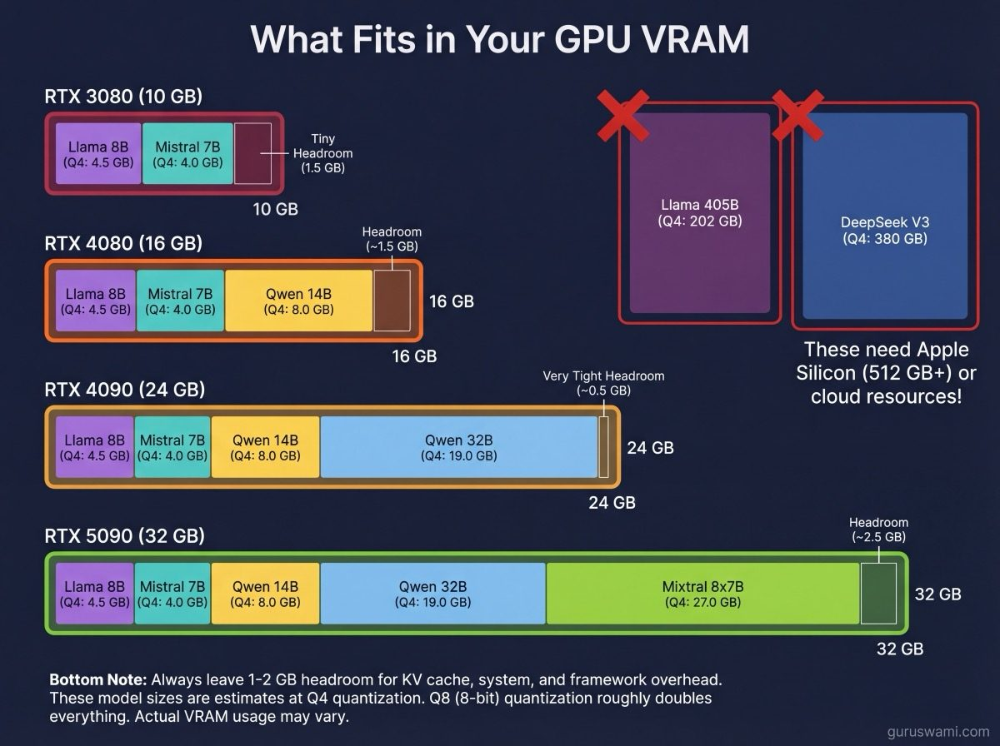
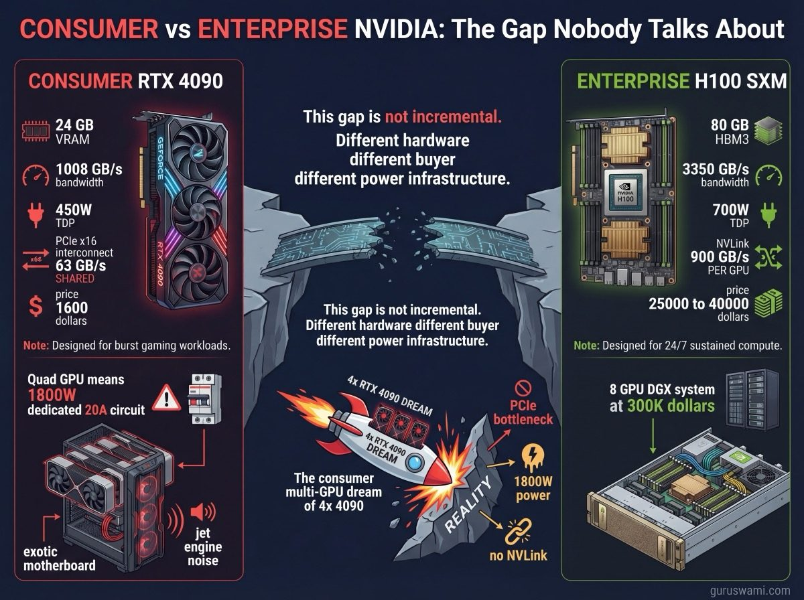

# NVIDIA Consumer GPUs: Where Most People Start

## The Gaming Card That Does AI

You probably already own one. An RTX 3080, a 4090, maybe a 5090 if you sold a kidney recently. These are gaming cards. They were designed to render Cyberpunk at 4K, not to run trillion-parameter language models. But they are remarkably good at inference, and they are often where the learning starts.

If you have a modern NVIDIA GPU sitting under your desk right now, you can be running a local coding assistant, chatbot, or disturbingly convincing D&D dungeon master within the hour. No cloud subscription. No API keys. No per-token charges. Just you, your GPU, and whatever model fits in VRAM.

---

## The Hardware

### What You Have (Probably)

| GPU | VRAM | Memory BW | TDP | Price (approx) | Year |
|-----|------|-----------|-----|-----------------|------|
| RTX 3080 | 10 GB | 760 GB/s | 320W | $300 used | 2020 |
| RTX 3090 | 24 GB | 936 GB/s | 350W | $700 used | 2020 |
| RTX 4080 | 16 GB | 717 GB/s | 320W | $800 used | 2022 |
| RTX 4090 | 24 GB | 1008 GB/s | 450W | $1,600 | 2022 |
| RTX 5090 | 32 GB | 1792 GB/s | 575W | $2,000 | 2025 |

### VRAM Is the Hard Limit

VRAM is the hard limit. Your model must fit in VRAM. If it does not fit, it does not run at full speed. Period.

Some tools (llama.cpp, Ollama) can "offload" layers to system RAM when VRAM runs out. This works, technically. A model split between 24 GB of VRAM and 32 GB of system RAM will run. It will also be 5-10× slower than fitting entirely in VRAM, because system RAM bandwidth (50-80 GB/s) is a fraction of VRAM bandwidth (760-1792 GB/s). CPU offloading is a learning tool, not a production strategy.

### What Fits Where

| GPU (VRAM) | Max model at Q4 | Max model at Q8 | Examples |
|-----------|----------------|----------------|---------|
| 10 GB (3080) | ~14B | ~7B | Llama 8B Q4, Mistral 7B Q4 |
| 16 GB (4080) | ~24B | ~14B | Qwen 14B Q4, Phi-3 Medium |
| 24 GB (4090) | ~32B | ~24B | Qwen 32B Q4 (tight), Llama 8B Q8 |
| 32 GB (5090) | ~48B | ~32B | Qwen 32B Q8, Mixtral 8x7B Q4 |

These are rough estimates. Actual usage depends on KV cache (context length), framework overhead, and the specific quantisation method. Always leave 1-2 GB of headroom.

---

## What You Can Do With a Consumer GPU

### The Practical Stuff

**Local coding assistant.** A 7B coding model (DeepSeek-Coder, Codestral, Qwen-Coder) at Q4 runs at 120+ TPS on an RTX 4090. That is faster than most cloud APIs. Plug it into VS Code via Continue or Cody. Your code never leaves your machine.

**Chat and experimentation.** Llama 8B Instruct at Q4 on a 3080: ~120 TPS. Fast enough that the model feels conversational. Good for exploring what models can and cannot do, testing prompts, and building intuition about LLM behaviour.

**RAG and document Q&A.** Load a 14B model at Q4 on a 4080 or above. Feed it documents via a RAG pipeline. The 16K context window handles most practical document lengths. You learn what retrieval-augmented generation actually does, not what a vendor's marketing page claims.

**AI dungeon master.** Run a 32B model at Q4 on a 4090 or 5090. Give it a system prompt with your campaign setting. The model maintains character, generates encounters, and handles player actions. Nobody needs to show up to your D&D party; the model is always available and never cancels last minute.

### The Learning Stuff

**Quantisation experiments.** Download the same model at Q2, Q4, Q6, and Q8. Run them all. Feel the speed difference. Read the output quality difference. This teaches you more about the speed-quality trade-off than any paper.

**Context length impact.** Run the same prompt at 1K, 4K, 16K tokens. Watch TTFT climb. Watch TPS drop. Now you understand why cloud APIs charge more for long context.

**Perplexity measurement.** Run `llama-perplexity` on different quants of the same model. Find the cliff where quality collapses. Every model has one. Finding it yourself makes you a better judge of model selection.

---

## What Consumer GPUs Are Not

### Not Enterprise Hardware

Gaming cards are designed for burst workloads. Render a frame, wait for vsync, render the next frame. Even under sustained gaming, the GPU cycles between load and idle thousands of times per second. Thermals are managed for this pattern.

LLM inference is different. The GPU runs at 100% utilisation continuously for as long as the model is generating. A 4090 at full load draws 450W and produces 350W of heat. Running 24/7, that is:

- **$500-$1000/year in electricity** (at typical residential rates)
- **Constant fan noise** at maximum RPM
- **Thermal degradation** of components designed for 3-5 year gaming lifespans, not 24/7 datacentre duty
- **No ECC memory** - bit flips happen under sustained thermal stress and go undetected

Consumer cards work for inference. They are not designed for it. Running a 4090 as a 24/7 inference server in your living room will shorten its life, raise your electricity bill, and make your partner question your priorities.

### Not Scalable

**You cannot just add more GPUs.** Multi-GPU on consumer hardware means:

- **PCIe interconnect** - 63 GB/s shared (not per-GPU). Compare with NVLink at 900 GB/s. The communication bottleneck destroys distributed performance.
- **1800W for four 4090s** - requires a dedicated 20A circuit. In many countries, this exceeds what a standard residential outlet can deliver.
- **Exotic motherboards and cases** - quad-slot GPUs need server chassis with adequate airflow. Consumer ATX cases and motherboards are not designed for this.
- **PSU requirements** - a 1600W+ PSU that can actually deliver clean power to four GPUs costs $300-$500 and sounds like a jet engine.
- **No guarantee it works** - PCIe bandwidth sharing means four GPUs do not give you 4× performance. Depending on the workload, you might get 2-2.5× at best.

The gap between consumer and enterprise NVIDIA. Four 4090s crammed into a mining rig gives you ~96 GB of fragmented VRAM connected by a PCIe bottleneck. A single H100 SXM gives you 80 GB of unified HBM3 with 3.35 TB/s bandwidth, connected to other H100s via NVLink at 900 GB/s. The H100 also costs $25,000-$40,000 and consumes 700W of its own.

### Not Comparable to Apple Silicon for Large Models

A 4090 (24 GB VRAM) cannot run any model larger than ~32B at Q4. An M3 Ultra (512 GB unified memory) runs a 405B model on a single machine. These are not competing products. They serve different roles:

| Need | Best option |
|------|-------------|
| Fast inference on 7B-14B models | NVIDIA consumer GPU |
| Power-efficient inference at any size | Apple Silicon |
| Models larger than 32B at Q4 | Apple Silicon or enterprise NVIDIA |
| Learning quantisation and context trade-offs | Whatever GPU you already own |
| 24/7 production inference serving | Enterprise hardware (neither consumer NVIDIA nor Mac Studio) |

---

## Where Consumer GPUs Excel

### Raw Speed on Small Models

The gap is clear. An RTX 5090 runs Llama 8B Q4 at ~275 TPS. An M3 Ultra runs the same model at ~120 TPS. The 5090 has 2.2× higher memory bandwidth (1792 vs 819 GB/s) and it shows directly in generation speed. For models that fit in VRAM, NVIDIA consumer cards are faster.

### TPS per Dollar

At $2000, an RTX 5090 delivers ~275 TPS on a 7B model. At $8000, an M3 Ultra delivers ~120 TPS on the same model. The 5090 is 9× more cost-effective for small model inference. The economics only flip when you need to run models that exceed VRAM capacity.

### Power-Efficient When Idle

A 4090 at idle draws ~30W. A Mac Studio at idle draws ~20W. The difference only appears under sustained load: 450W vs 155W for comparable inference workloads. If you are running inference intermittently (a few hours per day), the 4090's power consumption is manageable. If you are running 24/7, the Mac Studio uses a third of the electricity.

### Community and Tools

llama.cpp, Ollama, vLLM, TensorRT-LLM, text-generation-webui, LM Studio - the NVIDIA tool community is enormous. Every new model gets GGUF quantisations within hours of release. Every tool supports CUDA. If something goes wrong, someone on Reddit has already fixed it.

Apple Silicon's MLX community is growing fast but is younger. Fewer tools, fewer community-quantised models, fewer Stack Overflow answers. If you are just starting out, NVIDIA's community reduces friction significantly.

---

## The Honest Recommendation

If you have an NVIDIA GPU and want to learn about LLM inference, start there. Do not buy anything new. Download a model, run it, measure the results.

The concepts you learn on a 3080 - quantisation impact, context window costs, TTFT trade-offs, perplexity degradation - transfer directly to every other platform. An M3 Ultra, an H100 cluster, a cloud API: the same physics applies. Memory bandwidth determines generation speed. KV cache grows linearly with context. Quantisation trades precision for throughput.

Once you outgrow your VRAM - and you will, because 14B models are good but 70B models are better and 405B models are remarkably capable - that is when Apple Silicon or cloud inference enters the picture. Not before.

Start with what you have. Measure everything. The understanding you build is worth more than the hardware you buy.
