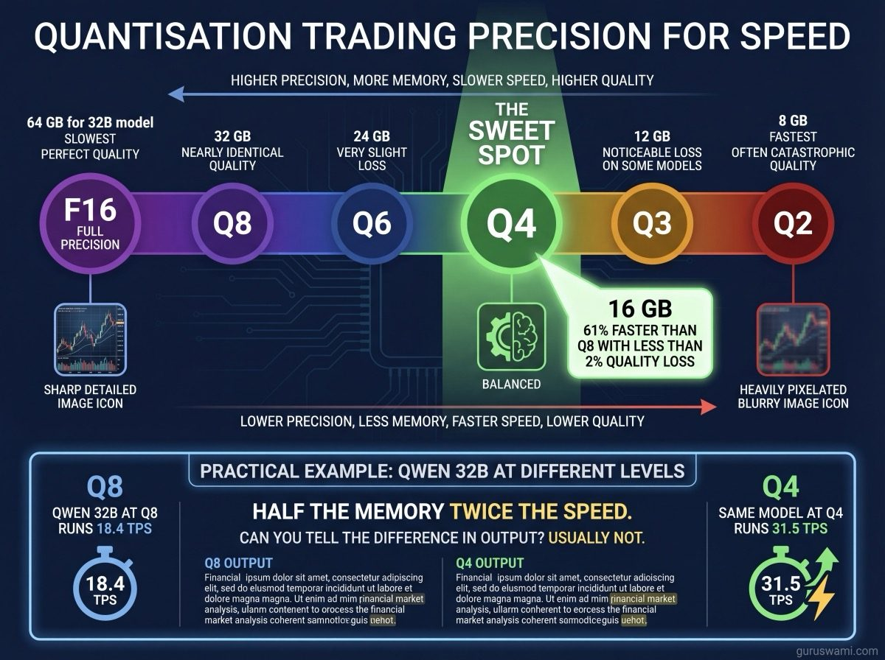
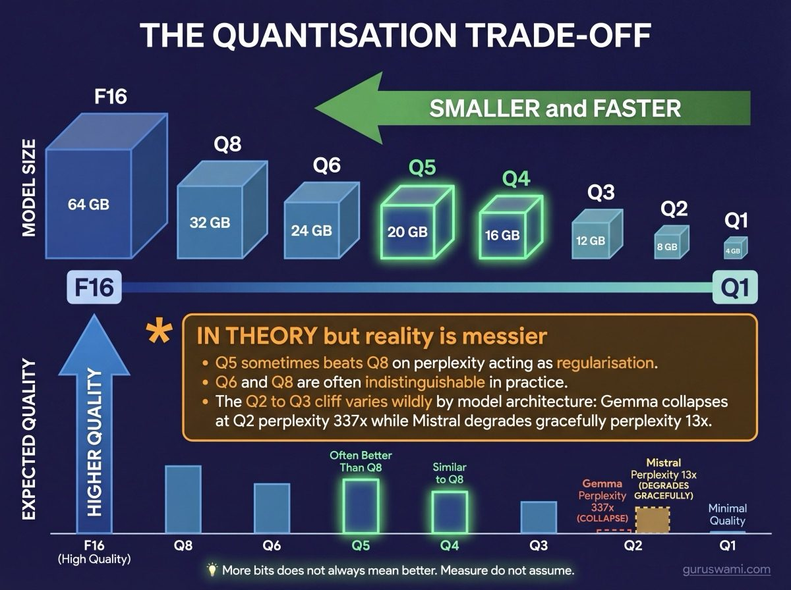

# Quantisation: Making Models Smaller and Faster

## What It Is

A neural network stores its knowledge as billions of numbers (called "weights" or "parameters"). Each number is stored with a certain precision. Full precision uses 16 bits per number. Quantisation reduces this to fewer bits.

## Every Quantisation Level Explained

| Quant | Bits | Size of 32B model | Quality | When to use |
|-------|------|-------------------|---------|-------------|
| **BF16/F16** | 16 | 64 GB | Perfect baseline | Research, quality measurement, fine-tuning |
| **Q8** | 8 | 32 GB | 99%+ of F16 | When you have memory to spare and want maximum quality |
| **Q6** | 6 | 24 GB | 98-99% of F16 | Good balance when Q4 is not quite enough |
| **Q5** | 5 | 20 GB | 98-99% of F16 | Sometimes beats Q8 on perplexity (regularisation effect) |
| **Q4** | 4 | 16 GB | 95-98% of F16 | **The sweet spot.** Best speed/quality trade-off |
| **Q3** | 3 | 12 GB | 85-95% of F16 | Marginal. Some models tolerate it, others degrade visibly |
| **Q2** | 2 | 8 GB | 30-80% of F16 | Usually catastrophic. Useful only for fitting otherwise impossible models |
| **Q1** | 1-1.5 | 4-6 GB | Experimental | Research papers only. Not available in any production tool |

**A note on Q1.** Q1 exists in academic papers (BitNet, 1-bit LLMs) but not in any inference tool you can download today. No llama.cpp quant, no MLX quant, no Hugging Face model produces a true 1-bit model. The closest practical thing is IQ1_S in llama.cpp, which uses ~1.5 effective bits and produces output quality roughly equivalent to asking a magic 8-ball. It is interesting research. It is not something you would use. If someone tells you to download a Q1 model, they are either reading a research paper or sending you for a left-handed screwdriver.

**BF16 vs F16.** Both are 16-bit, but BF16 (bfloat16) uses a different bit layout: more range, less precision. Most modern models train in BF16. For inference, they are interchangeable. When people say "F16" they usually mean whichever 16-bit format the model was trained in.

**FP8.** An 8-bit floating point format used by some models (DeepSeek V3 ships as FP8). Not the same as Q8 integer quantisation. FP8 preserves more dynamic range than Q8 but is less widely supported. You may see `FP8_E4M3` or `FP8_E5M2` - these are specific bit layouts within the 8-bit budget.

---

## Not All Layers Get Quantised

Often missed. When a model is "Q4," not every weight is actually 4-bit:

**Always kept at full precision:**
- **Embedding layers** - the input/output word representations. Quantising these destroys the model's vocabulary.
- **Layer normalization** - tiny layers (a few MB total) that stabilise the network. Quantising them causes training-like instability.
- **Router weights** (MoE models) - the network that decides which experts to activate. If this is approximate, the wrong experts fire.

**Sometimes kept at higher precision:**
- **Attention query/key projections** - some quantisation methods keep these at Q6 or Q8 even when the rest is Q4, because attention accuracy matters more than feed-forward accuracy.
- **First and last transformer layers** - these handle the transition between token space and hidden space. Some methods quantise them less aggressively.

That is why a "Q4" model is not exactly `params × 0.5 bytes`. The actual size includes full-precision embeddings plus quantised transformer layers, averaging out to roughly 4.2-4.5 effective bits per parameter.

---

## Platform and Software Availability

Not every quantisation level works everywhere. The toolchain determines what you can run.

| Quant | llama.cpp (NVIDIA/CPU) | MLX (Apple Silicon) | Notes |
|-------|----------------------|--------------------|----|
| F16/BF16 | Yes | Yes | Universal |
| Q8 | Q8_0, Q8_K | Yes | Universal |
| Q6 | Q6_K | Yes | Universal |
| Q5 | Q5_0, Q5_1, Q5_K_S, Q5_K_M | Yes | llama.cpp has more variants |
| Q4 | Q4_0, Q4_1, Q4_K_S, Q4_K_M | Yes | Most popular level |
| Q3 | Q3_K_S, Q3_K_M, Q3_K_L | Yes | llama.cpp has size variants |
| Q2 | Q2_K | Yes | Minimal support, often poor quality |
| IQ4/IQ3/IQ2/IQ1 | Yes (importance quants) | No | llama.cpp only, uses importance matrices |

**llama.cpp** has the richest quantisation ecosystem. K-quants (Q4_K_M, Q5_K_S, etc.) use different bit allocations for different layer types within a single file. The `_S`, `_M`, `_L` suffixes mean small, medium, large - referring to how many layers get the higher-precision treatment, not model size.

**MLX** supports straightforward per-layer quantisation (Q2 through Q8) via `mlx_lm.convert`. Simpler, fewer variants, but effective.

**Importance quants (IQ)** are a llama.cpp innovation: they use pre-computed importance matrices to decide which weights can tolerate more compression. IQ4_XS can achieve near-Q5 quality at Q4 sizes. Not available on MLX.

---

## Fractional and Hybrid Quantisation

The future is not uniform bit-widths. Several approaches mix precision within a single model:

**K-quants (llama.cpp).** Already mainstream. A "Q4_K_M" file uses Q4 for most layers but Q5 or Q6 for attention layers and Q8 for a few critical layers. The `_M` variant uses more high-precision layers than `_S`, giving better quality at a slightly larger file.

**AQLM, QuIP#, HQQ.** Research methods that optimise which weights to compress more. They can achieve Q2-level sizes with Q4-level quality by being smarter about which weights can tolerate rounding.

**Mixed-precision MoE.** Kimi K2.5 ships with its expert weights in INT4 but attention and shared layers in BF16. This makes sense: the experts are the bulk of the model (hundreds of billions of parameters) while the attention layers are relatively small and quality-critical.

**Dynamic quantisation.** Some serving frameworks quantise different layers to different precisions based on their measured sensitivity. A layer that causes large perplexity increases at Q4 might be kept at Q6 while a layer that barely notices Q3 gets compressed further. This is an active research area.

---

## The Trade-off

Quantisation is the single most impactful variable in local inference. Going from Q8 to Q4 cuts memory usage in half and roughly doubles generation speed. On a GPU with 24 GB of VRAM, this is the difference between "model does not fit" and "model runs comfortably."

Less precision means less accuracy. The model's weights are approximate instead of exact. For many tasks, Q4 weights produce output indistinguishable from F16. For others, the approximation introduces subtle errors. Perplexity measurement (relative to the F16 baseline of the same model) is how you tell the difference.

---

## Reading Model Names

When you see `Qwen2.5-32B-Instruct-Q4_K_M` on Hugging Face:
- **Qwen2.5** - model family (made by Alibaba)
- **32B** - 32 billion parameters
- **Instruct** - fine-tuned to follow instructions (vs raw "base" model)
- **Q4_K_M** - quantised to 4-bit using the K-quant method, medium size variant

Common quant method names: `Q4_K_M` (k-quant medium, mixed precision), `Q4_K_S` (k-quant small, fewer high-precision layers), `Q4_0` (basic uniform 4-bit, older method), `IQ4_XS` (importance quant, llama.cpp only), `AWQ` (Activation-aware Weight Quantisation), `GPTQ` (GPU-optimised post-training quantisation). They all aim for the same goal: fewer bits per weight with minimal quality loss. The differences are in how they choose which weights to compress more.
