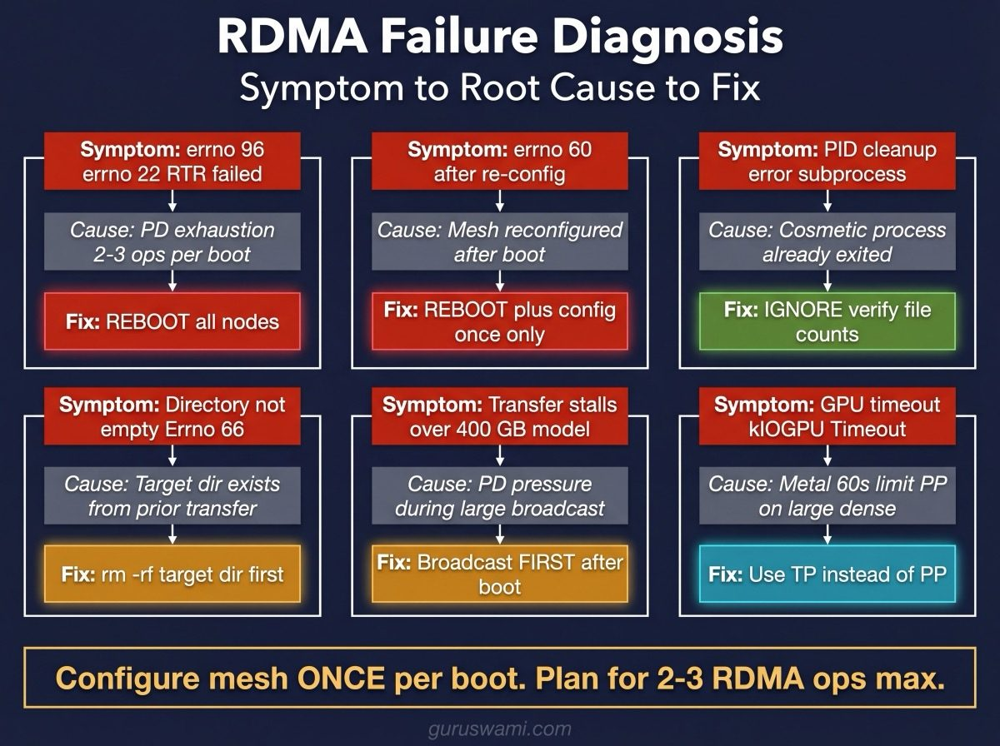

# RDMA Failure Modes on Apple Silicon TB5 Clusters

The blue screen of death for distributed inference - except more polite and less obvious. No crash dialog. No error popup. Just a `errno 96` buried in stderr and your benchmark silently producing garbage while you wonder why TP4 is slower than single-node.

Documented during systematic benchmarking of MLX distributed inference on a 5-node M3 Ultra cluster connected via Thunderbolt 5 RDMA (JACCL backend). These failure modes were observed with MLX 0.30.7 and mlx-lm 0.30.8 on macOS 26.3.1 (Tahoe). All are reproducible. None produce helpful error messages. We found them by running into each one, losing hours of benchmark time, and documenting the fix so you do not have to.



## 1. Protection Domain (PD) Exhaustion After Repeated RDMA Operations

**Symptom**: `[jaccl] Changing queue pair to RTR failed with errno 96` or `errno 22`. Subsequent RDMA operations fail until reboot.

**Cause**: Each `mlx_lm.share` broadcast or `mlx.launch` distributed run allocates RDMA protection domains in the kernel. After 2-3 consecutive broadcasts (or many distributed inference runs), the kernel's PD pool exhausts. The AppleThunderboltRDMA kernel extension does not reclaim PDs when processes exit.

**Reproduction**: Run `mlx_lm.share` three times in succession without rebooting. The third (or sometimes second) broadcast will fail with RTR errors.

**Fix**: Reboot the affected nodes. No hot-fix exists. PDs are allocated in kernel space and only released at boot.

**Impact on benchmarking**: Limits the number of RDMA model distributions per boot cycle to 2-3. Plan model staging accordingly.

**Workaround**: Stage models from DAS to the coordinator node (muladhara) first, then broadcast to all nodes in a single RDMA session per boot.

## 2. Mesh Reconfiguration Corruption

**Symptom**: `[jaccl] Changing queue pair to RTR failed with errno 60`. All RDMA operations fail, including ones that worked seconds earlier.

**Cause**: Running `mlx.distributed_config --auto-setup` more than once per boot corrupts the ARP tables and RDMA device mappings. The second config attempt assigns new IP addresses to TB5 interfaces, but the kernel's RDMA device bindings still reference the old addresses.

**Reproduction**: Run `mlx.distributed_config` for a 5-node mesh, then run it again for a 2-node subset. The second call corrupts the first mesh.

**Fix**: Reboot all nodes and run `mlx.distributed_config` exactly once.

**Impact on benchmarking**: Cannot switch between mesh configurations (e.g. 5-node for broadcasts, 2-node for TP2) without a reboot. Use the full mesh config and let `mlx.launch` use hostfile subsets for TP2/TP4.

## 3. Silent Transfer Failure (PID Cleanup Error)

**Symptom**: `mlx_lm.share` reports `subprocess.CalledProcessError` about PID file cleanup on remote nodes. The command exits with an error, but no data-related error is reported.

**Cause**: After the broadcast completes, `mlx.launch` tries to clean up remote processes via SSH. The PID file (`/var/folders/.../tmp.XXX`) has already been removed by the remote process exiting normally. The cleanup `kill` command fails because the process is already gone.

**Actual status**: The transfer usually succeeded. This is a cosmetic error in the launch cleanup code, not a transfer failure.

**Verification**: Always check the target nodes for file counts after a broadcast, regardless of the exit code:
```bash
ssh target_node "ls /path/to/model/*.safetensors | wc -l"
```

**Impact**: Misleading. Makes successful transfers appear to have failed. Caused unnecessary reboots and retries during our benchmarking until we learned to ignore the PID errors and verify file counts.

## 4. Directory Not Empty on Atomic Rename

**Symptom**: `OSError: [Errno 66] Directory not empty` on target nodes after a broadcast.

**Cause**: `mlx_lm.share` transfers files to a temporary directory, then attempts an atomic `os.rename()` to the final path. If the target directory already exists (from a previous partial transfer, rsync, or manual copy), the rename fails because macOS `rename()` cannot replace a non-empty directory.

**Actual status**: The data transferred successfully to the temp directory. It just wasn't moved to the final path.

**Fix**: Clear the target directory on all receiving nodes before broadcasting:
```bash
for node in svadhisthana manipura anahata vishuddha; do
  ssh $node "rm -rf /opt/models/target_path"
done
```

## 5. Large Model Broadcast Stalling (>400 GB)

**Symptom**: Broadcast starts transferring files at 5+ GB/s, then stops progressing partway through. Process stays alive but no new data is written to target nodes. Eventually times out or must be killed.

**Observed with**: Llama 405B Q8 (402 GB, 85 files) and initial attempts at Kimi K2.5 (614 GB, 182 files) when mesh was partially degraded.

**Cause**: Unclear. Likely related to PD pressure building during the transfer itself. With 85+ safetensors files each being broadcast to 4 nodes, the total RDMA operation count is 340+ per broadcast. Each operation may consume PD resources that aren't reclaimed until the transfer completes.

**Resolution**: After a clean reboot with a single mesh configuration, Kimi K2.5 (614 GB, 606 files) transferred successfully to all 4 nodes in 2 minutes 6 seconds at 5.2 GB/s. The key was having a completely clean RDMA state with no prior operations.

**Lesson**: For large models (>400 GB), ensure the broadcast is the FIRST RDMA operation after boot. Do not run any distributed inference or other broadcasts before the large transfer.

## 6. Metal GPU Timeout During Pipeline Parallelism

**Symptom**: `[METAL] Command buffer execution failed: Caused GPU Timeout Error (00000002:kIOGPUCommandBufferCallbackErrorTimeout)` on all nodes simultaneously.

**Cause**: Metal enforces a ~60-second unconfigurable timeout on GPU command buffers. When using Pipeline Parallelism (PP) on large models, each node processes a subset of layers. If that subset takes more than 60 seconds to process (including model weight reads and attention computation), the GPU times out.

**Observed with**: Llama 405B at PP2 (63 layers per node) and PP4 (31 layers per node). The 405B model's individual layers are heavy enough that even 31 sequential layers exceed the timeout.

**Not observed with**: Qwen 32B PP2 (32 layers, ~19 GB model - well within timeout). Mixtral 8x7B PP4 (8 layers per node, MoE activation makes it fast).

**Impact**: PP is not viable for 405B-class dense models on current Apple Silicon. TP is required.

## Summary: Practical Rules

1. Configure mesh **once per boot** - never reconfigure
2. Plan for **2-3 RDMA operations per boot session** maximum
3. For large models (>400 GB), broadcast **first** after a clean boot
4. Always **verify file counts** on target nodes - ignore PID cleanup errors
5. Always **clear target directories** before broadcasting
6. Distribute hostfile to **all nodes** after mesh configuration - RDMA device names change each boot
7. PP is limited by Metal's 60-second GPU timeout - use TP for 405B+ dense models
