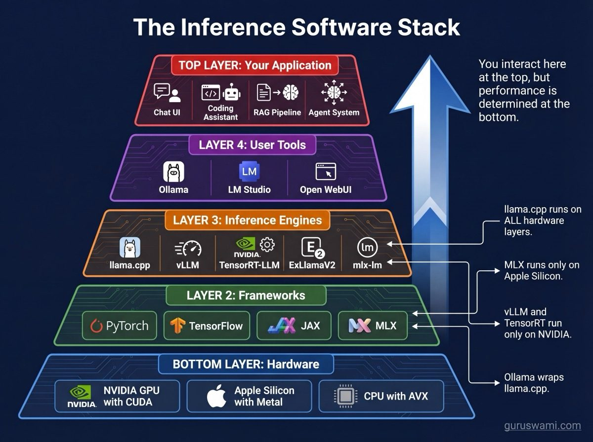
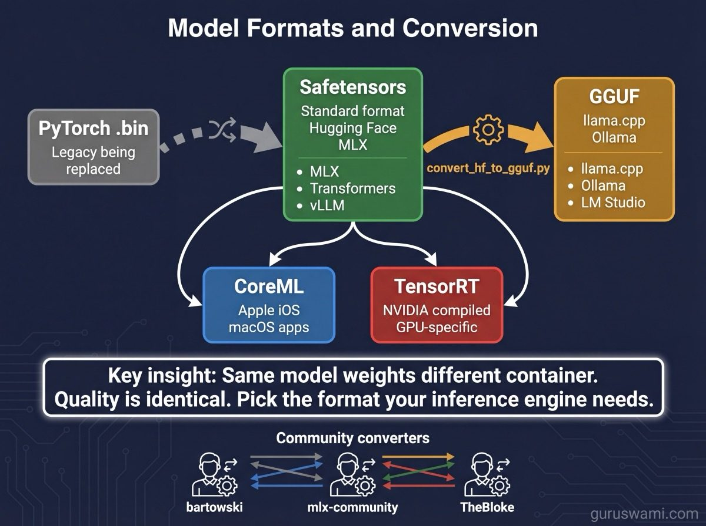
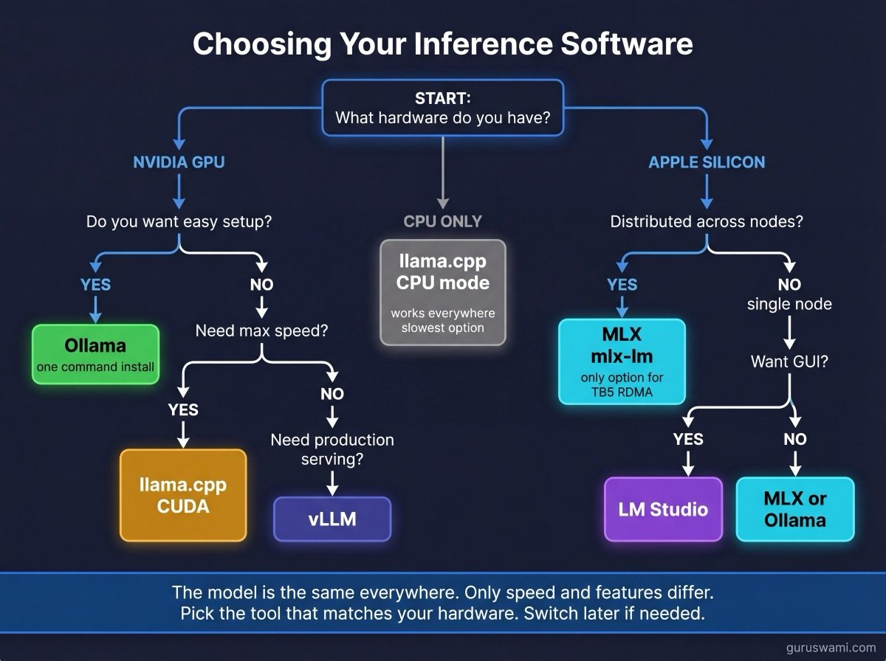

# Software: Tools for Running Models

There are dozens of tools for running LLM inference. They differ in what hardware they support, how fast they are, what features they offer, and how easy they are to use. This guide covers the ones that matter.

---



## Inference Engines (What Actually Runs the Model)

### llama.cpp

**What it is.** The original local inference engine. Written in C/C++ by Georgi Gerganov. Runs on everything: NVIDIA GPUs (CUDA), Apple Silicon (Metal), AMD GPUs (ROCm), CPUs (AVX2/AVX512), and even phones.

**Key features:**
- Widest hardware support of any inference engine
- GGUF model format with the richest quantisation options (Q2 through Q8, K-quants, importance quants)
- Extremely active development (multiple releases per week)
- Server mode with OpenAI-compatible API
- Speculative decoding, grammar-constrained generation, multimodal support

**When to use:** NVIDIA GPUs, AMD GPUs, CPU-only machines, or when you need a specific quantisation format. Also the most battle-tested option.

**Command example:**
```bash
./llama-server -m model.gguf -c 4096 --port 8080 -ngl 99
```

### MLX / mlx-lm

**What it is.** Apple's native ML framework for Apple Silicon. Built from the ground up for unified memory and Metal GPU. mlx-lm is the LLM inference layer built on top.

**Key features:**
- Designed specifically for Apple Silicon unified memory (no VRAM wall)
- Lazy evaluation and automatic kernel fusion
- Distributed inference via JACCL RDMA (TB5 tensor/pipeline parallelism)
- LoRA/QLoRA fine-tuning support
- Safetensors model format

**When to use:** Apple Silicon hardware. Required for distributed inference on Mac clusters. All benchmarks in this project use MLX.

**Command example:**
```bash
mlx_lm.generate --model mlx-community/Qwen2.5-32B-Instruct-4bit \
    --prompt "Hello world"
```

### vLLM

**What it is.** A high-throughput serving engine designed for production deployments. Focuses on batched inference with many concurrent users.

**Key features:**
- PagedAttention for efficient KV cache management
- Continuous batching (handles concurrent requests without wasting compute)
- Tensor parallelism across multiple NVIDIA GPUs
- OpenAI-compatible API
- Supports AWQ, GPTQ, and FP8 quantisation

**When to use:** Production serving on NVIDIA hardware with multiple concurrent users. Not designed for single-user local inference.

### TensorRT-LLM

**What it is.** NVIDIA's official optimised inference engine. Compiles models into optimised CUDA kernels.

**Key features:**
- Maximum performance on NVIDIA hardware (often 20-30% faster than llama.cpp)
- INT8/INT4/FP8 quantisation with NVIDIA-specific optimisations
- Multi-GPU support with NVLink
- In-flight batching

**When to use:** When you need maximum NVIDIA throughput and are willing to deal with a more complex setup. The compilation step can take hours.

### ExLlamaV2

**What it is.** A CUDA-optimised inference engine focused on consumer NVIDIA GPUs. Known for excellent performance on RTX 30/40 series.

**Key features:**
- EXL2 quantisation format (mixed-precision, highly optimised)
- Excellent single-GPU performance
- Lower VRAM overhead than competitors
- Flash Attention integration

**When to use:** Single NVIDIA GPU inference when you want maximum speed and do not need multi-GPU.

---

## User-Friendly Wrappers (What You Actually Download)

### Ollama

**What it is.** The easiest way to run models locally. One command to download and run any model. Built on llama.cpp internally.

**Key features:**
- `ollama run llama3.1` - that is the entire setup
- Automatic model downloading from Ollama's library
- OpenAI-compatible API on port 11434
- GPU auto-detection (CUDA, Metal, ROCm)
- Modelfile system for custom model configurations

**When to use:** Getting started. If you have never run a local model, start here. Works on macOS, Linux, and Windows.

**Limitation:** Less control over quantisation, context length, and generation parameters compared to using llama.cpp directly. Uses llama.cpp under the hood, so performance is identical - Ollama just wraps it.

### LM Studio

**What it is.** A desktop application for running local models with a graphical interface. Chat UI, model browser, and server mode.

**Key features:**
- GUI model browser with one-click downloads from Hugging Face
- Chat interface with conversation history
- Built-in server (OpenAI-compatible API)
- Supports GGUF (llama.cpp backend) and MLX (on macOS)

**When to use:** When you want a visual interface for model exploration. Good for comparing models side-by-side.

### Open WebUI

**What it is.** A web-based chat interface that connects to any OpenAI-compatible API backend (Ollama, llama.cpp, vLLM, etc.).

**Key features:**
- Multi-user support with authentication
- RAG pipeline with document upload
- Model switching within conversations
- Chat history and sharing
- Plugin system

**When to use:** When you want a ChatGPT-like experience with local or self-hosted models. Good for teams.

---

## Frameworks (What Models Are Built With)

These are not inference tools. They are the frameworks used to train and develop models. You encounter them when reading model documentation or doing fine-tuning.

### PyTorch

**What it is.** The dominant deep learning framework. Nearly every LLM is trained in PyTorch. Developed by Meta.

**Relevance to inference:** Hugging Face Transformers uses PyTorch for model loading and inference. Not optimised for production inference (use vLLM, TensorRT-LLM, or llama.cpp instead). PyTorch inference works but is slower than dedicated inference engines.

### CUDA

**What it is.** NVIDIA's GPU programming platform. Not a framework - it is the low-level programming model that everything else builds on.

**Relevance to inference:** Every NVIDIA inference tool (llama.cpp CUDA, vLLM, TensorRT-LLM, ExLlamaV2) uses CUDA under the hood. You need NVIDIA drivers and the CUDA toolkit installed. The CUDA version determines which GPU features are available.

### Metal

**What it is.** Apple's GPU programming framework. The equivalent of CUDA for Apple Silicon.

**Relevance to inference:** MLX uses Metal. llama.cpp uses Metal on macOS. You do not install Metal separately - it comes with macOS.

### TensorFlow / JAX

**What it is.** Google's ML frameworks. TensorFlow was dominant before PyTorch. JAX is Google's newer framework used for some Gemma and PaLM models.

**Relevance to inference:** Some older models were trained in TensorFlow but converted to PyTorch/Safetensors for inference. You rarely need TensorFlow for inference in 2026. JAX is used by Google internally but models are published in standard formats.

### Hugging Face Transformers

**What it is.** A Python library that provides a unified API for loading and running thousands of model architectures. The standard way to interact with models in Python.

**Relevance to inference:** `from transformers import AutoModelForCausalLM` loads nearly any model. Not the fastest inference option, but the most compatible. Most quantisation tools (AWQ, GPTQ, AutoGPTQ) integrate with Transformers.

---

## Model Formats and Conversion



| Format | Used by | Created by | Notes |
|--------|---------|-----------|-------|
| **Safetensors** | MLX, Transformers, vLLM | Hugging Face | Safe, fast loading, no code execution |
| **GGUF** | llama.cpp, Ollama, LM Studio | llama.cpp project | Single file, includes metadata |
| **PyTorch (.bin/.pt)** | Transformers | PyTorch | Legacy, being replaced by Safetensors |
| **ONNX** | ONNX Runtime | Microsoft | Cross-platform, less common for LLMs |
| **TensorRT engines** | TensorRT-LLM | NVIDIA | Pre-compiled, GPU-specific |
| **CoreML** | Apple apps | Apple | For on-device iOS/macOS apps |

**Converting between formats:**
- Safetensors → GGUF: `llama.cpp/convert_hf_to_gguf.py`
- Safetensors → MLX: `mlx_lm.convert`
- Any → GGUF quantised: `llama.cpp/llama-quantize`

Most models on Hugging Face are published in Safetensors. Community members (like `bartowski`, `mlx-community`, `TheBloke`) convert them to GGUF and MLX formats with various quantisations.

---

## How to Choose



| Situation | Tool | Why |
|-----------|------|-----|
| Never run a model before | **Ollama** | One command setup |
| NVIDIA GPU, want speed | **llama.cpp** with CUDA | Best single-GPU performance |
| Apple Silicon, any model | **mlx-lm** | Native unified memory, distributed |
| Want a GUI | **LM Studio** | Visual model browser |
| Production serving | **vLLM** (NVIDIA) | Batched, multi-user |
| Maximum NVIDIA performance | **TensorRT-LLM** | Compiled kernels |
| Team chat interface | **Open WebUI** + Ollama | Multi-user web UI |
| Fine-tuning on Apple | **mlx-lm** | LoRA/QLoRA with full memory |
| Fine-tuning on NVIDIA | **Transformers** + PEFT | Widest model support |
| Building an application | Any with **OpenAI-compatible API** | Portable code |

The inference engine does not change the model's quality. A Qwen 32B Q4 produces identical output whether it runs on llama.cpp, MLX, or vLLM. The differences are speed, memory efficiency, and features. Pick the tool that matches your hardware and use case. Switch later if you need to - the models are the same.
