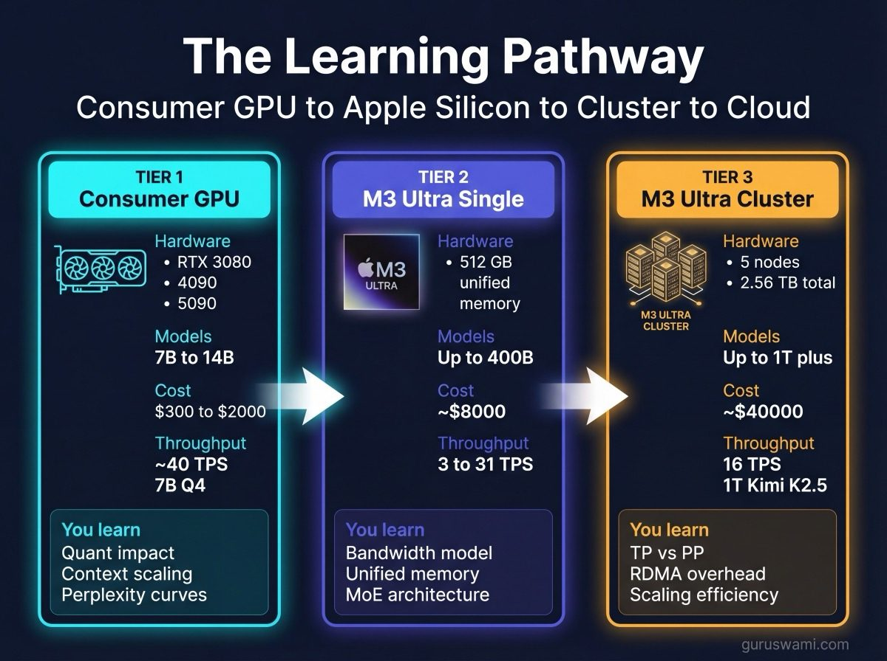

# Combined Benchmark Vision: Consumer GPU to Apple Silicon Cluster

## The Learning Pathway

If you only ever use cloud inference, you never learn what is actually happening. You send tokens, you get tokens back. The relationship between quantisation and quality, between context length and latency, between model architecture and memory bandwidth, between parallelism strategy and communication overhead: these stay invisible behind an API.

The person who has loaded a model onto their own GPU, watched it fit (or not fit) into memory, measured the difference between Q4 and Q8, and hit the KV cache wall at 64K context understands something fundamental that no amount of reading documentation can replace. That understanding transfers directly to making good decisions about cloud deployments, model selection, cost estimation, and system architecture.

These benchmarks follow a natural learning curve. Start with a gaming GPU you already own. Progress to Apple Silicon when you outgrow VRAM. Build a cluster when you want to understand distributed inference. Each tier teaches concepts the previous tier could not, and everything you learn applies when you eventually scale to cloud hardware. The difference is that you arrive at the cloud understanding *why* things cost what they cost, not just *that* they do.

## Hardware Tiers

### Tier 1: Consumer NVIDIA GPU (learning fundamentals)

| GPU | VRAM | Memory BW | Price (approx) |
|-----|------|-----------|----------------|
| RTX 3080 | 10 GB | 760 GB/s | $300 used |
| RTX 4090 | 24 GB | 1008 GB/s | $1600 |
| RTX 5090 | 32 GB | 1792 GB/s | $2000 |

**What you can run:** 7B-14B models at any quant. 32B models at Q4 (5090 only). Up to ~16K context comfortably.

**What you learn:** Quantisation impact on speed and quality. Context length vs KV cache trade-offs. TTFT vs generation TPS. Perplexity degradation curves. Power consumption per inference.

**Benchmark data:** 850 runs across 3 GPUs, 17 models, multiple quant levels. Includes power consumption, perplexity, TTFT percentiles.

### Tier 2: Apple M3 Ultra (single node, large models)

| Spec | Value |
|------|-------|
| Unified Memory | 512 GB |
| Memory Bandwidth | 819.2 GB/s (620 effective) |
| GPU Cores | 80 |
| Price | ~$8000 |

**What you can run:** Any model up to ~400 GB. Llama 405B Q4 (213 GB). DeepSeek V3 Q4 (352 GB). Even models that need 4× RTX 5090 VRAM.

**What you learn:** Unified memory eliminates PCIe bottlenecks. Memory bandwidth becomes the sole constraint. The theoretical model (TPS = bandwidth / model_size) is validated at 95-111% efficiency.

**Benchmark data:** 182 data points across 5 models (32B to 1T), 5 quant levels, 7 context lengths.

### Tier 3: Apple Silicon Cluster (distributed, enterprise concepts)

| Spec | Value |
|------|-------|
| Nodes | 5× M3 Ultra |
| Total Memory | 2.56 TB |
| Interconnect | Thunderbolt 5 RDMA (5.3 GB/s per link) |
| Price | ~$40,000 total |

**What you can run:** Kimi K2.5 (1T params). Any model with tensor or pipeline parallelism. Multiple topology configurations.

**What you learn:** Communication overhead in distributed inference. Why TP scaling is quant-dependent. When PP beats TP. Expert parallelism for MoE models. RDMA vs Ethernet for inter-node communication. All the concepts that apply to H100 clusters, at 1/10th the cost.

## Where Each Tier Ends

The most useful chart is the overlap zone: models both tiers can run, showing the performance difference.

### Qwen 32B Q4 (runs on both NVIDIA and Apple Silicon)

| Hardware | Gen TPS | TTFT (1K) | Notes |
|----------|---------|-----------|-------|
| RTX 5090 (32GB) | ~40 TPS | ~25ms | VRAM-limited to Q4 |
| M3 Ultra single | 31.5 TPS | 2.9s | Bandwidth-limited |
| M3 Ultra TP4 | 18.3 TPS | 1.1s | Communication overhead |

The 5090 wins on raw generation speed for this model. Higher memory bandwidth (1792 vs 819 GB/s) and GPU compute advantage. But the M3 Ultra can also run Llama 405B, DeepSeek V3, and Kimi K2.5 on the same hardware. The 5090 cannot.

### The Crossover Point

Consumer GPUs are faster for models that fit in VRAM. Apple Silicon is the only practical consumer option for models that don't. The crossover is around 30-40B parameters at Q4.

Below 30B: use the fastest GPU you have.
30B-400B: single M3 Ultra.
400B-1T: M3 Ultra cluster with TP2/TP4.
Above 1T: cloud or wait for M4/M5 Ultra.

**Why not multi-GPU NVIDIA?** In theory, four RTX 4090s can pool 96 GB of VRAM and run 70B+ models. In practice, consumer multi-GPU means PCIe interconnect (63 GB/s shared, not per-GPU), 1800W sustained power draw, a dedicated 20A circuit, a chassis designed for quad-slot cooling, and a noise profile that evicts you from any room with other humans. Enterprise NVIDIA (H100/A100 with NVLink at 900 GB/s) solves the interconnect and power delivery problems, but at $25K-$40K per GPU. The gap between a consumer 4090 and an H100 is not incremental. It is a different category of hardware, and a different category of buyer. These benchmarks compare what a person can actually buy and run at home or in a small office.

## Unified Methodology

Both datasets follow the same principles:
- Theoretical performance model predicts results before testing
- Multiple runs per configuration for variance measurement
- Quant sweeps show speed-quality trade-offs
- Context sweeps show KV cache impact

The NVIDIA data adds power consumption and perplexity (not yet measured on Apple Silicon). The Apple Silicon data adds distributed topology comparisons and cross-node reproducibility checks. Together they cover the full picture.

## What This Teaches

These are the lessons that stay invisible if you only use cloud APIs.

1. **Quantisation is not just compression.** It changes speed, quality, memory usage, and distributed scaling characteristics. Each quant level behaves differently. You cannot learn this from a pricing page.

2. **Context length has a real cost.** KV cache grows linearly. Beyond 32K tokens, every model slows measurably. Beyond 128K, TTFT becomes impractical on most hardware. Cloud providers absorb this cost into per-token pricing. Local inference makes you feel it directly.

3. **More hardware is not always faster.** Distributing a 32B model across 4 nodes makes generation 42% slower. The communication overhead exceeds the benefit. This is the most expensive lesson in cloud infrastructure, and you can learn it on a $40K cluster instead of a $400K one.

4. **MoE models are not what they seem.** A 671B MoE model runs at 20 TPS because only 37B parameters are active per token. Naive bandwidth models predict 3× too slow. Understanding active vs total parameter count changes how you evaluate every new model release.

5. **The hardware is not the bottleneck.** Single-node Apple Silicon achieves 95-111% of theoretical bandwidth limits. The gap in distributed inference (47-93%) is software: RDMA overhead, Metal dispatch, kernel efficiency. Knowing where the bottleneck actually is prevents you from throwing money at the wrong problem.

6. **Local inference is the fastest way to build real intuition.** A $300 used RTX 3080 teaches the same quantisation concepts as an H100. An $8000 Mac Studio teaches distributed inference concepts that apply to $100K GPU clusters. The concepts transfer. Only the scale changes. The person who has run 200 benchmark configurations on their own hardware will make better infrastructure decisions than someone who has read 200 blog posts about someone else's benchmarks.

---

## The Case for Local Inference

The biggest value in running models locally is not avoiding API costs. It is learning by experimentation.

Cloud inference hides every trade-off. You send tokens, you get tokens back. You never learn that Q4 is 61% faster than Q8 with only 1.8% quality loss. You never discover that your 32K context window costs 16 seconds before the first token appears. You never find out that distributing a small model across 4 nodes makes it 42% slower. You just pay per token and trust the provider made the right choices.

Local inference forces you to confront these decisions. Quantisation selection. Context limits. Memory budgets. Topology trade-offs. Each one is a lesson that applies directly to cloud deployments: choosing the right model size for a task, setting appropriate context limits, understanding why some API calls are slow and expensive.

These benchmarks exist because we wanted to test our own assumptions. Many turned out wrong. The ones that were wrong are likely shared by others making infrastructure and procurement decisions based on vendor claims and blog posts.

Run the models. Measure the results. Then decide if cloud is the right choice for your workload. Not before.

---

## These Numbers Will Age. The Lessons Will Not.

A year ago, 7B models were impressive. Now a Q4 70B model fits on a consumer GPU. A 24B MoE model outperforms dense models four times its size in complex reasoning and tool calling. A trillion-parameter model runs on four Mac Studios.

These specific benchmark numbers will be outdated within months. New models, new hardware, new optimisations. But the relationships they reveal are baked into the physics: memory bandwidth determines generation speed, KV cache grows linearly with context, communication overhead compounds with node count, and quantisation trades precision for throughput at rates the hardware dictates.

The engineers at the forefront of model architecture keep finding remarkable optimisations. MoE with learned routing. MLA with compressed KV cache. Speculative decoding. Mixture of depths. Each one shifts the curves, but the curves themselves remain the same shape. The benchmark methodology here measures those curves. The specific coordinates will change. The geometry will not.

We are starting to suspect that the future of much of AI inference is not massive cloud models, but highly specialised smaller models deployed at the edge: as agents, as components in multi-level agentic systems, running on increasingly optimised and affordable hardware. Frontier models will remain vast in knowledge and speed. But smaller optimised models are already proving capable enough for most tasks, even on a $300 used GPU. The gap between "good enough locally" and "marginally better in the cloud" is narrowing faster than anyone predicted.
