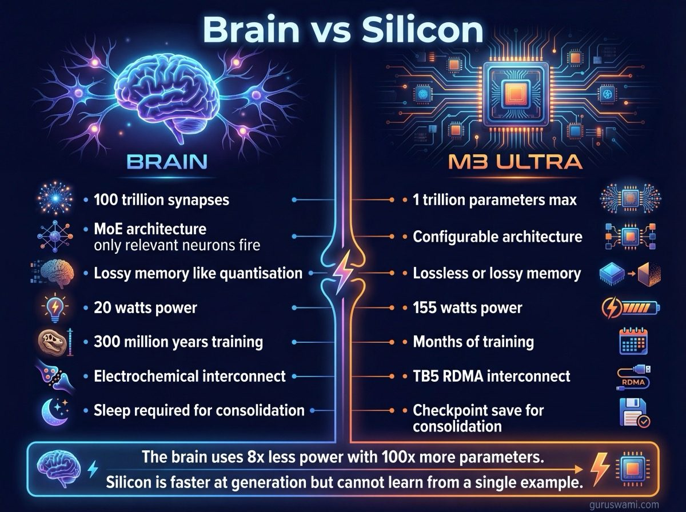
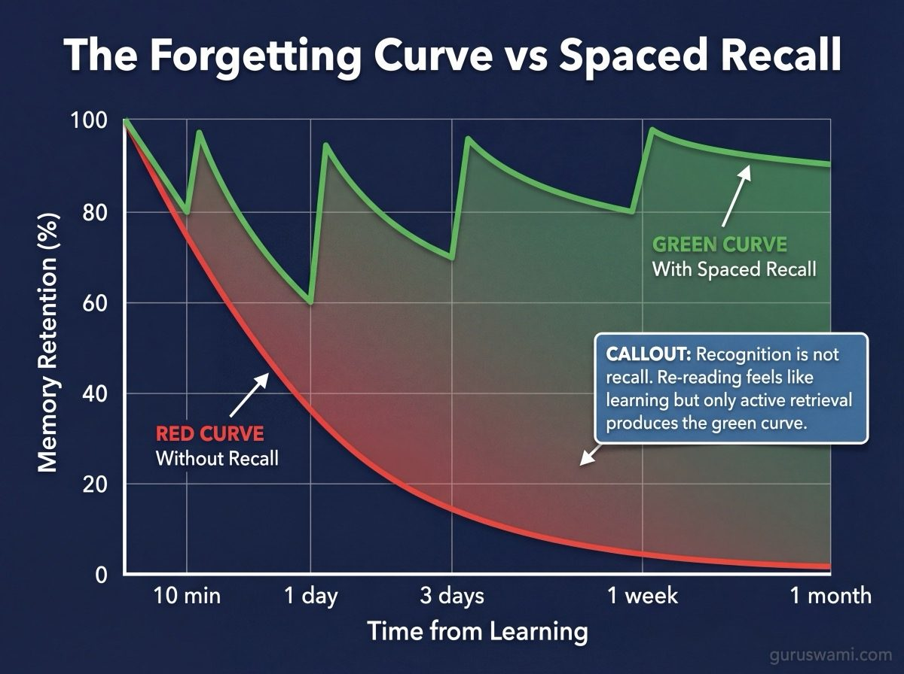
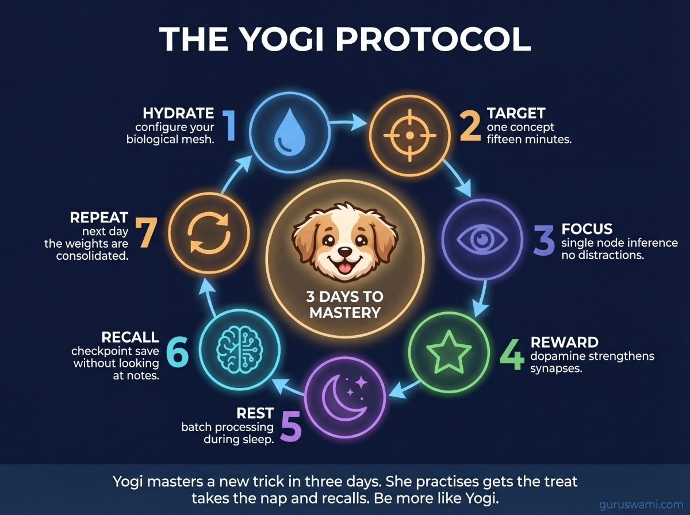
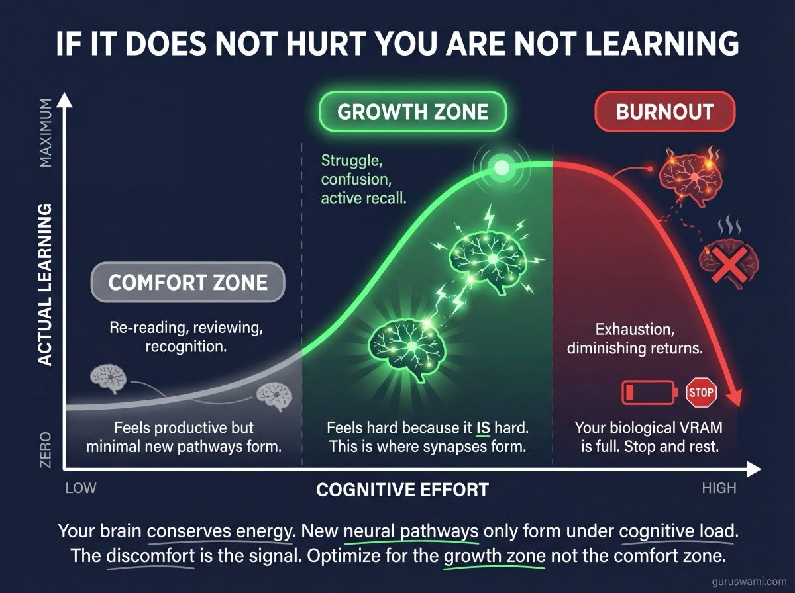

# The Yogi Method: Brain Inference Benchmarks

We have established that AI is maths, not magic. But we also know that the biological brain of a Golden Retriever puppy is a vastly superior learning machine to any 5-node M3 cluster. And it is not even close.

Your brain has roughly 100 trillion synaptic connections - parameters, in AI terms. It runs a mixture of experts architecture: only a small fraction of your neurons activate for any given thought, while the rest stay dormant. Your memory is lossy by design - you quantise experiences down to the essential signal, discarding detail to save storage, just like Q4 discards precision to save VRAM. You forget most of what you see, hear, and read. The things that survive are the ones your biological reward system flagged as important. This is not a bug. It is compression. Your brain has been doing quantisation, attention mechanisms, and reinforcement learning for 300 million years.

Yogi does not need a trillion parameters or 512 GB of unified memory to learn. She uses highly optimised biological feedback loops that evolution spent longer perfecting than we have spent building computers.

To master the hardcore maths in this repository, do not just study the silicon. Study the puppy. Here are four biological learning hacks, modelled directly on how Yogi optimises her own neural net.

---

## 1. Optimise Your Learning Window (The Pre-Nap Protocol)

**The observation.** Yogi is a focused learning machine for exactly 15 minutes. She will master "sit," "stay," and "roll over" with 100% accuracy. Then her context window collapses, she starts chewing the rug, and she crashes for a 2-hour nap.

**The silicon parallel.** This is VRAM management. Your prefrontal cortex has a limited capacity for high-focus, heavy-compute learning. If you push past this limit, swapping occurs, perplexity rises, and learning stops.

**The Yogi hack.** Do not attempt to read the entire Codex in one sitting. Use the Rule of 15. Study one specific concept (e.g. pipeline parallelism) with absolute focus for 15 minutes. Then stop. Walk away. Engage your default mode network. This allows your biological VRAM to flush and prepare for the next compute cycle.

Your brain is not a Mac Studio with 512 GB. It is more like an ESP-32 with incredible efficiency but limited working memory. Respect the context window.

---

## 2. Use Dopamine for Reward-Based Learning (RLHF)

**The observation.** Yogi will do anything for a small piece of freeze-dried chicken. The reward is instant, highly desired, and triggers a massive dopamine spike that strengthens the synaptic connection of the exact behaviour she just performed.

**The silicon parallel.** This is Reinforcement Learning from Human Feedback (RLHF). We adjust the model's weights based on a reward signal to encourage desired outputs.

**The Yogi hack.** Gamify your own learning. Do not read [Distributed Inference](DISTRIBUTED_INFERENCE.md) just because you feel you should. Instead, set a clear challenge: "If I can explain the difference between tensor and pipeline parallelism to someone who has never heard of either, I earn a reward." A coffee. Ten minutes of a game. A treat. The promise of the reward keeps you engaged through the dry mathematics.

This is not a productivity trick. It is literally how your synapses strengthen. The dopamine does not just make you feel good - it is the chemical signal that tells your brain "this connection is worth keeping." Without it, the learning does not consolidate. Yogi knows this instinctively. We have to remind ourselves.

---

## 3. Use Sleep for Weight Consolidation (Gradient Descent)

**The observation.** When Yogi sleeps, her paws twitch. She is reliving the day's runs, chases, and successes. This is not passive rest. It is active data processing. Her brain is moving short-term experiences into long-term memory, replaying and strengthening the neural pathways that worked.

**The silicon parallel.** This is batch processing and optimisation. While the model is not running, we process the accumulated data to find the optimal set of weights - the configuration that minimises the loss function.

**The Yogi hack.** Sleep is not optional. It is when the learning happens. If you study a complex concept like [interconnect bandwidth and RDMA latency](INTERCONNECTS.md) right before bed, your brain will consolidate that knowledge during REM sleep, physically strengthening the new neural pathways. A sleep-deprived brain cannot save new data. It is running inference without enough memory - the results are there but they will not persist.

The most productive thing you can do after 15 minutes of focused study is take a nap. Yogi figured this out on day one.

---

## 4. Optimise the Biological Interconnect (The Hydration Hack)

**The observation.** After a hard play session, Yogi drinks a massive bowl of water. If she is dehydrated, she gets lethargic, grumpy, and her response time slows down significantly.

**The silicon parallel.** This is bandwidth and latency. The speed of the signal matters. In the cluster, it is Thunderbolt 5 at 5.3 GB/s. In your brain, it is water and electrolytes carrying electrical signals between neurons.

**The Yogi hack.** Your brain is 73% water. Dehydration of just 2% impairs attention, memory, and coordination. Water is your Thunderbolt 5 cable. If you are trying to understand why [TP scaling is quant-dependent](FINDINGS.md) and you are thirsty, you are throttling your own biological throughput. Drink water to lower your cognitive latency.

This is not wellness advice dressed up as technology. The electrochemical signals between your neurons literally travel through water. Dehydration increases the resistance. Your biological interconnect degrades the same way a noisy TB5 link degrades - gradually, silently, and with symptoms you attribute to everything except the actual cause.

---

## 5. Graduated Recall (Spaced Repetition)

**The observation.** Yogi does not learn "sit" once and remember it forever. She learns it on Monday, forgets half of it by Tuesday, relearns it faster on Wednesday, and by Friday it is permanent. If you skip Wednesday, she is back to square one by the weekend. The gaps between practice sessions matter as much as the sessions themselves.

**The silicon parallel.** This is checkpoint saving and model evaluation. You do not train a model once and deploy it. You train, evaluate, adjust, retrain. Each pass over the data strengthens the weights that matter and prunes the ones that do not. The spacing between training runs determines whether the learning generalises or overfits to the most recent session.

**The Yogi hack.** Spaced repetition is the single most effective learning technique neuroscience has ever validated, and almost nobody uses it. The pattern is simple:

| Interval | What to do | Why |
|----------|-----------|-----|
| **10 minutes after** | Recall the key concept without looking at notes | Catches gaps while the memory is fresh |
| **1 day later** | Explain the concept from memory | Forces retrieval, strengthens the pathway |
| **3 days later** | Apply it to a different example | Tests generalisation, not just memorisation |
| **1 week later** | Teach it to someone (or write it down) | Teaching is the highest form of recall |
| **1 month later** | Revisit - it should feel effortless | If it does, it is permanent. If not, one more cycle. |

The key insight: **recall is not the same as recognition.** Re-reading a page and thinking "yes, I know this" is recognition. Closing the page and explaining the concept from memory is recall. Recognition feels like learning but does not strengthen the pathway. Recall is harder, slower, and is the only thing that actually works.

Yogi does not re-read the "sit" manual. She performs the sit. She recalls the behaviour under different conditions - in the kitchen, in the garden, with distractions. Each successful recall in a new context strengthens the generalisation. If she only ever practised "sit" in the kitchen, she would not sit in the park. The retrieval in varied contexts is what makes the learning robust.

**The practical version for this repo:** after studying [Distributed Inference](DISTRIBUTED_INFERENCE.md), close the page. Wait 10 minutes. Then write down from memory: what is TP, what is PP, why does TP scaling depend on quantisation. If you cannot, go back and study just the part you missed. Tomorrow, do it again without looking. By the third recall, you own it.

---

## The Protocol

Before each study session:

1. **Hydrate.** Glass of water. You are configuring your biological mesh.
2. **Set a target.** One concept. One doc. Fifteen minutes. This is your prompt.
3. **Focus.** No tabs. No phone. Your prefrontal cortex is running single-node inference - do not add communication overhead.
4. **Reward.** Hit your target? Treat yourself. Your synapses need the dopamine to consolidate.
5. **Rest.** Walk away. Nap if you can. Your brain is running batch processing. Let it finish.
6. **Recall.** Ten minutes later, explain what you learned without looking. This is the checkpoint save.
7. **Repeat.** Tomorrow. Recall again. The same concept will be easier because the weights consolidated overnight. By the third recall, it is yours.

Yogi masters a new trick in three days using this exact protocol. She does not read about tricks. She does not watch videos about tricks. She practises the trick, gets the treat, takes the nap, recalls the trick the next day, and by the third day it is permanent. The learning is in the doing, the reward, the rest, and the recall. Not the reading.

---

## The Uncomfortable Truth: If It Does Not Hurt, You Are Not Learning

Everything above - the dopamine hacks, the spaced repetition, the hydration - is optimisation. But there is no optimisation that removes the fundamental cost: **thinking is expensive.**

Your brain consumes 20% of your body's energy while being 2% of its mass. It is the most energy-hungry organ you have, and your body knows it. Millions of years of evolution have made your brain deeply, structurally lazy. Not as an insult - as a survival strategy. Energy conservation kept your ancestors alive. Your brain only allocates resources to building new neural pathways when it absolutely has to. When the thing you are learning is important enough to justify the caloric expense.

This means real learning hurts. Not metaphorically. The mental fatigue you feel when grappling with a concept you do not yet understand - that is the physical sensation of new synaptic connections forming. Your brain is burning glucose to build infrastructure it did not have before. If it feels easy, you are reviewing what you already know. If it feels hard, you are learning.

You can trick yourself for a while with gamification, gradual rewards, and motivational hacks. But the core truth remains: new neural pathways are only created under cognitive load. No load, no pathways. No pain, no gain is not a gym cliche - it is neuroscience.

**The biological parallel is exact.** Your brain allocates resources to learning things that are designed to keep you alive, help you procreate, or otherwise propagate your genes. Everything else, your biology considers optional. To learn something your ancestors never needed - like how tensor parallelism scales with quantisation - you have to override millions of years of energy conservation firmware. That takes effort. Sustained, deliberate, uncomfortable effort.

**The good news:** you can optimise the effort the same way you optimise inference.

| Inference optimisation | Learning optimisation |
|----------------------|---------------------|
| Choose the right quantisation | Choose the right difficulty level - hard enough to hurt, not so hard you crash |
| Set an appropriate context window | Set an appropriate session length - 15 minutes of real struggle beats 2 hours of comfortable review |
| Use RLHF to reinforce good outputs | Use rewards to reinforce successful recall |
| Sleep-based weight consolidation | Sleep-based memory consolidation |
| Do not distribute what fits on one node | Do not spread your attention across 5 topics when one needs your full focus |

There is such a thing as too much learning, wasted learning time, and inefficient learning. Pacing yourself with any new subject is the trick. You can optimise your own learning the same way you optimise an inference pipeline - by understanding your hardware constraints, respecting your bandwidth limits, and knowing when to stop and let the batch job finish.

The point is not to suffer. The point is to recognise that the discomfort is the signal that learning is happening. If you are comfortable, you are probably reviewing. If you are struggling, you are probably growing. Yogi does not enjoy the first attempt at a new trick. She finds it confusing and frustrating. But she does it anyway because there is a treat at the end. Do the hard thing. Get the treat. Take the nap.

This is a long way of saying: as your knowledge of AI increases, you will start to see how your own brain does many of the same things. You get to hack and optimise your own learning, as you are learning about AI. Imagine that.

Pace yourself. Your AI models may do 100 TPS. Your brain needs sleep, repetition, and recall at biological TPS.

---

## Why This Is Here

This page exists in a benchmark repository because the benchmarks are not the point. The understanding is the point. The data, the charts, the findings - they are inputs to your own neural network. How effectively you process them depends on how well you manage your own hardware.

This matters because applying the knowledge about how your brain works will let you learn AI faster and in more detail. You already have a head start - you are reading this archive. But here is the thing nobody tells you: by learning AI, you are also learning brain optimisation. The concepts are the same. Attention windows. Weight consolidation. Reward signals. Bandwidth constraints. Context limits. The vocabulary transfers in both directions. Understanding how a transformer processes a sequence teaches you something about how you process a day. Understanding how your prefrontal cortex manages working memory teaches you why your study sessions have a natural token limit.

The two fields illuminate each other. The deeper you go into one, the more you understand the other. This is not a coincidence. Artificial neural networks were inspired by biological ones. The maths diverged but the principles did not.

Yogi does not know what a tensor is. But she is a better learner than most humans because she instinctively follows the protocol that neuroscience confirms: focused attention, immediate reward, sleep consolidation, and adequate hydration. She does not overthink it. She does not skip the nap to read one more paper.

Be more like Yogi.
